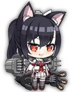

# Your Waifu is SHIP's opinionated & extra-biased Unit Guide (IDOLMASTER EDITION)

## _VERY IMPORTANT OPENING NOTE_ 
Be it because of the very generous gacha, dinctly not predatory monetisation, the shoot-em-up RPG gameplay or the ever-increasing unit roster, Azur Lane stands out among oceans of mobage for several reasons; the most relevant of which, in my opinion, is fostering a Pokémon-esque approach to compbuilding, where the player is encouraged and/or expected to use the units they like the most, rather than simply homing into the 'strongest' ones.  
While a very laudable approach, it is also one that lends itself to misconceptions of the toxic casual "ez gaem lmao use w/e ur gud" variety: to quote a wise Azur Lane Community member, "just because it works, it doesn't mean it's good": while all units are indeed viable, there are clearly objectively superior ones, and this Tierless Guide aims to identify who are they and for what reasons.  
A few years at this and counting, and it's become to me abundantly clear that tiers cause a lot more issues than they actually solve; most people only pay attention to the tier and ignore the reasons why they're tiered that way, engage in pointless debates over which tier is *right* (like it's not all subjective anyway) and are left knowing just as much as they did before about the unit itself or how they are supposed to use it. 
The Tierless Guide means to dispense with all that nonsense and tell you all the important stuff, with none of the nastiness and drivel that inevitably follows tiers. Should you still wish for a shorter form writeup on what the units are like, [consider checking the Ko-Fi posts here.](https://ko-fi.com/ywisguides#).  
Whatever the case and however you choose to read this guide, I want to stress this - ALL units are viable, SOME are better than others, NONE of them will work if you don't know how to use them.
Good reading, and godspeed cap'n!
## _VERY IMPORTANT OPENING NOTE_ 
 
  
  
### Evaluation Criteria:
- Ships are evaluated by their PvE PERFORMANCE first and foremost, but notes on notable PvP usage will be made if suitable.
- Ships are evaluated according to their ability to act as a STAND-ALONE unit.
- Ships unable to evaluated the above criterion (eg. carriers as a whole, Vestal) are rated according to their ability to act as a SUPPORT unit; buffs/debuffs/aa/heals garner higher ranks than sheer damage output, especially during boss fights. See assorted notes for reasoning.
- Ships are compared to others in their OWN CLASS for tiering purposes; if two ships are have comparable stats and purpose, the least expensive one will be ranked higher.
- Ships are listed alphabetically and in order of nationality (USS -> HMS -> IJN -> KMS -> France -> Italy -> Russia).
- All units are assumed to be MAXED (ie. lv120, BiS gear, SL10 across the board). PRs are an exception, as they take at the very least two full months to max, let alone rainbow ones.
- Auto or Manual performance is not taken into consideration, unless it is specifically relevant to the unit.
- The Retrofit Priority List orderings are decided on the basis of how effective is the retrofitted unit, not how much does it need the retrofit; in other words, the better (more powerful/more useful) the retrofit, the higher it is.
  
  
  
#### Role Explanations:
- The Role field seeks to explain at a glance what's the purpose of a unit, how it should be employed, and how does it compare in those roles to other units in her hull class. A **bold** role means that should be the unit's main purpose; an absent role means the unit cannot be relied upon to perform said role at all.
- DPS can be Gun, Torp, Plane or Barrage focused, and can be Light / Below Average / Medium / Above Average / Heavy / Extreme.
- Tank can be Light / Medium / Heavy.
- AA can be either Carry (will spearhead the fleet's AA damage) or Support (will assist significatively to the fleet's AA damage but should not be expected to handle things on its own), with both having Light / Medium / Heavy variants.
- Support is too varied a field and thus simply references how the unit supports others via heals, buffs or debuffs.
- If you'd like to know individual numbers, feel free to ask me on Discord (or Issues if you truly must).

#### Retrofit/Kai Priority List and PRiority list:
- DD                  : Ayanami = Z23 > Laffey > Kagerou = Tanikaze = Z1 > Nicholas = Cassin/Downes > Javelin > Foxhound = Shiranui
- CL                  : San Diego* > Jintsuu > Leipzig = Leander > Kinu = Emile Bertin > Helena > Curlew/Curacoa > Abukuma = Ping Hai/Ning Hai (ONLY WITH YAT SEN) > Ajax/Achilles
- CA                  : London > Mogami > Portland > Furutaka/Kako > Suffolk > Exeter
- BB/C                : Hyuuga > Warspite* > Ise > Yamashiro/Fusou (DO NOT TAKE LAST TWO NODES) = Nevada/Oklahoma
- CV/L                : Hiryu/Soryu > Shouhou > Langley > Ranger = Saratoga
 
 - PR1                : Monarch > Ibuki > Saint Louis > Neptune > Roon (unless focusing on KMS) 
 - PR2                : Georgia > Kitakaze = Gascogne > Seattle > Azuma > Friedrich der Grobe (unless focusing on KMS)
 - PR3                : Odin = Champagne > Cheshire > Mainz > Drake
 
#### What gear do I give X?
Courtesy of two ALEC veterans of ours, xscore#4740 and ʝimmy#8049, have some handy flowcharts. No need to memorise the names anymore, refer to the images!  
- [DD Gun Selection Guide](https://cdn.discordapp.com/attachments/367307557796053002/801526158306312242/DD_gun_selection_guide2.png)
- [CL Gun Selection Guide](https://cdn.discordapp.com/attachments/770435752080310342/800743624626536529/CL_gun_selection_guide.png)
- [CA Gun Selection Guide](https://cdn.discordapp.com/attachments/770435752080310342/800743674715570186/CA_gun_selection_guide.png)
- [BB Gun Selection Guide](https://cdn.discordapp.com/attachments/367307557796053002/801513820655714334/BB_gun_selection_guide.png)

#### Assorted notes:
- Read the VERY IMPORTANT OPENING NOTE at the top.
- Gear isn't an afterthought; good units with bad gear fail where bad units with good gear succeed. Learn what's good and why [here](https://github.com/Meowrin/al-guides), and if you don't know the nicknames for the various pieces of gear, look [here](https://imgur.com/a/4wEvTQo).
- The 'loadout' listed under CV/L entries details the number of planes each unit gets; eg. Unicorn gets 3 Fighters / 0 Dive Bombers / 3 Torpedo Bombers.
- The asterisk next to a name in the Priority List means the Kai is tied to some sort of event and may not be available right now; also, if you do not see a name in it, it's because it is not worth prioritizing.
- No, Izumo isn't missing from the PRiority list. She's just worthless. More details on why [here](https://github.com/YourWaifuIsShip/Azur-Lane-Guides/blob/master/AL%20Untier%20Guide.md).
- If you're wondering why carriers are judged differently from the rest, consider the following - they have no self-defence capabilities against suicide boats and are inherently worse than big guns at handling hard targets due to ordnance scatter and unhelpful anti-Heavy modifiers, but their AoE damage dispatches waves better than big guns usually do and come stock with screen clears.
tldr; BB/BC and CV/CVL do different things, holding them to the same standards makes little sense.
- **TIERLESS MEANS YOU NOW HAVE TO READ THE DESCRIPTIONS INSTEAD OF FOCUSING ON THE IRRELEVANT ARBITRARY ACCURSED TIER NUMBERS. YOUR QUICK OVERVIEW OF THE UNIT IS FOUND IN THE ROLES FIELD. ENJOY.**
- **READ THE DAMN DESCRIPTIONS OR GHOSTLY HORSES WILL HAUNT YOU IN YOUR SLEEP.**
  
## Table of Contents 
- ### [DD ](#dd--1)
- ### [CL ](#cl--1)
- ### [CA ](#ca--1)
- ### [BB/BC ](#bbbc--1)
- ### [BBV ](#bbv--1)
- ### [CV/CVL ](#cvcvl--1)
- ### [SS ](#ss--1)
- ### [AR ](#ar--1)

## Changelog as of last major update (26/07/2021)

- Haruka Amami, Miura Azusa, Chihaya Kisaragi, Iori Minase have all been added.

  
---
  

### DD 
---
 - **[USS Allen M. Sumner](https://azurlane.koumakan.jp/Allen_M_Sumner)** 
* Roles:
  * **Medium AA carry, AA buffer, generalist DD**; light tank, above average DPS (split between guns, torps and barrages).

* Skill:
  * Ignitions taken last -3s and deal +15% dmg to Light Armour. Every 20s, 70% chance to fire a [mixed barrage](https://streamable.com/97g703) and grant +20% AA to the entire fleet for 8s.
    * The 17 STARLETS deal 30 bdmg with 110/110/100 mods; the 5 TORPEDOES deal 101 bdmg with 80/100/130 mods. The starlets are modified by 100% of the unit's FP, the torpedoes by 100% of the unit's Torp. 
  * If sortied with 2+ USS units OR after Allen sinks 2+ enemies, gain +15% Torp/AA until the end of the battle. Upon equipping any piece of USS gear, gain a special ghost AA mount.
    * The ghost AA deals 142 bdmg at 100% AAEff, has 30 range and a 1.04s reload.

- Desc:
>The most accomplished flyswatter in her hull class, Allen shreds the skies with a prowess matched only by the higher end AA CL (and beaten only by the Trio of Flyer Doom, namely San Diego / Cheshire / Isuzu) while retaining solid DPS on the sea and a sturdy enough hull to weather the storms coming her way.  
As is customary for USS DD, neither her guns nor her torpedoes are particularly noteworthy and their lack of quality is made up by quantity, again in the form of the aforementioned barrages. Have care that they hit; given their somewhat wide pattern, that would be more likely on a mobbing fleet.  

 - **[USS Cassin Kai](https://azurlane.koumakan.jp/Cassin#Retrofit)** **[USS Downes Kai](https://azurlane.koumakan.jp/Downes#Retrofit)**
* Skill:
  * When HP falls under 20%, heals 25% of max HP once per battle
  * 60% chance to activate every 20 seconds, increase own Reload by 40% for 10 seconds

- Desc: The bubblewrap fights back!
>Packing a lot of Firepower for destroyers and blessed with a decent Reload buff to go along the excellent self-heal, Cassin and Downes may not have the monstrous damage output of their IJN counterparts but they can and will outlast them many times over.  
As it is for Phoenix, they are best used in mobbing fleets.

 - **[USS Charles Ausburne](https://azurlane.koumakan.jp/Charles_Ausburne)**
* Roles:
  * **Part of the USS Fletcher Trio** (off-tank, secondary buffer).
 
* Skill:
  * 4% activation upon firing, increases Fleet movement speed, and Escort evasion by 40% for 8s
  * 60% activation every 20s, increases own FP by 40% for 10s.

* Desc: 
>Another slippery little bastard, obsessed with justice and GOING FAST.  
Her torps are fairly worthless, but her guns are decent and her skill is absolutely amazing - not only does she increase your whole frontline's survivability, she also fixes whatever movement issues you might have at hand. The best DD friend your CAs could ever have.

 - **[USS Cooper](https://azurlane.koumakan.jp/Cooper)**
* Role:
  * Dedicated ASW DD.
  
* Skill:
  * Every 20s, gain +15% FP, reveal all enemy submarines for 10s and launch an ASW airstrike; also, if equipped with PBY-5A Catalina and HP falls below 40%, launch a special airstrike. Only works once for battle.
    * (20s Airstrike) The 1 BOMB deals 84 bdmg w/ 100/50/20 armour modifiers. The damage is modified by 100% of Cooper's ASW stat.
    * (Spc Airstrike) The 4 BOMBS deal 456 bdmg w/ 70/105/125 armour modifiers. The damage is modified by 120% of Cooper's Torp stat.
  
- Desc: 
>Fairly competent ASW DD with the same jack-of-all-trades-ish statline most USS DD get, plus a minor FP boost; as per usual, it makes for a decently rounded performance with relatively good AA to boot.  
Make no mistake, though, her main job is ASW: and in that regard she's fortunate not to have to use a sonar to reveal submarines, an aux slot that may be filled with a Catalina if you wish to give her some more ASW prowess and/or a sucker punch to whatever managed to drop her HP low enough (an unlikely prospect, and an unwanted one to boot). The regular ASW airstrike is just a single Catalina dropping one bomb, so expect little from it.  
Meme but alright.

- **[USS Eldridge](https://azurlane.koumakan.jp/Eldridge)**
* Roles:
  * Dead PvP meme. Still annoying.

* Skill:
  * Upon taking damage, 15% chance to make entire escort fleet to evade all attacks for 10s. DoT and Ramming damage still apply. CAN'T PROC BEFORE 20s HAVE PASSED (skill starts on cooldown).

* Desc: 
>Slippery little bastard, despite her CA-like movement speed. Her offensive stats are somewhat lacklustre, but she makes up for it with her skill - it might be RNG and her high Evasion works against it, but 10s of invulnerability is nothing to scoff at. Make sure to have her eat weak shots to minimise exposure to danger.

 - **[USS Fletcher](https://azurlane.koumakan.jp/Fletcher)**
* Roles:
  * **Part of the USS Fletcher Trio** (as flagship buffer).

* Skill:
  * Increases Firepower and Evasion of all Fletcher-Class in fleet by 30%
  * Increases Firepower, Torpedo, and Reload of DDs in the fleet by 10%

* Desc: 
>Lynchpin of the Fletcher Trio, think of her as an USS Z1 with a greater focus on gunnery as opposed to torps, as befitting her nation's doctrine. Very solid and dependable, but obviously better with other Fletchers.

 - **[USS Laffey Kai](https://azurlane.koumakan.jp/Laffey#Retrofit)**
* Roles:
  * **Notorious DPS machine** (very high Reload). Deceptively flimsy.

* Skill:
  * 5% activation upon firing, increases own FP, Reload, and Evasion by 40% for 8s.
  * Every 20 seconds, has a 70% chance to active Vanquish Mode, increasing own Reload stat by 200% for 10 seconds and releasing a powerful barrage.

- Desc: Vorpal Bunny.
>While pretty good to begin with, once Kai'd Laffey truly stands out thanks to CL-tier amounts of Firepower and Efficiency coupled with absurd amounts of Reload, allowing her to akimbo gun down any fool standing in her way. Her torpedoes also come out much quicker than anyone else's, but given the lacking nature of US torps spamming them is one of the few ways to keep them relevant.  
The DPS monster to AyaKai's DPH.

 - **[USS Maury](https://azurlane.koumakan.jp/Maury)**
* Skill:
  * 40% chance every 10s to raise evasion by 60% for 8s
  * Upon launching torpedoes, 30% chance to launch a second spread

* Desc: 
>Good double torpedoes and merely okay guns? On my USS DD? It's more likely than you think.  
Maury does things differently from many of her colleagues, but she does them well - despite not quite reaching the torp heights of the IJN or the gunnery of the KMS, she strikes a comfortable balance between the two factions and proves a reliable, independent addition to most fleets.

 - **[USS Nicholas Kai](https://azurlane.koumakan.jp/Nicholas#Retrofit)**
* Role:
**Part of the USS Fletcher Trio** (as main tank and main DPS).

* Skill:
  * 5% chance upon firing to +40% her own Evasion and -40% damage received from planes for 8s
  * 60% e/ 20s to +40% her own Firepower for 8s
  * 70% e/ 20s to +40% her own Firepower/Torpedo/Reload for 10s and, once per battle, if an escort ship's Health falls below 20%, decrease the damage it takes by 15%. If the ship is Helena, additionally heal 8% of Helena's max Health

- Desc:
>Nicholas is a rarity among destroyers, in that she boasts both enough Firepower to face off with the best in her class and very solid defensive capabilities; a true generalist, even more so than Laffey considering her actually good torpedoes.  
With no real weakness on display, beyond simply not being quite as good as more specialised units, Nicholas is a worthy addition in pretty much any escort fleet - especially one with Helena or Fletcher.

- **[HMS Amazon Kai](https://azurlane.koumakan.jp/Amazon#Retrofit)**
* Skill: 
  * Allied DDs in the fleet gain +18% experience.
  * Upon battle start and for 80s afterwards, deal +15% damage, take -8% damage and reduce the damage taken by allied DDs by -12% damage.
  * Has AAGM+1.

* Desc: 
>Nobody truly expected this to happen, but somehow Amazon's Kai turned out to be... somewhat alright!  
Certainly as an AA barge at least, whenever her double AA mount is allowed to do work, but she's also alright in terms of DPS and staying power; still, her niche is of questionable relevance so it's unlikely she'll see much use, but worth keeping in mind nonethless.

 - **[HMS Eskimo](https://azurlane.koumakan.jp/Eskimo)**
* Role:
  * **Light self-healing DD tank**, medium DD Gun DPS, below average DD Torp DPS.
  
* Skill:
  * Every 30s, launch a special [barrage](https://cdn.discordapp.com/attachments/742730234893172796/742730440154152960/Eskimo-Barrage.gif); upon falling below 30% HP, heal 10% of max HP back and launch a special barrage (only one proc per battle). Those barrages are the same.
    * The 17 shots deal 24 bdmg with 100/100/100 armour mods. They are modified by 100% of the unit's FP.

- Desc: 
>Finally, a competent enough HMS DD! Sure, her staying power is somewhat questionable if exposed to heavy fire and its damage output is just alright, but a self-heal is always appreciated and if you main HMS, you don't really get to be picky with your DD choices.

 - **[HMS Javelin Kai](https://azurlane.koumakan.jp/Javelin#Retrofit)**
* Skill:
  * 5% chance on firing main gun to boost Evasion by 60% for 8s.
  * 70% chance every 20s to fire a special barrage and boost torpedo stat by 30% for 8s.

* Desc: 
>While her starter version is pretty much undeniably the worst out of the three, the Kai does her some justice. Still nowhere as powerful as Ayanami or Laffey, but the EX barrage helps to close the gap to some extent... alas, the Evasion boost still accomplishes little due to powerful diminishing returns the stat incurs, with little to show for it.

 - **[IJN Ayanami Kai](https://azurlane.koumakan.jp/Ayanami#Retrofit)** 
* Skill:
  * 5% chance on firing main gun to boost Torpedo by 60% for 8s
  * 70% chance every 20s to fire a special barrage and boost Evasion stat by 30% for 5s

* Desc: Nuclear Launch Detected.
>Ayanami is the last word in Torp Damage - with her skill procced, the damage she can inflict with them is completely unrivaled and, with enough buff stacking, can even reach the tens of thousands.  
On the flip side, Torpedoes are all she's got and once she's blown her load, she won't have much to do except waiting for them to come back online; and given how massively overkill her torpedoes tend to be, it would be advisable to deploy her in boss fights first, foremost and only.  
The DPH monster to LafKai's DPS.

####   - **[IJN Hanazuki](https://azurlane.koumakan.jp/Hanazuki)** **[IJN Harutsuki](https://azurlane.koumakan.jp/Harutsuki)** **[IJN Yoizuki](https://azurlane.koumakan.jp/Yoizuki)**
* Role:
  * AA support, light hybrid DPS with solid staying power.

* Skill:
  * When planes are shot down within the AA circle, +25% own AA and Firepower for 8s.

- Desc:
>New-and-improved Niizukis, now with half the clothing and a better AA skill. While DDs aren't particularly good at AA, they do get Main Gun +1 and their skill actively encourages hunting those planes down. Decent even when planes aren't around, better when there are and surprisingly tough.

 - **[IJN Hibiki](https://azurlane.koumakan.jp/Hibiki)**
* Skill:
  * Upon launching a torpedo spread, 30% chance to launch a second one; also, once per fight upon falling below 20% HP, heal back up by 20%.
  * If sortied with any other Akatsuki-class DD (Akatsuki, Inazuma, Ikazuchi), gain +15% FP/Torp/Reload.
  * Every 20s, 30% chance to lower an enemy's Reload by -30% and Damage by -15% for 10s (targets humanoid ships first).

* Desc: IJN Mahan!
>The IJN finally gets in on the self-healing action, and it does so in its own peculiar - read, torp-heavy and guns-light - way.  
An interesting proposition but one that is for the most part only going to appeal to dedicated torp-heavy vanguards, as the Mahans are much cheaper and much more effective in their role of unshiftable-yet-adequately-armed bubblewrap, but she can be put to good use if one is willing to manual and invest on torp buffers.  
Forget about the self-buff if sortied with Akatsuki-class DDs, they aren't worth using in the first place unless you particularly like them.  

 - **[IJN Kagerou Kai](https://azurlane.koumakan.jp/Kagerou#Retrofit)**
* Skill:
  * Grant +15% Torpedo to the entire vanguard.
  * Upon launching a torpedo spread, 30% chance to launch a second one.
  * Every 20s, 30% chance to lower an enemy's Reload by -30% and Damage by -15% for 10s (targets humanoid ships first).

* Desc: 
>Widely available early on and blessed with both excellent skills and a very solid statline, Kagerou has a place in every torp-heavy frontline (torp-CA in particular, as they typically do not have access to torpedo buffs). Her Kai is more of a slight upgrade than a massive change, with her skill being middling at best, but the extra stats are appreciated nonetheless.

 - **[IJN Kazagumo](https://azurlane.koumakan.jp/Kazagumo)**
* Roles:
  * **Strong CV/L cheerleader, torpedo spammer**. High torpedo DPS.

* Skill:
  * Gain +5% Torp and +15% Reload; also, whenever this unit launches her regular barrage, take 3s away from the unit's torpedo cooldown.
  * Grant +15% damage to CV/L (DOES NOT STACK with the generic +15% damage to CV/L skill). Upon firing the 4th torpedo spread, heal the CV/L with the lowest HP by 10% of its max HP, and if the flagship is a CV, the unit will be healed by +15% of its max HP instead.

* Desc: *Ey, I'm torpin' 'ere!*
>A cut above most other CV/L cheerleaders and considerably more reliable than most other IJN Torp-DDs, owing to her very solid statline and torpedo spread acceleration gimmick. Burst damage is good and all, but sometimes you'd rather just pop more than pop harder - and mob fleets tend to be carrier territory more so than big guns'.  
Her regular barrage is also fairly ideal for the task and is the main incentive for using accelerators such as the usual 120x1 or 76x1, dealing fairly significant damage on [a linear, reasonably narrow](https://gyazo.com/a02b1d4b0388a01dec99ebadfc105362) pattern.  
Don't ask about the Brooklyn accent. Blame Littorio's mistress.

 - **[IJN Kawakaze](https://azurlane.koumakan.jp/Kawakaze)**
* Skill:
  * All IJN DD deal +15% damage to CL/CA.
  * Her torpedoes always deal 115% damage against all targets, regardless of the normal torpedo modifiers (80/100/130)

* Desc: Black Not Shooter.
>A veritable turncoat of a DD, Kawakaze's main purpose is making Light Armoured units' lives hell by drilling right through it with her torps and her stellar torpedo-armed barrage - and she accomplishes it beautifully.  
Terrifyingly effective against her intended targets, to the point of overtaking even Ayanami Kai - but she does still lose to her when faced with Heavy Armour, against which her skill puts her at a disadvantage.

 - **[IJN Kitakaze](https://azurlane.koumakan.jp/Kitakaze)**
* Skill:
  * Main Gun modifiers are fixed to 115/115/115; also, gain +15% Main Gun Efficiency if using an IJN DD gun.
  * 10s after the start of the battle, launch a torpedo barrage and take -6% damage for 50s; also, upon hitting with 8 NON-BARRAGE torpedoes, launch the same torpedo barrage.
  * Deal +15% dmg to Sirens.
  * Has MGM+1.

* Desc: 
>Always liked the Akizuki-class's DDakka and disliked their lack of anything resembling proper firepower?  
Well, look no further, for Kitakaze dispenses with the flimsy pretense of being an AA DD like the others and goes all-in on surface weaponry - from the supercharged twinned DD gun rocking high FP and Eff with fixed 115% modifiers across the board to the solid regular/barrage torpedo suite, Kitakaze is more than capable of taking on any sort of foe and coming out on top handily (helped also by her exceptionally high HP).  
Fits any comp, is downright murderous against Heavy. Brilliant.

 - **[IJN Kuroshio](https://azurlane.koumakan.jp/Kuroshio)** **[IJN Oyashio](https://azurlane.koumakan.jp/Oyashio)**
* Skill:
  * 30% chance upon torpedo launch to launch a second spread
  * 60% e/ 20s to +40% her own Firepower for 8s

- Desc:
>Kagerou's sisters with practically identical stats and the same double-launch skill. The firepower skill is kinda irrelevant, but that's not what you're using them for anyway.

 - **[IJN Naganami](https://azurlane.koumakan.jp/Naganami)**
* Role:
  * IJN DD/CL torpedo vanguard buffer, high torpedo DPS.

* Skill:
  * 10s after the start of the battle, launch a torpedo spread; every 20s afterwards and on a 25% chance, launch a torpedo spread. The torpedoes' power and amount are the same as that of those currently equipped.
  * Upon battle start, if Naganami is sortied in the middle of a full vanguard, grant +15% Torp and +10% Torp CritRate to DD/CL and +15% Eva to DDs.

* Desc: 
>By and large an alternative to Kagerou Kai, as their statlines are almost identical but their focus differs slightly.  
Whereas Kagerou Kai buffs the entire vanguard regardless of amount of members and hull class, CAs included, Naganami buffs DD/CL more (and especially DDs, though the +Eva is mostly negligible on units with such a high Eva stat already); the 'free' torpedo spreads aren't as reliable as the Chain Torpedo Kagerou brings, as they are timer-based rather than on-launch, but are still fairly good.

- **[IJN Niizuki](https://azurlane.koumakan.jp/Niizuki)**
* Skill:
  * 25% chance every 20s, Increase entire fleet's Reload by 25% for 8s (does not stack with multiple instances of the same skill)
  * 25% chance on firing AA guns to boost AA by 40% and reduce Firepower by 20% for 3s. Has MGM+1.

* Desc: 
>An oddity among DDs and especially IJN ones, Niizuki focuses on AA and guns over torps - and does so with a decent measure of success, too.   
Despite her low FP and an AA skill actively hampering it, her MGM+1 and good Efficiency let her deal constant, solid damage regardless; she's no KMS or USS Gun-DD, but she puts up a good showing and still retains serviceable torps, as well as an unreliable but decent fleetwide buff.

 - **[IJN Shigure Kai](https://azurlane.koumakan.jp/Shigure#Retrofit)**
* Skill:
  * Upon Main Gun fire, 5% chance to gain +60% Evasion for 8s.
  * If deployed with Yukikaze, gain +15% Torpedo and a 70% chance every 20s to launch a special barrage; if NOT deployed with Yukikaze, grant a -5% fleetwide damage reduction and, once per battle when any unit falls below 20% HP, restore 10% of that unit's max HP.  

- Desc: Javelin has been obsoleted. Again.  
>Poor starter just can't catch a break - first Yukikaze big dicks everyone else in her class (and beyond) in terms of sheer eHP while bringing good DPS and remarkable support, then Shigure joins in by either providing a higher-damage off-tank solution or by acting as a Yukikaze-lite if she's on her own.  
That aside, she behaves in the usual IJN DD fashion - no torps means no DPS, so make the spreads count.

 - **[IJN Shiranui Kai](https://azurlane.koumakan.jp/Shiranui#Retrofit)**
* Skill:
  * 30% chance upon torpedo launch to launch a second spread
  * When alive in fleet, allied CV/L take -15% damage

- Desc:
>Ah, the wonders of Kai. Shiranui goes from an excellent 0LB DD meme to a supremely legit pick for normal play, owing to her much improved torp stat and efficiency. The CV/L protection skill is nice to have, too.

 - **[IJN Suzutsuki](https://azurlane.koumakan.jp/Suzutsuki)**
* Role:
  * **Medium self-healing tank**, very high Gun DPS (barrage-reliant), high Torp DPS (barrage-reliant), Light AA support.
  
* Skill:
  * For every IJN unit in the fleet and/or upon shooting down 2 planes in the AA circle, gain a +5% FP/AA stack (up to 6 stacks).
  * 3s after battle start, deploy a Smokescreen (+40% EvaRate within smoke, 5s duration) and fire a [barrage](https://streamable.com/pqt761); every 15s afterwards, fire the barrage again and on a 30% chance, deploy another Smokescreen; also, upon falling below 20% HP, heal back 15% of max HP (once per battle).
    * The 40 SHOTS deal 16 bdmg with 100/80/60 armour modifiers; the 8 TORPEDOES deal 54 bdmg with 80/100/130 armour modifiers. Both are modified by 100% of the respective relevant stats.

- Desc: 
>An Akizuki-class done properly, at long last, sporting a very tough (and self-repairing) hull for her weight and an impressive array of guns in a neat, IJN-flavoured package well capable of shaming most of the competition. Don't fret about the IJN stack gain condition, either: so long as she has at least a few planes overhead to pop, she'll be gaining those stacks just fine.  
Do fret, however, about her consistency; while she's nowhere near as unreliable as her fellow IJN self-healer, Hibiki, her impresssive DPS still does come down in significant part to the barrages, and without manual control (which is recommended anyway, this being a DD and all) they may fire off at inopportune times or inopportune places.  
Truly excellent nevertheless.  

 - **[IJN Tanikaze Kai](https://azurlane.koumakan.jp/Tanikaze#Retrofit)**
* Role:
  * **Helena, but for torps. Submarine torpedoes as well.**

* Skill:
  * When only escort ship alive, increase own evasion by 10% and reduce damage taken from airstrike to self by 50%
  * When her torpedo hits an enemy, 17% chance to make said enemy take 40% more damage from all torpedoes for 8s.

* Desc:
>Tinykaze sacrifices almost every part of her statline for exceptionally powerful torpedoes and a torpedo-boosting debuff, giving her a shot at being an actual force multiplier.  
Devastating if the stars align and the debuff procs on her first torp hit, but little more than a dead weight while she's stuck reloading (like so many other IJN DD). Handle with care.

 - **[IJN Yukikaze](https://azurlane.koumakan.jp/Yukikaze)**
* Skill:
  * While alive in fleet, the backline takes -8% dmg and, once per battle, heals any backliner under 20% HP for 10% of the healed unit's max HP.
  * 25% chance to activate when taking damage, decreases said damage to 1. 
  * Her regular barrage includes 4 conventional torpedoes.

* Desc: She protecc, she attacc, but most importantly, she tsun catt.
>Nowhere as devastating as her tier companions (or a good few other IJN DDs for that matter), she is nonetheless quite powerful and has incredible defensive skills for both herself and the backline.  
Also, her barrage gets a few torps thrown into it for good measure.

 - **[IJN Yuugure Kai](https://azurlane.koumakan.jp/Yuugure#Retrofit)**
* Roles:
  * **Carrier damage/defence booster**, torpedo barge.

* Skill: 
  * When alive in fleet, allied CV/L take -15% damage.
  * When alive in fleet, allied CV/L deal +15% damage.

* Desc: Ardent Kai but good.
>Prémiere vanguard CVeerlader, Yuugure Kai is a rather standard IJN DD (great torpedoes, non-existent gunnery and AA) with a no-nonsense, straightforward couple of buffs for your precious backline carriers.

 - **[KMS Z1 Kai](https://azurlane.koumakan.jp/Z1#retrofit)**
* Role:
  * **Z-class vanguard flagship**.

* Skill:
  * +40% FP and Eva to all KMS DD.
  * Every 20s, 80% chance to fire a special barrage, gain +50% CritDmg and grant -30% Aviation Damage to the vanguard for 10s.

* Desc: 
>Z1 Kai read Z23 Kai's damn book and has learnt an EX barrage of her own, as well as a few other tricks, and as a result can now put out some remarkable DPS of her own while offering some measure of protection from planes.  
Her guns didn't improve all that much, however, so don't forget she's more torp-focused than her peers.

 - **[KMS Z2](https://azurlane.koumakan.jp/Z2)**
* Role:
  * Purple KMS DD.

* Skill:
  * Deal +25% AP damage.
  * Every time the main gun is fired 10 times, gain +5% Reload and +20% Barrage damage. Can be stacked 4 times. 

* Desc: 
>Z2 takes the concept of 'barrage boat' very literally.  
Not entirely unlike a few other DDs, most of Z2's DPS comes straight from her barrage rather than anything else; unlike them, however, this is by design and both her skills reinforce that notion, meaning she's at her best when manually controlled and firing non-stop and on the backfoot when she's not.  
Limited in scope but potentially very good at her job, given enough books.

 - **[KMS Z23 Kai](https://azurlane.koumakan.jp/Z23#Retrofit)**
* Role:
  * **Z-class vanguard main DPS (gun-focused)**.

* Skill:
  * 5% chance on firing main gun to boost Firepower by 60% for 8s
  * Every 20 seconds, has a 40% (70%) chance to active Destruction Mode, releasing a powerful barrage and spawning 2 rotating shields that can block 5 enemy shells each, and for 10 seconds own main gun critical rate becomes 100%.
  * Can equip CL guns, but shouldn't.

* Desc:
>Z23 takes the opposite approach to Ayanami, in that she goes all in on guns - her base FP is unmatched among DDs and her skills further ehnance her gun DPS to obscene degrees, while also having great uptime.  
Torps are even more of an afterthought than they are on Laffey, however, and unlike Laffey she can't make up for it by simply spamming them; she will punch ship-sized holes in Light and Medium Armour, but she'll find herself a little stumped against Heavy.

 - **[KMS Z24](https://azurlane.koumakan.jp/Z24)**
* Role:
  * Purple KMS DD.

* Skill:
  * Deal +15% damage to DD/CL; also, when another Z-class DD falls below 30% HP, gain +15% FP/Torp/Reload and reduce the damage they take by 30% (may trigger only once per battle).
  * Upon battle start and every 20s, fire an [edgy barrage](https://streamable.com/n1l6nu); also, gain a +4% FP/Torp stack for every kill (up to +20%).
    * The 18 BLACK SHOTS deal 20 bdmg with 100/100/100 mods; the 9 RED SHOTS deal 20 bdmg with 100/80/60 mods; both are modified by 100% of the unit's FP.
  * Can equip CL guns (but shouldn't).

* Desc: 
>Among the strongest purple KMS DDs, provided she's shooting at Destroyers and Light Cruisers. Nothing special otherwise, you know the drill; good guns, tough hull, mediocre torpedoes.

 - **[KMS Z25](https://azurlane.koumakan.jp/Z25)**
* Role: 
  * Purple KMS DD, flagship protector.
  
* Skill:
  * 60% activation every 20s, increases own FP by 40% for 10s
  * Reduces the damage taken by the Flagship by 25%; can equip CL guns.
  * Can equip CL guns (but shouldn't).

* Desc: 
>Best of the three ships with the Flagship Protection skill, with the KMS DD standard powerful gunnery, tough hull and middling torpedoes.
That said, if you have no need for such a skill you should probably look for another ship.

 - **[KMS Z28](https://azurlane.koumakan.jp/Z28)**
* Role:
  * Purple KMS DD, Z1 wannabe.

* Skill:
  * Grant all Z-class DDs +10% FP and Accuracy, and +15% AA; also, if deployed with other Z-class DDs, gain +10% FP/Torp and +15% ASW.
  * At a 70% chance, when the flagship takes damage fire a [long barrage](https://streamable.com/v0kfrw); also, upon battle start and at a 30% chance every 15s, deploy a smokescreen lasting 5s (allies within gain 40% EvaRate).
    * The 66 SHOTS deal 20 bdmg with 100/80/60 mods; they are modified by 100% of the unit's FP.
  * Can equip CL guns (but shouldn't).

* Desc: 
>Tries to be Z1. Isn't.  
Still okay-ish... if you for some reason don't want to use the obviousy superior option, or somehow deem the ASW/AA boost valuable. Or lack components for the Z Trio.

 - **[KMS Z35](https://azurlane.koumakan.jp/Z35)**
* Role:
  * Purple KMS DD.

* Skill:
  * 70% activation every 20s, increase firepower by 50% and Reload by 200% for 10s
  * Upon expiration, decrease reload by 100% for 3s.

- Desc: Vorpal Häschen.
>Z35 takes a page from Laffey's book and kicks her guns into overdrive, putting them to similar effect (and wrekcing them in the process for a few seconds).  
Very similar in behaviour to her USS counterpart, but whereas she can run a one-bunny show thanks to her Kai statline and skills, Z35 needs Z1's presence to really compare; and while she won't be matching her anytime soon, she'll still be giving many other DDs a run for their money.

 - **[KMS Z36](https://azurlane.koumakan.jp/Z36)**
* Role:
  * Purple KMS DD.

* Skill:
  * At the start of battle and every 20s afterwards, launch a special barrage (a few HE shots in a cone, two waves of 5 and 4 torpedoes respectively) and gain +24% FP/Torp; the buff loses potency and expires over the next 20s.

- Desc:
>Through the sheer power of chuunibyou, Z36 gets to carry extra ordnance and lob it at her enemies every 20s while buffing herself in the process.
The tempo she forces upon you is fairly demanding, as the average DD torpedo set reloads in 21-22s and that leaves you precious little time to position yourself for an attack run at full power, but if you can keep up the DPS is fairly remarkable; if you can't, however, you'll be stuck with middling efficiencies and no buff to rescue them.

 - **[KMS Z46](https://azurlane.koumakan.jp/Z46)**
* Role:
  * **Z-class vanguard DPS (barrage-focused)**, light AA support.

* Skill:
  * Whenever enemy planes are shot down within own AA range, increase FP by 15% of own total AA stat (Only base stat and gear is counted) and if skill procs again during its duration, it refreshes the buff
  * Increases AP damage by 25%
  
* Desc:
>Don't let the kit or the (admittedly excellent by DD standards) AA efficiency; Z46 is a very capable barrage barge ~~(barrarge?)~~ that just so happens to throw a little AA in the mix, not nearly enough to bother actual flying threats.
Proud owner of a quick-firing, high-volume, AP conal barrage with four homing torpedoes to the side that is boosted both by her own +APdmg skill (only use the recently released golden KMS DD AP gun or stick with the usual quick-firing solutions) and her high torp stat, she puts every other standard DD barrage in the game to shame and is the main reason for her remarkable prowess. That said, like most KMS DD, her normal torpedoes are pretty bad and will bank on her gunnery to pull through.

 - **[SN Gromky](https://azurlane.koumakan.jp/Gromky#Retrofit)**
* Roles:
  * **Floating medkit (heals a fellow vanguard on critical HP)**; good Gun DPS.

* Skill:
  * Upon battle start, gain +20% CritRate if not sortied alone; also, once per battle heal another vanguard whose HP fell below 20% by 10% of their max HP at the cost of 5% of Gromky's max HP (which will be healed back by 8% of her max HP 5s later).
  * Take -10% damage by DD guns and torpedoes. Every 20s, gain +5 Speed and +20% FP for 10s.

- Desc: MEEEEEEEDIC!
>A floating medkit with guns, Gromky's statline plays it straight with her nation's traits (tougher but less evasive hulls, strong guns, torpedoes so bad even Roon would laugh at them) and thankfully spices it up with a useful, if admittedly somewhat roundabout, vanguard heal.  
If you're taking her, that's the reason you're doing it - and it is a pretty good reason, if you're concerned about a vanguard dying on you and your backline's too busy DPSing to bring healers.

 - **[SN Tashkent](https://azurlane.koumakan.jp/Tashkent#Retrofit)**
* Roles:
  * **Superior Gunship DD (extreme Gun DPS w/ Light focus, average Torp DPS)**; medium tank, minor Slow support.

* Skill:
  * Upon battle start, gain +10% FP and summon ~~Navi~~ an ice fairy for 50s, whose shots inflict 1 stack of -1.5% Speed for 4s (max 10 stacks; each icicle refreshes the 4s duration).
    * The 6 ICICLES deal 24 bdmg with 100/50/20 modifiers and a 125% Coefficient; the icicles are fired every 2s in two three-icicle bursts, which can be aimed at two different targets.
  * Upon battle start, grant +10% Main Gun Efficiency and +15% Accuracy to all Northern Parliament DDs armed with Northern Parliament guns.

- Desc: L'incrociatore blu.
>Also known as the "Blue Cruiser", this Italian-born destroyer leader entirely deserves her moniker; her statline is hilariously stacked, with an eHP well capable of rivaling even the tough Cleveland-class light cruisers and a Firepower that actually overtakes them (to a not insignificant degree, when factoring both her Efficiencies and DD guns).  
The historical records are curiously silent on the subject of suspiciously familiar-looking guardian faeries, but one cannot fault her effectiveness nonetheless: for all the 50s she's active it puts out a shocking amount of DPS, roughly equivalent to that of a second gun mount backed by her stats, and also doles out a little bit of slows along the way (not too relevant, but it's better than nothing anyway).  
Impressive as she is, Tashkent does have a couple of drawbacks; first of all is her damage output, heavily slanted towards Light (both her ideal gun and the fairy have Normal DD ammo modifiers), and secondly is the simple fact her DPS does drop quite significantly once the fairy pops. While this does not exactly force her into a mob fleet role, it is nevertheless where she is bound to be most effectively deployed.  

 - **[Muse Tashkent](https://azurlane.koumakan.jp/Tashkent_µt#Retrofit)**
* Roles:
  * **Excellent Gunship DD (very high Gun DPS w/ Light focus, average Torp DPS)**; medium tank, minor carrier support.

* Skill:
  * Upon battle start, gain +10% FP and summon ~~Navi~~ an ice fairy for 50s, whose shots inflict a -5% Aviation Damage Taken debuff upon enemies hit by them 10 times.
    * The 6 ICICLES deal 24 bdmg with 100/50/20 modifiers and a 125% Coefficient; the icicles are fired every 2s in two three-icicle bursts, which can be aimed at two different targets.
  * For the first three battles of the sortie, gain +12% FP; for the fourth battle and onwards, gain +12% AA.

- Desc: A somewhat pallid imitation of the original.
>Musekent behaves almost exactly like the normal Tashkent while performing somewhat worse; the hefty extra Efficiency on the main guns is gone in favour of a fairly negligible carrier-minded debuff (potency is too low) and a FP boost that eventually melts away in favour of AA she can't actually use.  
Is she bad? No, she's still a Taskhent and this means she's still a beast with a few caveats. Is she worse than Tashkent? Yes.  

 - **[MNF Le Malin](https://azurlane.koumakan.jp/Le_Malin)**
* Roles:
  * **Gunship DD (high Gun DPS, average Torp DPS); DD buffer**.
* Skill:
  * If her Main Gun shots hit an enemy 10 times, that enemy takes +12% dmg from any destroyer in the fleet; also, upon destroying an enemy, Le Malin gains a +2% FP stack (up to +20%).
  * Upon battle start, gain +20% Torp/Eva for 30s; over the next 20s, the buff potency lowers to 0%.

- Desc:
>Le Malin shares both Le Triomphant's statline and the "hit the same target" gimmick, but makes it a lot more lenient and considerably more effective besides.  
Strong guns and barrage, a useful debuff skill, okay AA and defences, weak torpedoes - all in all, a very solid gunnery DD.

 - **[Muse Le Malin](https://azurlane.koumakan.jp/Le_Malin_µ)**
* Roles:
  * **Gunship DD (high Gun DPS, average Torp DPS)**; self-healer, DD healer.

* Skill:
   * Every 20s after battle start, stop for 3s and summon [a pair of manjuu cherubs](https://streamable.com/m748lq) to bomb enemies; also, when this happens, 50% chance to heal for 3% of Muselin's max HP.
      * The 4 BOMBS deal 220 bdmg with 80/90/110 amods. They are modified by 60% of the unit's Torpedo stat, and are thus unaffected by enemy AA.
  * Gain +20% FP and a further +3% FP (up to +9%) for every enemy destroyed. Take -5% damage and, every 25s, heal all DD in the fleet by 3% of their max HP.

- Desc:
>Le Memin returns to the fore as an angelic idol while retaining the kit concept behind the original: very good gunnery, valuable if quirky support, middling torpedoes, excessive amounts of speed.  
The quirks are especially notable this time around, even if her moment-to-moment play doesn't change all that much. The 3s stops are the most notable item on the list, and are more of a boon than a detriment (will prevent ramming on auto and not slow the vanguard significantly); the mini-airstrikes she throws out are remisnescent of Shirakami Fubuki, with the same AA bypass and more bombs; the heals are somewhat more consistent and welcome, if not quite enough to sustain her under heavy fire.  

 - **[FFNF Le Triomphant](https://azurlane.koumakan.jp/Le_Triomphant)**
* Skill:
  * Each time the Main Gun damages an enemy, gain a +40% Reload stack up to a maximum of 4 stacks (can only gain one per second, stacks lost upon damaging a different target).
  * When sortied as the Lead Ship, +20% Main Gun Efficiency and -30% AA Gun Efficiency.

- Desc:
>A gun-focused DD blessed with a great statline where it counts the most and a remarkable Efficiency to go along with it, Letri is rather unwieldy but pretty powerful, if allowed to stack up and lead the charge. Handle with care, and the guns of the revolution will never fall silent.  
Similarly to Laffey, her torps are awful but come out quick; consider patching up this weakness with an Oxygen Torpedo.
 
  - **[RN Carabiniere](https://azurlane.koumakan.jp/Carabiniere)**
* Skill:
  * Deal +50% Damage with the first 3 torpedo spreads.
  * Every 20s and if placed as vanguard rear, 70% chance to gain +15% damage and grant +15% damage to the vanguard lead for 10s. THIS DOES NOT WORK IF SHE IS ALONE.

* Desc: La benemerita, nei secoli fedele!
>Small but unassumingly tough and fierce, Carabiniere is a Gun-DD packing a surprising amount of heat - be it either through her laser-like barrage, the charged torps or the remarkable gunnery, she can hold her own in the rearguard as she supports the lead.

  - **[RN Libeccio](https://azurlane.koumakan.jp/Libeccio)**
* Skill:
  * When any OTHER unit in the fleet takes damage, 30% chance to launch a [special barrage](https://streamable.com/brnwfc) (15s internal cooldown).
    * The 24 CURVED SHOTS deal 20 bdmg with 100/100/100 armour mods; the 9 TORPEDOES deal 40 bdmg with 80/100/130 armour mods. The CURVED SHOTS are modified by 100% of the unit's FP, while the TORPEDOES are modified by 120% of the unit's Torp.
  * If sortied with 2+ RN units, gain 5+ Speed and +15% AA/Eva.

* Desc: 
>Despite the higher efficiency AA, slightly better torps and slightly worse guns, Libeccio's (and by extension Maestrale's) statline is more or less akin to Carabiniere's - meaning, tough little gunboat-ish thingies that are mostly reliant on their skills for relevance.  
In her case, it's a nifty barrage proccing on damage taken by anyone but her on a 15s cooldown with a wide pattern and pretty alright damage, meant for mob fleets more so than anything else. Decent utility.

  - **[RN Maestrale](https://azurlane.koumakan.jp/Maestrale)**
* Skill:
  * When any OTHER unit in the fleet takes damage, 30% chance grant +15% Eva for 5s to all RN units and to deploy a smokescreen (+40% EvaRate while in it). The smokescreen has a 15s cooldown.
  * If sortied with 2+ RN units, gain 5+ Speed and +15% FP/Torp.

* Desc: 
>See above for comments about her statline; this one brings some heavier duty defensive support, however, courtesy of the 5s of +15% Evasion for all Regia Marina ships.  
Considering how often a vanguard gets pelted with sprinkles or the backline tickled by planes, when not accompanied by AA-capable units, the chances of it firing up are very high; the smokescreen is also worth a mention, not because it's good at its intended job (smokescreens never are) but because it can proc a lot faster, meaning you could realistically get some use out of them even on auto. Imagine that!

  - **[RN Nicoloso da Recco](https://azurlane.koumakan.jp/Nicoloso_da_Recco)**
* Skill:
  * For the first three battles of the map, gain +15% AA/Eva and +5 Speed; gain +5% FP/Torp/Reload (up to +15%) for every fleet defeated by hers.
  * Enemy CL take +8% more damage. Nicoloso da Recco takes +1% more damage.

* Desc: 
>Little miss CL botherer. Fairly okay statline with the customary good guns, poor torps and non-existent AA.
 
 - **[Shirakami Fubuki](https://azurlane.koumakan.jp/Shirakami_Fubuki)**
* Skill:
  * Forces a "Mach 2.42 Bermbew Sprawt" weapon camo on the currently equipped Dive Bomber. When an airstrike is called in, the Dive Bombers take twice as long as normal to arrive; also, every 20s, summons a Dive Bomber.
    * The 6 BOMBS deal 220 bdmg with 80/90/110 modifiers. Their damage is modified by 60% of the unit's TORP and counts as TORPEDO DAMAGE (therefore unaffected by enemy AA).
  * Gain +15% FP; also, gain +12% Torp after having defeated 3 enemy nodes in a sortie.
  * The AA slot is replaced with a DB slot (holding up to 2 DBs per airstrike; only 1 airstrike can be stored).
 
* Desc: I can't believe it's Not Kawakaze(tm)!
>The first ever legitimately good collaboat, Not Kawakaze marries a typically IJN DD statline to a gushing love for modern military aircraft - so much so that she lugs a pair around instead of AA guns and has one swinging by every 20s to bomb her foes.  
The trade is a net positive. While two 80% Dive Bombers and 201 Aviation make for very weak airstrikes, she loses nothing of value (IJN AA is by and large terrible, and IJN DD AA is usually worst in hull class) for it while gaining some 'free damage' and, more importantly, a quick-firing screenclear no other vanguard in the game can claim to have; as for the other skills they're alright, somewhat low-impact but appreciated nonetheless.  
One can only hope we'll see more DDVs like this one in the future.  

 - **[SN Grozny](https://azurlane.koumakan.jp/Grozny#Retrofit)**
* Skill:
  * Every 20s, 60% chance to gain +40% FP for 10s.
  * Gain +15% AA.

- Desc: 
>Standard russian DD, which means she has remarkable bulk, good guns and terrible torpedoes. She deviates from said norm by having slightly better AA than her peers, but not by much.

 - **[SN Minsk](https://azurlane.koumakan.jp/Minsk#Retrofit)**
* Skill:
  * Take -10% damage from DD guns and torpedoes; also, every 20s, gain +5 Speed and +20% FP for 10s.
  * Upon battle start and on a 30% chance every 15s afterwards, deploy a smokescreen (+40% Evasion Rate for those in the cloud; lasts 5s).
  

- Desc: 
>Standard russian DD, which means she has remarkable bulk, good guns and terrible torpedoes. Slightly bulkier than Grozny, slightly weaker, has a little bit more support.

 - **[Marie Rose](https://azurlane.koumakan.jp/Marie_Rose)**
* Roles:
  * **Strong mob Torp-DD (average Gun DPS, high Torp DPS)**; Evasion buffer.

* Skill:
  * Gain +15% FP/TRP for 60s. Upon taking a hit (MISSES COUNT AS HITS), 10% chance to launch a [barrage](https://streamable.com/8nfasn) (10s internal cooldown).
    * The 30 AIMED SHOTS, fired in 3x10 waves, deal 25 bdmg with 100/100/100 amods. They are modified by 100% of the unit's FP. 
  * The unit's first 3 torpedo launches deal +50% damage; upon torpedo launch, grant +3 Speed and +15% EVA to the vanguard lead.
  
- Desc: 
>An IJN Torp-DD armed with actual guns, Marie Rose barges into a fight swinging with a very considerable damage boost on her main weapon, ie. torpedoes, while sporting an unassumingly solid frame (all the better to proc those barrages) and a useful defensive buff.  
Fairly straightforward, extremely capable.

### Pro Team Players:
---
####     - [PRAN Anshan](https://azurlane.koumakan.jp/An_Shan), [PRAN Changchun](https://azurlane.koumakan.jp/Chang_Chun), [PRAN Fushun](https://azurlane.koumakan.jp/Fu_Shun) [PRAN Taiyuan](https://azurlane.koumakan.jp/Tai_Yuan)
* Skill (Anshan): While in combat, Anshan-class (all PRAN) ships have increased Accuracy, Firepower by 25% and evasion by 10%
* Skill (Changchun): Increases Firepower, Reload and Accuracy by 12% for all North Union and Eastern Radiance (ROC, PRAN) ships in fleet.
* Skill (Fushun): Increase own main gun's critical rate by 20%.
* Skill (Taiyuan): While in combat with 6 ships in the fleet, increase own Firepower and Reload by 25%, and evasion by 10%.

- Description:
Use Fushun if you don't want to pony up for a full fleet: her DPS won't be as stable as Taiyuan's, but she won't be far off and you'll be burning a lot less Oil.
 
####  - **[FFNF Forbin Kai](https://azurlane.koumakan.jp/Forbin#retrofit)** **[MNF Le Mars Kai](https://azurlane.koumakan.jp/Le_Mars#retrofit)**
* Skill (Forbin):
  * If the vanguard only fields FFNF/MNF units and every 20s, 50% chance to grant the entire fleet -30% damage taken for 8s.
  * Every 20s, 30% chance to avoid all incoming damage for 6s.

* Skill (Le Mars):
  * If the vanguard only fields FFNF/MNF units and every 20s, 50% chance to grant the entire fleet +25% Damage for 8s.
  * Every 20s, 30% chance to avoid all incoming damage for 6s.

* Desc: 
>Vaguely reminiscent of HMS DDs in both defence, offence and skillset quality, Le Mars and Forbin are a cut slightly above them - but not quite enough to make them worth taking in their own right.  
Still, if you're willing to field a full french vanguard (and you do have good options for that, namely Saint Louis and Emile Bertin), the buffs they provide are quite substantial. 

### Honourable Mentions:
---
####   [USS Cassin](https://azurlane.koumakan.jp/Cassin) & [USS Downes](https://azurlane.koumakan.jp/Downes)
* Skill:
  * Once per fight, restore 25% max HP upon falling under 20% HP.

* Desc: Cheap and inexpensive bubblewrap.
>While their Kai does augment their DPS somewhat, it's fair to say that the star of the show is still their self-rescue skill and their pretty good base HP; therefore, if all you want are some ablative wounds for a more valuable unit or just something to stall with while the backline does all the work, there are no better options than a 0LB Cassin and Downes.

####  [HMS Amazon](https://azurlane.koumakan.jp/Amazon)
* Skill:
  * +18% Exp gain for DDs.

* Desc: 
>The first real DD to hit the seas, and boy does it show. Her barely combat-worthy statline and lack of any skill beyond the XP boost makes her a very poor candiate for Limit Breaks, and a very good candidate for 0LB shenanigans.

####  [IJN Shiranui](https://azurlane.koumakan.jp/Shiranui)
* Skill:
  * 30% chance upon launching a torpedo spread to launch a second one.

* Desc: 
>One of the top DD choices for a 0LB min-cost farm fleet due to her high torpedo stat, low fuel usage, and chain torpedo skill.

 - **[Kizuna AI](https://azurlane.koumakan.jp/Kizuna_AI)**
* Skill:
  * Every 20s, initiate RNG fiesta. (35% chance for -8% FP/Torp/Aviation to all enemies; 35% chance for -6%; 18% chance for -4%; 12% chance for +4% instead).
  * Upon taking damage, 12% chance to launch a torpedo barrage, become invincible for 3s and gain +40% Eva for 3s afterwards. This skill may only activate thrice per battle.

* Desc: AI-TAN BIIIIIMU!
>Also known as "Nowaki but not completely awful", DD AI is overall surprisingly okay - a decent statline, a reliable debuff and a nice-if-short lived defensive/offensive skill aren't enough to let her outshine the vast majority of proper DD (and the lack of a real barrage doesn't help), but she's still an interesting and fairly competent addition.

  
---
  
## CL 
---

 - **[USS Biloxi](https://azurlane.koumakan.jp/Biloxi)**
* Role:
  * **Medium Tank**, average Gun DPS, light AA support.

* Skill: 
  * If equipped with a Twin 127mm MK12 Dual Gun, gain +15% AA and lose -5% FP; if NOT equipped with it, gain +15% FP and lose -5% AA.
  * Once per fight and upon any ally falling below 50% HP, gain +15% AA and reduce the damage taken by that unit by -15% for 12s.

*  Desc: 
>Second best of the Cleveland-class, chiefly by virtue of... acknowledging their limits?
Ever since the game moved on from those early worlds (W8 or W9), the Clevelands have struggled to find their footing; CL guns, once preferred to CA guns because faster to reload and unlikely to overkill targets, are severely underpowered... as is their AA, when facing the nippon flying steel of W12 or swarms of W13.  
Biloxi does not actually solve these problems, but does mitigate them by doing away with those early low-proc skills like Full Firepower in favour of passive buffs; out of the two, the one most likely to aid is the +FP -AA, not least because the 127x2 is a fairly poor gun.  
Also, she can defend a fellow vanguard that's taking too many hits. That's okay.

 - **[USS Birmingham](https://azurlane.koumakan.jp/Birmingham)**
* Role:
  * **Medium Tank**, average Gun DPS, light AA support, flag protector.

* Skill: 
  * Shortens Ignitions sustained by the flagship by -3s; gain +15% FP/AA for 8s when an enemy plane is shot down.
  * Upon taking damage (and on a 8s internal cooldown), 10% chance to gain +40% Evasion for 5s; once per battle and upon falling below 30% HP, lock EvaRate to 100% for 5s.

- Desc: 
>A slightly sturdier than usual Cleveland who performs better rather than worse when planes are around.  
Not much to say about her, she's solid and unremarkable like the rest of her class (Montpelier notwithstanding).

 - **[USS Boise](https://azurlane.koumakan.jp/Boise)**
* Role:
  * **Very high Gun DPS**, medium self-healing tank.

* Skill: 
  * Every 15s, fire an [aimed barrage](https://streamable.com/44t8bz) at the closest enemy. Also, gain +10% CritRate and deal +15% dmg to Heavy Armour.
    * The 12 AP SHOTS deal 10 bdmg with 80/100/120 armour modifiers. They are modified by 100% of the unit's FP.
  * While above 45% HP, gain +15% FP/AA; while below 45% HP, take -15% Ignition dmg. Upon falling below 30% HP, heal back by 10% of her max HP.

*  Desc: 
>Expectations were low when this Brooklyn-class CL was announced, given the poor performance of Gun-CLs as a whole, but this one somewhat bucks the trend.  
Owing to her gunnery self-buffs, a desperately needed anti-Heavy boost and aimed barrage, and the little self-heal, Boise can rebreathe easy as she does her part (though as ever, do not expect her to shoot up).

 - **[USS Cleveland](https://azurlane.koumakan.jp/Cleveland)**
* Role:
  * **Medium Tank**, average Gun DPS, light AA support, light support.

* Skill: 
  * 25% chance every 20s to boost Damage fleetwide by 25%
  * 25% upon firing AA guns, -20% own FP and +40% own AA for 3s.

- Desc: Original Dadster.
>A new player mainstay, for good or ill, Cleveland has helped many a newbie reach the higher leagues with her plucky go-getter attitude, remarkable bulk and generally good all-around stats; nevertheless, she becomes obsolete quickly as those same higher leagues (W10+) ramp up enemy bulk and damage output beyond her capabilities to dispatch them efficiently, and her skills help her or the fleet little.

Chibi.png "Muse Cleveland") - **[Muse Cleveland](https://azurlane.koumakan.jp/Cleveland_(Muse))**
* Role:
  * **Medium Tank**, average Gun DPS, light AA support.

* Skill: 
  * Every 15s, change Main Gun ammo to musical notes (120/120/90 modifiers, penetrates once) for 8s.
  * Whenever a plane is shot down, gain a +8% AA stack for 8s; can gain up to 4 stacks.

- Desc:
>A sort-of sidegrade to the regular Cleveland, loses some bulk in favour of slightly better DPS and a less detrimental AA skill.  
She's okay.

 - **[USS Columbia](https://azurlane.koumakan.jp/Columbia)**
* Role:
  * **Medium Tank, Flagship protector**, average Gun DPS, light AA support.

* Skill: 
  * Lowers damage sustained by the Flagship by 25%.
  * 25% upon firing AA guns, -20% own FP and +40% own AA for 3s.

- Desc:
>Ever wanted to use Hammann but didn't want to deal with her terrible stats and weaponry? Well, now you can.  
All the utility of her skills with the sturdiness and DPS of the Cleveland-class. Neat.

 - **[USS Helena Kai](https://azurlane.koumakan.jp/Helena#retrofit)**
* Role:
  * **Boss debuffer supreme**, heavy Gun DPS, medium tank, medium AA support.

* Skill:
  * 60% chance every 20s, inflict a -40% damage resistance debuff on all enemies currently on the screen. If mounting a SG Radar, gain +10% Evasion and the first proc attempt occurs at 16s instead of 20s.
  * Take -15% Torpedo damage. Upon battle start, if there are three units in the vanguard and the last unit in it is USS (and isn't her), grant it +12% Evasion.

* Desc: 
>Helena Kai is exceedingly good against bosses and merely alright everywhere else.  
While the power of her debuff is unparalled, it's hard to make sure she will proc when you need her to - either because the enemy has died already or there's no worthy targets on the screen, as tends to happen on mob nodes, or because it just won't proc due to bad luck; only boss fights tend to drag on for long enough to guarantee her debuff will proc and get some use, so long as you can make sure the fleet will be ready to strike when she does.  
Do not give her a SG Radar, as it will severely hinder your fleet's ability to exploit the burst windows Helena creates and the +10% Evasion barely makes up for the loss in Evasion she would suffer by not taking the usual PR Rudder.

 - **[USS Montpelier](https://azurlane.koumakan.jp/Montpelier)**
* Role:
  * **Medium Tank, great Cruiser support**, above average Gun DPS, light AA support.

* Skill: 
  * 60% chance every 20s, grant +25% Firepower and Accuracy to all CL/CA/CB in the fleet and decrease the damage they take by -15% for 8s.
  * 25% chance upon firing AA guns, -20% own FP and +40% own AA for 3s.

- Desc:
> Creme de la creme of the Cleveland class by virtue of a slightly superior statline (compared to her sisters'), an absolute bomb of a Cruiser buffing skill, and surprising amounts of Luck to make the most out of her already sturdy build.  
Most Cruiser compositions will benefit by her presence.

 - **[USS Phoenix](https://azurlane.koumakan.jp/Phoenix)**
* Roles:
  * **Heavy self-healing tank**, average Gun DPS.

* Skill:
  * Once per fight and upon falling below 20% HP, restore 25% HP and +30% FP for 15s.

* Desc: 
>Sturdy, cost-effective and perfectly capable of carrying a fleet through multiple battles with no healing support, Phoenix is a supremely reliable workhorse for any fleet; whether it's farming or a cheeky way to skimp on healers to ramp up the backline damage, she'll get it done.

 - **[USS Reno](https://azurlane.koumakan.jp/Reno)** 
* Role:
  * Carrier defender; mob/boss fleet high DPS and **heavy AA carry**.

* Skill:
  * Upon battle start and if there is 1+ alive CV/L in the fleet, gain +35% CritRate. For every alive CV/L in the fleet, deal +10% Dmg to DD/CL (up to +30%). For the first four battles of her fleet, CV/L in her fleet take -10% Dmg.
  * Upon battle start, gain +15% AA and +15% FP. Every 2nd time the backline takes damage, gain a stack of +6% AA/FP until the end of the fight (can gain 2 stacks max).
  * +10% Main Gun Efficiency if wielding a DD gun.

* Desc: Protector of mAAnkind.
>Another great entry in the ever-expanding roster of USS flyswatters, Reno is a dedicated AA CL sporting surprisingly high DPS - not too far off from a San Diego Kai in fact, which is no mean feat, especially against DD/CL - and an overwhelming urge to protect carriers.  
Most of her kit more or less revolves around carriers, in fact - she gains substantial boosts with them around and can defend them remarkably well with her boosted guns, an armour-modifiers-ignoring (100/100/100) barrage and a nifty damage reduction for the first few engagements she's in, something better suited to a mob fleet than a boss fleet.  
Wherever there are planes to shred and carriers to protect, Reno is at home - and the more there is of both, the better.

 - **[USS San Diego Kai](https://azurlane.koumakan.jp/San_Diego#Retrofit)**
* Roles:
  * **Best fleetwide AA carry in the game, third best AA solo carry in the game**, very high Gun DPS, below average Torp DPS, light tank.

* Skill: 
  * 15% chance upon firing AA guns, +50% AA to the entire fleet for 8s
  * +25% own AA; every 20s, launches a special barrage (torrent of slightly homing stars behind her, 1/4 of the screen in width) 
  * Can equip DD guns, and should.

- Desc: WATASHI WA NUMBA WAN!
>They finally did it, the madmen. Not only they Kai'd Azur Lane's greatest meme, they even made her the hero she was always supposed to be - sporting one whole extra Main Gun Mount, some much needed markups in Firepower and Efficiency, a shiny new and dazzling (but ultimately not too powerful) barrage and EVEN MORE anti-air capabilities, neither the skies nor the seas present any challenge to the once most unwanted gold unit in the game.  
You'll still want to give her an Oxygen Torpedo or two, though - her torp stat remains abysmal, and even if it's not the torps you're taking her for there's no reason to let them rot. Besides, fireworks go great with a nice, starry night.

 - **[USS San Juan](https://azurlane.koumakan.jp/San_Juan)**
* Roles:
  * **San Diego alternative for USS fleets**, below average Gun DPS, low Torp DPS, light tank.

* Skill: 
  * Upon firing AA guns, 25% chance to grant +30% AA to ALL USS units in the fleet for 5s; also, every 13 main gun shots hits, gain a stack of +8% FP (max. 3 stacks)

* Desc: Smol Diego done right.
>Leagues bette than the travesty that was Lil Diego, San Juan very successfully emulates San Diego's main strength (strong fleetwide AA buff) while having some passable DPS of her own; stick her in with a USS fleet and watch them become murder incarnate to incoming aircraft.  
It goes without saying that she'll severely underperform if she's not going to assist USS units, of course.

 - **[USS Seattle](https://azurlane.koumakan.jp/Seattle)**
* Roles:
  * **Heavy AA carry and high Gun DPS** (if built for AA) or **Medium AA carry and very high Gun DPS** (if built for gunnery), **heavy tank**.

* Skill: 
  * If an aircraft is shot down within the AA circle, gain +15% FP/AA for 8s; if more than 15 aircraft have been shot down throughout the battle *or* if Air Control is at Parity or above, gain +15% FP and +20% Reload until the end of the battle.
  * If mounting a CL gun as secondary, gain +15% AA Efficiency; if mounting an AA gun as secondary, gain +15% Main Gun Efficiency; if placed as Vanguard Rear, take -15% less damage.
    * No, sortieing Seattle alone doesn't work. There is no vanguard rear when you're on your own, after all.
  * Deal +15% dmg to Sirens.
  * Can mount a CL gun or an AA gun as secondary.

* Desc: Scuttlefish.
>Yet another example of the modular buffing structure the USS displays as a whole, she has the potential to be useful in a variety of situations if outfitted and deployed accordingly; while her AA isn't as strong as San Diego's, her staying power isn't on par with Neptune's and her DPS falls behind that of her peers, Scuttle can nevertheless put up a remarkable show on all accounts
and endure a shocking amount of abuse in the process.  
Weird but potentially very good. Watch out for her loadout.

 - **[USS St. Louis](https://azurlane.koumakan.jp/St._Louis)**
* Roles:
  * **Above average Gun DPS**, medium tank.

* Skill: 
  * 60% chance every 20s to boost her own Firepower, Reload, and Evasion by 30% for 10s
  * 25% chance on firing AA guns to boost AA by 40% and reduce Firepower by 20% for 3s

* Desc: 
>Lewdis' remarkable statline goes exceedingly well with a solid set of self-buffs to all relevant stats for a Gun-CL like herself, letting her withstand amounts of punishment that would fell a lesser CL or gun harder and faster than much of her competition.  
Beware the lack of support, though; while her AA isn't Helena-tier bad, it is still bad by CL standards, and her buffs only affect herself.

  - **[HMS Achilles Kai](https://azurlane.koumakan.jp/Achilles#retrofit)** **[HMS Ajax Kai](https://azurlane.koumakan.jp/ajax#retrofit)**
* Roles:
  * **High Gun DPS (w/ boost vs CA)**, average torp DPS (w/ boost vs CA). Go squish.

* Skill: 
  * 60% chance every 20s, +40% own Firepower for 10s.
  * Gain +15% Eva/Torp, deal +25% damage to Medium Armour targets. Slows enemy CAs by 30% for 5s after hitting them with 4 shots.

*  Desc: 
>Ajax and Achilles go all in on the offensive, sporting a stellar FP stat and solid torpedoes bolstered by high efficiencies and a decent skillset - despite the questionable usefulness of the anti-CA buff.  
While powerful for their class, they are also dangerously frail and lacking in support capabilities.

 - **[HMS Aurora](https://azurlane.koumakan.jp/Aurora)**
* Roles:
  * **PvP DD/CL debuffer**, below average gun DPS, average Torp DPS.

* Skill: 
  * +20% own Damage vs cargo ships, torpedo boats, suicide boats and DDs. 
  * While alive, -20% Evasion Rate for enemy DD/CL.

*  Desc: 
>Okay and niche DD/CL-busting skills paired with middling CL stats, with the glaring exception of her sub-par HP.  
More suited for PvP than PvE, especially against HMS frontlines. Oh the irony.

 - **[HMS Belchan](https://azurlane.koumakan.jp/Little_Bel)**
* Roles:
  * **Medium tank**, very weak fleetwide healer, below average Gun DPS, average Torp DPS.

* Skill:
  * +8 Speed and +25% Evasion.
  * Upon battle start, heals the fleet by 3.5% of her max HP.

* Desc: 
>The cutest Belfast you'll ever see, and with a brand new support-focused skillset to boot.  
Not entirely as powerful as her older self, but she's up there without being forced to take a subpar gun, is considerably more Evasive and that full fleet healing is a nice addition.

 - **[HMS Belfast](https://azurlane.koumakan.jp/Belfast)**
* Roles:
  * **Medium tank**, PvP annoyance, above average Gun DPS (HE locked), average Torp DPS.

* Skill: 
  * Increase HE damage by 25% and chance to Ignite by 3%.
  * 10s after battle starts and on a 20% chance every 20s aftewards, create a special smokescreen (+35% Evasion Rate and-35% damage from planes while inside) that lasts 10s.

* Desc: Hot honeytrap maid.
>Dealing more damage than usual with HE guns and packing better torps than every other HMS cruiser, she tends to have a decent answer for most Light and Heavy Armour shaped issues - but not a great one on either side, and her smokescreen is almost entirely useless in PvE with its terrible procrate plus lower defence compared to the 'regular' screen and planes not attacking you.  
That said, the recent introduction of a CL HE gun that deigns itself to fire *straight* singlehandedly makes her considerably more combat-effective, if still lacking in support power.  
Her place is mostly PvP, as there are many other CL who will do what she does - be it DPS or tanking - better for less.

 - **[HMS Black Prince](https://azurlane.koumakan.jp/Black_Prince)**
* Roles:
  * **Above average Gun DPS (conditional)**, low Torp DPS, light tank.

* Skill:
  * If deployed with any USS unit, gain +40% Main Gun CritRate and +20% FP/Torp.
  * Upon battle start and at a 30% chance every 15s afterwards, deploy a smokescreen (smoke cloud granting +40% EvaRate to those in it) for 5s.
  * Can use DD guns, and should.
  
* Desc: Pretty fly for a white gal?
Take Sirius, strip her two-way carrier buff and the busted damage on her barrage, then replace them with massive buffs to her 'ordinary weaponry' and a bad ol' fart cloud - and this is what you get.  
All things considered she's a fairly good deal, providing stable and solid DPS with a side order of okay-ish support as long as you do stick her in with one USS unit. Not particularly hard to do, but not doing so makes her nearly worthless.  

  - **[HMS Curlew Kai](https://azurlane.koumakan.jp/Curlew#retrofit)** **[HMS Curacoa Kai](https://azurlane.koumakan.jp/Curacoa#retrofit)**
* Roles:
  * **Medium AA carry**, average Gun DPS, light tank. Curlew also provides a strong CV/L boost.

* Skill (Curlew): 
  * When planes are shot down within the AA circle, gain +25% FP/AA for 8s. 
  * Grant +15% damage to CV/L.
  * Can use DD guns, and should; has MGM+1; the torpedo slot is replaced by a second AA gun.

* Skill (Curacoa): 
  * When planes are shot down within the AA circle, gain +25% FP/AA for 8s. 
  * Grant +15% AA to the vanguard.
  * Can use DD guns, and should; has MGM+1; the torpedo slot is replaced by a second AA gun.
  
*  Desc: 
>Rescued from the brink of ignonimy by a timely Kai, Curlew got the injection of stats and efficienicies she desperately needed to be even a little relevant - as well as a useful little carrier buff.  
Nevertheless, she and her less fortunate sisters have always been the HMS answer to Isuzu and alas, they're not really - their DPS is abysmal owing to a poor statline to back the DD guns, and the AA suite is far from good enough to compete with their IJN rival (let alone the USS one). Still, they can provide solid AA and their double AA mount shenanigans may have a place when tinkering with the burst cooldowns may be necessary.

 - **[HMS Dido](https://azurlane.koumakan.jp/Dido)**
* Roles:
  * **Very high Gun DPS (barrage and fleet reliant), medium AA carry (fleet reliant)**, low Torp DPS, medium tank, Dido-class flagship, Queen Elizabeth buffer.

* Skill:
  * Grant +15% FP/Torp/AA to all Dido-class cruisers in the fleet; also, upon battle start, gain +15% AA/Evasion for 30s.
  * Gain a stack of +6% FP/AA/Reload for every HMS unit in the fleet (herself included, max 4 stacks); if QE is in the fleet, grant QE +7% FP/Evasion/Reload and +20% CritRate.
  * Can use DD guns, and should.

* Desc: Easy Access to Monkey Business.
> It was to be expected that the Dido-class flagship would be good; what was not expected is that she'd also make Queen Elizabeth not terrible anymore (still not a first pick though, alas; her base statline is too poor to be fixed *that* easily).  
As a standalone unit, she's an overall improved Sirius: the barrage is more powerful and easier to land, the statline is better across the board, the AA is actually good-to-excellent this time around and the buffs she gets are very significant, more so than those she grants.  
On the flipside, the buffs can be unwieldy: while the Dido+3HMS requirements is easily filled and so is taking the chimpanQE along, exploiting the Dido-class buff will result in at least *someone* not getting to use part of their kit (Dido would want QE, Sirius wants carriers, Black Prince wants 1 USS unit). You have options with Dido, but trying to fit all in isn't one of them... if you lack Muse Dido, that is. 

 - **[Muse Dido](https://azurlane.koumakan.jp/Dido_µ)**
* Roles:
  * **High Gun DPS (barrage reliant), medium AA carry and buffer**, low Torp DPS, medium tank.

* Skill:
  * If depolyed alone, fire a barrage every 20s and grant +15% AA to the flagship; otherwise, fire a barrage every 20s and grant +3 Speed and +15% AA to the vanguard.
  * For every two enemies destroyed, gain +10% AA (up to +30%); also, gain +15% Evasion for 60s.
  * Can use DD guns, and should.

* Desc: If you want something done right, idol it yourself.
> As it turns out, the much-desired third Dido-class member for the vanguard Dido wants is Dido herself. Variety!  
Sameness aside, Mido will behave more or less like the regular one does save for the extra barrage and a greater focus on AA; a welcome addition, considering these so-called AA cruisers have proven more adept at shooting up ships than simply shooting up (not that's a bad thing, but still).  
Slightly better as a standalone unit, slightly worse in terms of Dido-class support. Use both Dido together and enjoy the best of both worlds.

 - **[HMS Edinburgh](https://azurlane.koumakan.jp/Edinburgh)**
* Roles:
  * **Medium tank**, average Gun DPS (AP locked), average Torp DPS.

* Skill:
  * Deal +25% AP damage.

- Desc: Worth her weight in gold.
>Edinburgh is in a similar situation as Cleveland: both have merely 'okay' skills, both have impressive statlines, both will stay in front and tank for days while the rest of the team gets the job done.  
The difference lies in how 'safe' they play things, as Edinburgh gets a passive boost to AP damage inflicted, an even bulkier HP pool (4.1k is amazing for both varieties of Cruiser) and no AA skill to burn her FP, but doesn't get that lone shot at the fleetwide buff and her DPS is still par for the course for a CL.  
Still, there's very few more reliable frontline tanks than she - and that's a definite plus.

 - **[HMS Hermione](https://azurlane.koumakan.jp/Hermione)**
* Role:
  * High DD Gun and Barrage DPS (if not vanguard lead *and* managing to land both barrages).
  
* Skill:
  * On battle start and every 15s, fire a [special long-range, straight barrage](https://streamable.com/jxco4l); if no enemies are within 30 units (eg. your average Quad Bofors+113mm setup), also fires a special mid-range, arcing, aimed(?) barrage.
    * The 20 pellets deal 20 bdmg with 120/80/60 armour modifiers. Both barrages use these values, and both are modified by 100% of the unit's FP.
  * If NOT deployed as vanguard lead, gain +20% FP/Torp/AA/Reload; if there are any other HMS units, also deal +8% damage.
  * Can and should equip DD guns.
  
- Desc: what if black prince but good
>A fairly standard Dido-class CL, she comes with the expected solid-but-unremarkable DD gun DPS, passable AA and atrocious torpedoes.  
As a Dido-class, the barrages should be the main attraction here... except they're implemented in just about the stupidest way possible: the arcing, short-range barrage only fires when she's 30+ units away from any enemy, meaning she has to gingerly skirt the edge of the 30-35 units mark for it to fire (no guarantee of it landing on target either), whereas the non-conditional one just fires straight... which doesn't mesh with the supposed aiming on the arcing barrage.  
It's a mess, but if you actually do jump through the hoops she forces you to, the damage *is* there and it's *mostly* worth it.

 - **[HMS Gloucester](https://azurlane.koumakan.jp/Gloucester)**
* Roles:
  * **Out of Ammo debuff mitigator**, average Gun DPS, average Torp DPS, medium tank.

* Skill: 
  * Decrease the Out of Ammo debuff potency to -35% damage (from -50% damage) for the fleet Gloucester is in.
  * Gain +5% FP/Accuracy; also, gain a +2% FP/Accuracy stack upon sinking an enemy (max 5 stacks).

- Desc: Answering the question nobody asked.
>Hey you! Yes, you! Did you ever wonder how much easier would clearing mobs be if you could just reduce the Out of Ammo debuff, maybe by taking one ship that could do it?  
No? Well me neither, but there she is anyway.  
To be clear, Gloucester isn't a bad CL: she's on par with your average HMS CL, in fact, which is a fairly good place to be in, and taking her will not hamper your progress... however, the usefulness of that skill is a matter of fierce debate.
As the common method of dealing with the Out of Ammo thing is to have a comp capable of handling those multiple fights, usually reliant on healing of some sort, in order not to take casualties and potentially reduce overall costs; Gloucester's skill grows 'stronger' the more units you take, however, which is something you'd rather avoid in a mob fleet because the costs would increase.  
She's in a weird position, all in all, and whether you'll take her or not will most likely depend on whether you find her skill useful; she's good enough to pull her own weight, either way, and that's good enough.

 - **[HMS Leander Kai](https://azurlane.koumakan.jp/Leander)**
* Roles:
  * **Cruiser FP buffer**, average Gun DPS, average Torp DPS, light tank.

* Skill: 
  * +15% Firepower to CL/CA.
  * Upon battle start and on a 30% chance every 15s, creates a smokescreen (+40% Evasion Rate while inside) for 5s.

* Desc: A very solid statline, a bargain basement price tag, a Firepower buff for cruisers, a smokescreen that won't accomplish much (but is better than Belfast's) and a smile to melt your heart.  
What's not to like? 

 - **[HMS Neptune](https://azurlane.koumakan.jp/HMS_Neptune)**
* Roles:
  * **Heavy self-healing tank**, high Gun DPS (AP locked, barrage reliant), average Torp DPS.

* Skill: 
  * Deal +40% AP damage.
  * Once per fight and upon falling below 20% HP, heals herself for 25% of her max HP and gains +30% Reload.
  * +15% damage to Sirens.

- Desc: Insistent termaidology.
>In some respects, an improved Phoenix at the cost of manual play reliance.  
Armed with an excellent AP barrage and a very powerful AP boosting passive, and protected by a very large HP pool for her weight class plus a stronger version of Phoenix's self-rescue skill, Neptune is perfectly capable of tanking just as well as her colleague but (given manual usage) also of ending the fights much faster, due to her quite considerable damage output.

 - **[HMS Newcastle Kai](https://azurlane.koumakan.jp/Newcastle#retrofit)**
* Roles:
  * **Vanguard FP buffer, light AA carry**, average Gun DPS, low Torp DPS, medium tank.

* Skill: 
  * Upon firing AA guns, 25% chance to gain +40% AA and lose -20% FP for 3s.
  * Every 20s, 25% chance to grant +25% Reload to the entire fleet for 8s.
  * Grant +15% FP to the entire vanguard.

* Desc: The advent of Plane Hells earned this previously inferior version of Leander a spot on the Tier Guide, as she patches the glaring AA-shaped hole in the HMS vanguard lineup. Her skillset isn't particularly remarkable and focusing on gunnery as a Torp-CL is somewhat questionable, but she does the job legitimately well - especially with planes to shoot at.

 - **[HMS Penelope](https://azurlane.koumakan.jp/Penelope)** 
* Roles:
  * **Self-healing tank**, average DPS. HMS Phoenix (another one), sort of.

* Skill:
  * Deal +20% damage to DD/CL. Also, gain a +5% AA/Evasion stack (up to +15%) upon destroying an enemy.
  * Once per battle and upon falling below 30% HP, take -50% damage for 5s and heal for 15% HP.

* Desc:
>The other HMS answer to Phoenix, and... just as the other (Neptune), unable to truly upstage her despite being pretty okay.  
What makes Phoenix so desirable is a combination of extreme reliability (all-gun setup), solid statline and low costs; Penelope loses that reliability by taking torpedoes, hindering her already lacking Torp-CL clearing power, resulting in more frequent occurrences of ramming enemies and taking severe damage in the process.  
This is less of a concern on manual play, naturally, and on the bright side the self-heal comes with a considerable temporary damage reduction; this may come in handy should she be exposed to particularly heavy burst damage (or ramming things).  
Remember that boosting her torpedoes with Oxytorps will cut into her survivability, so handle with care.  

 - **[HMS Sirius](https://azurlane.koumakan.jp/Sirius)** 
* Roles:
  * **Good carrier buffer (conditional), high Gun DPS (barrage and fleet reliant)**, low Torp DPS.  

* Skill:
  * Grant +10% Aviation and +10% HitRate vs DD/CL/CA to CV/Ls in the fleet; also, gain +7% Firepower/Torpedo/Reload for every CV/L in the fleet.
  * Gain +20% FP.
  * Can use DD guns, and should.

* Desc: Not 2B taken lightly.
>Similar in a few ways to Jintsuu, Sirius offers a spectacular buff to a specific subset of units while benefiting greatly from it herself - significant enough to offset her otherwise unimpressive statline and really get the most out of her DD guns.
Gunnery is her main asset, and her barrage even more so - one of the absolute best as far as vanguards are concerned, very quick and hard-hitting despite the unassuming Normal shells, and unique in its narrowing pattern, which makes landing most of the shots from long range a rather simple task.  
That said, you will need to deploy a few carriers to get the full experience and with her barrage making up a significant portion of her overall DPS, her auto performance will suffer - handle with care.

 - **[HMS Sheffield](https://azurlane.koumakan.jp/Sheffield)**
* Roles:
  * **Vanguard protector**, average Gun DPS, below average Torp DPS.

* Skill:
  *  Allied ships with lower current HP than Sheffield at the start of battle have a 30% chance to take -50% dmg upon taking damage.
  * +12% CritRate and +30% CritDmg to self.

* Desc: Amazing how some spit and polish can enhance decimetres thick armour, isn't it?
>Rivaled by very few in the field of damage reduction buffs, Sheffield's defensive skill can greatly extend the survivability of almost any given vanguard, especially DD ones (provided she's placed in the middle and her HP has been raised above those she is meant to protect); and she'll do it while still being capable of packing a serious, if swingy, punch.

 - **[HMS Swiftsure](https://azurlane.koumakan.jp/Swiftsure)**
* Roles:
  * **Evasion Rate debuffer, vanguard AA buffer**, above average Gun DPS, above average Torp DPS, light AA support.

* Skill:
  * Upon firing AA guns, 30% chance to grant +30% AA to the entire vanguard for 10s; also, for every 5 planes shot down inside the AA circle, gain up to 10 stacks of +1% Firepower and -1% Damage taken by planes by the backline.
  * Gain +30% CritRate and +10% Accuracy vs DD/CL; also, enemies hit by her Main Gun fire have a 10% chance to have their EvaRate reduced by 10% for 6s.

* Desc:
> A jack-of-all-tradeish unit whose skillset betrays her obvious Plane Hell oriented design, but who still packs a significant enough punch and remarkably useful enough support to put up a good showing for herself even outside the boundaries of W12 and W13.  
Your backline in particular will thank her for her support - they are desperately lacking in Accuracy, carriers even more so, and a flat -EvaRate cut improves their chance to actually deal damage by a considerable margin.

 - **[IJN Kinu Kai](https://azurlane.koumakan.jp/Kinu#retrofit)**
* Roles:
  * **High Torp DPS, medium AA support, medium tank**, average Gun DPS.

* Skill: 
  * Gain +15% FP, AA and ASW; also, decrease Damage sustained by SS and SSV by 15%.
  * Deal +15% Torpedo Damage; also, when launching a torpedo spread, 30% chance to launch a second one.

* Desc: Torpblade.
> What do you get when you strip away the Sendai-class's vanguard-wide torpedo buffs, replace them with a massive flat damage boost and a chance for double torpedoes, tack on some extra HP, real AA guns (a first for the IJN) and lob some Firepower onto their above-average main guns? You get the last word in terms of CL torpedo prowess, that's what - Kinu Kai.   
Accept no substitute, but do consider a Jintsuu or Noshiro to boost even further her obscenely powerful ordnance; also feel free to forget about the ASW stuff, your subs shouldn't be taking damage in the first place.  

 - **[IJN Isuzu Kai](https://azurlane.koumakan.jp/Isuzu#retrofit)**
* Role:
  * **Best AA carry**, below average Gun DPS, average Torp DPS, light tank.

* Skill: 
  * Upon firing her AA guns, 25% chance to gain +40% AA and lose -20% FP for 3s.
  * If mounting an IJN DD gun, take -12% damage; if mounting a non-IJN DD gun, lose -50% AA Efficiency but gain +20% Main Gun Efficiency, +50% Torpedo Efficiency and launch a special torpedo barrage alongside the regular barrage.
    * The 4 TORPEDOES deal 54 bdmg with 70/90/120 armour modifiers. The damage is modified by 100% of the unit's Torp stat.
  * Can take DD guns (and should), and has AAGM+1.
 
- Desc: Crybaby no more.
>Isuzu's retrofit went a long way towards cementing her position as the strongest solo AA powerhouse in the game, while also bolstering her thin hull - and giving her something to do when her monstrous AA isn't actually needed, in the form of some sizeable buffs to weapon efficiencies and some free torpedoes.  
The 'assault mode' she goes into when taking non-IJN guns raises her DPS to fairly respectable levels, roughly on par with your average HMS CL, while also bringing down her AA to less obscene levels (which are still considerably higher than most of the competition's).  
That said, Isuzu Kai's main calling is that of the AA monster; it's nice you can now use her outside of that one role, but you have better DPS options. Consider her if you need significant AA on top of some DPS.  

 - **[IJN Jintsuu Kai](https://azurlane.koumakan.jp/Jintsuu#Retrofit)**
* Roles:
  * **Excellent DD/CL Torpedo buffer, very high Torp DPS**, below average Gun DPS (barrage reliant), light tank.

* Skill: 
  * -20% Damage taken to self, +10% Torpedo Critical chance and +30% Torpedo Critical Damage to all DD/CL in Fleet
  * +20% Reload and Torpedo to all DD/CL in Fleet

- Desc: The fox says 'torp'.
>As far as torpedoes are concerned, this is what peak efficiency looks like. Sporting three different superb torpedo buffs for whoever has any business mounting them and stellar torpedo stats+efficiency, she's a powerhouse in her own right with access to a handy damage cut (which she needs, considering her abysmal HP pool) and an uncharacteristically good barrage.  
With no real weakness to speak of beyond a somewhat flimsy hull, her one significant flaw is not being able to bolster CA torpedoes - you'll want to look elsewhere for that.

 - **[IJN Noshiro](https://azurlane.koumakan.jp/Noshiro)**
* Roles:
  * **Super heavy tank, excellent Torp-vanguard buffer, high Torp DPS**, average Gun DPS.

* Skill: 
  * Gain +15% EvaRate and reduce the torpedo Damage taken by the vanguard by 20%.
  * Deal +20% Damage to CV/Ls; grant +20% Torpedo to the entire vanguard; grant +12% CritRate to the entire vanguard.

- Desc: 
>What is there to say? Noshiro is almost perfect.  
One of the absolute toughest units in the entire game, regardless of hull class; astounding supportive capabilities in general and especially for torp-heavy comps; high DPS thanks to the torpedo/crit buffs, IJN standard high quality torpedoes and unusually decent guns; and a nice barrage to cap it all off, like she needed the extra help or something.  
About the only flaw she has, if we're feeling nitpicky, is not being as helpful to gun-heavy comps as some other cruisers, but... for everyone else that does happen to have torpedoes, you'll want her specifically.  

 - **[IJN Sendai Kai](https://azurlane.koumakan.jp/Sendai#retrofit)**
* Roles:
  * **Good DD/CL Torp buffer, high Torp DPS**, PvP EvaRate debuffer, low Gun DPS (barrage reliant).

* Skill: 
  * +15% Torp and Reload to all DD/CL in the fleet.
  * 10s after battle start and on a 40% chance every 20s afterwards, deploys a flare (-25% Evasion Rate in the area) for 10s.

* Desc: 
>A slightly weaker Jintsuu who stole a few notes from Aurora's book.   
Her statline is still damn good, though, and their buffs can stack - as do the -EvaRate debuffs, if you REALLY want to stick it to those DD in PvP.

 - **[IJN Yuubari Kai](https://azurlane.koumakan.jp/Yuubari#retrofit)**
* Roles:
  * **Cruiser exp booster**, cheap but effective CL tax.

* Skill: 
  * All Cruisers (CL/CA/CB) gain +15% Experience.
  * Every 20s, 60% chance to gain +40% FP.
  * Every 12s, commence RNG FIESTA! (17% chance for gun barrage; 17% chance for torpedo barrage; 14% chance for a sprinkler-shot grenade; 14% chance to erect a 60-shots-tough shield for 18s; 14% chance to erect a 99-shots-tough shield for 6s; 14% chance to heal the entire fleet for 2.4% of Yuubari's max HP; 10% chance to heal the entire fleet for 9HP).

* Desc: 
>Yuubari, ever the tinkerer, has an impressive array of tools at her disposal - shame she's an indecisive bastard and has to roll a die to decide which to crack out.
Make no mistake, she can hold her ground and all but 2 of the RNG Fiesta's outcomes are desirable (namely the two heals, one intentionally meant to be bad and one that is bad merely because Yuubari has barely more HP than the average DD without their Evasion), but the complete inability to control the results makes her a tough sell for anyone but the most compulsive gamblers - or the most squeamish about oil costs (8 Oil at MLB).

 - **[KMS Leipzig Kai](https://azurlane.koumakan.jp/Leipzig#retrofit)**
* Roles:
  * **Good cruiser buffer, high Torpedo DPS, medium AA support**, average Gun DPS, medium tank.

* Skill: 
  * Grant 10% FP/Torpedo/Reload to all CL/CA in the fleet. (It stacks with Command skills, too.)
  * Grant +3 Speed to all units in the vanguard and reduce the ramming damage they sustain by -25%; once per battle and when below 30% HP, become Intangible (100% EvaRate) for 5s and gain +15% Damage for the rest of the battle.

* Desc: Not Fishy at all!
> More of the same good, old, flexible cruiser buffing action - but on a much more capable platform.  
Ziggy's Kai gave her the statline she needed to compete favourably with the other big-name CL supporters, even if the second skill is kinda lacklustre. Her torps in particular have shot up a fair few notches, going from an afterthought to her main source of damage, while also making adequate gains in staying power.  Nice.  

 - **[KMS Mainz](https://azurlane.koumakan.jp/Mainz)**
* Roles:
  * **Very high Gun DPS and medium shielded tank** or High Gun DPS and shielded Heavy tank.

* Skill: 
  * Every 15s, deploy a hitshield in front of Mainz (blocks up to 6 shots, lasts for 8s). If the hitshield breaks, gain +8% FP/Accuracy (up to +16%) until the end of the battle and fire a special aimed barrage.
    * The 8 AP SHOTS deal 36 bdmg with 90/70/40 mods; the 8 HE SHOTS deal 36 bdm with 120/60/60 mods. They are modified by 100% of the unit's FP.
  * If vanguard lead, gain +5 Speed and +12% Evasion until the end of the battle and take -15% damage for 30s; if NOT vanguard lead, deal +25% CritDmg and fire a special barrage every 15s at a 70% chance.
    * The 6 SHOTS deal 36 bdmg with 200/200/200 mods. They are modified by 100% of the unit's FP.
  * Deal +15% damage to Sirens.
  * Has Medium Armour, MGM+1 and torpedoes. Really,  *really* bad torpedoes.

* Desc: Hipper grew a pair or two.
> Clearly inspired by the popular and very capable Zara, this former Admiral Hipper hull does away with the predecessor's CA guns and revolving shields in favour of more CL guns and the much superior single front-facing style of hitshields... which, uniquely, also happen to shoot back as they are inevitably broken. While frailer than Zara's and slower to respawn, by virtue of triggering a barrage when broken they are also more universally useful: hitshields have a deservedly poor reputation for breaking far too quickly to incoming enemy fire that would have dealt little to no damage anyway, and this provides an elegant solution to the issue.  
Shielding aside, Mainz shows some versatility in use, gaining more bulk and speed if set as vanguard lead or more damage output if placed elsewhere; given how ubiquitous CL or CA tanks are (and how rare Gun-CL capable of actual DPS are), it would be better to have her off-tank and let her rip.  

 - **[KMS Nurnberg](https://azurlane.koumakan.jp/Nürnberg)**
* Roles:
  * **KMS AA buffer, high Torpedo DPS, light AA carry**, average Gun DPS, medium tank, submarine exp booster.

* Skill: 
  * Every 15s, fire a [special barrage](https://streamable.com/26f2ur); also, submarines called in gain +10% exp.
    * The 32 SHOTS deal 15 bdmg with 75/110/75 mods. They are modified by 100% of the unit's FP.
  * Gain +10% Torp and grant +15% AA to all KMS units in the fleet; also, for every 1

A Leipzig Kai that has traded in the generalised cruiser buffs and a little survivability for extra AA for herself, a KMS-wide AA boost, and a nifty timed barrage. AA focus aside, she behaves almost exactly like the aforementioned unit, so... that's it, really.

 - **[FFNF Emile Bertin Kai](https://azurlane.koumakan.jp/Emile_Bertin#retrofit)**
* Roles:
  * **French DD vanguard leader**, DD vanguard leader, above average Gun DPS, average Torp DPS, medium tank.

* Skill: 
  * +15% FP/Eva/Acc to French (FFNF and MNF) DDs in the fleet.
  * If the vanguard is composed of Emile Bertin and DDs, +4 Speed and +20% Damage vs DD/CL for herself.
  * If sortied with 1 or more DD, gain +15% FP/AA/Accuracy; once per battle, if a DD falls below 50% HP, launch a barrage.
    * The 12 SHOTS deal 62 bdmg with 100/80/60 mods; the 12 TORPEDOES deal 72 bdmg with 80/100/130 mods. Their damage is modified by 100% of their relevant stat.

* Desc: La merveilleuse DDanseuse!
>With the retrofit patching up her average statline and further bolstering it when she's doing her job (ie. escorting DDs), Emile Bertin proves herself as a strong DD flotilla leader and an invaluable asset for French DDs specifically.  
Her retaliatory barrage is pretty strong, but you should try *not* to proc it; les torpeilleures can't patch themselves back up!

 - **[FFNF Jeanne d'Arc](https://azurlane.koumakan.jp/Jeanne_d%27Arc)**
* Role:
  * **Best vanguard protector**, slightly above average CL DPS.
  
* Skill:
  * Deal +10% damage to HMS units; upon battle start, self-inflict a very weak Ignition (30s long burn, 10 x 3s ticks, each dealing 8 damage, non-scaling) with a 10% refresh chance whenever Jeanne is hit, and gain +20% FP/Torp/AA/Evasion whenever she's Ignited.
    * Regular Ignitions stack with this Ignition and deal damage as if she were not Ignited.
  * 10s after battle start and every 20s afterwards, grant every vanguard unit a personal shield. The shield blocks up to 6% of Jeanne's max HP and lasts 8s; if the shield breaks before then, the unshielded unit gains 2s of total invincibility, and if the shield survives, the unshielded unit heals 70HP.

- Desc: Toasty!
>Setting yourself on fire usually isn't a great way to start a fight, but apparently Jeanne d'Arc - this one, at least - never got the memo. Or maybe it's *holy* fire and that's what lets her get considerably stronger while she's blazing?  Anyway.  
Jeanne d'Arc one-ups Sheffield in the 'vanguard protector' role, as her shields apply to every ship regardless of HP and are proper shields instead of a damage reduction, meaning at least some damage will be blocked entirely; better yet, if the personal shields were to break (as they are wont do during enemy bursts), the subsequent 2s of invulnerability let those units evade even more damage.  
The heal on shield expiration is nice too, but hardly going to make a difference later on (they'll just break first, but DDs could still appreciate the help when the pressure is lower); the +HMS damage is a funny historical reference and about as relevant as the damage she takes from her immolation (a meagre 80 damage after 30s of battle, entirely negligible).

 - **[RN Duca degli Abruzzi](https://azurlane.koumakan.jp/Duca_degli_Abruzzi)**
* Roles:
  * **Extreme Torp DPS, above average Gun DPS, heavy self-healing tank.** Auto-friendlier than usual.

* Skill: 
  * Upon battle start, gain +15% AA/Eva/Acc for 60s. Upon torpedo launch, 70% chance to fire a [special barrage](https://streamable.com/y7vz5b).
    * The 10 SAP SHOTS deal 26 bdmg with 65/125/65 armour mods. They pierce once and are modified by 100% of the unit's FP.
  * Decrease the speed of her torpedoes by 1, gain +40% Torpedo CritChance/CritDmg, and halve the cooldown for the first torpedo spread cooldown.
  * Take -20% AP damage and reduce the Torpedo damage taken by the vanguard lead by -8%. Upon falling below 30% HP, create a frontal anti-torp shield (blocking up to 5 torpedoes, lasts 10s) and heal by 9% of max HP over 9s (3% heal ticks every 3s).

- Desc: 
>The first Regia Marina CL released hits the ground not just running, but sprinting like an Olympic athlete and leaving all her competitors in the dust.  
Whether it's defence (second largest HP pool among CLs, PRs aside; hefty and lengthy Evasion boost, AP and torpedo damage reductions; self-heal) or offence (quickload, straight up devastating torpedoes, extra barrage on torp launch), Duca degli Abruzzi is easily a match for the most biased IJN CLs out there as well as a priviledged partner of theirs.  
It's worth mentioning how the -1 Torpedo Speed is a very good thing, despite what it sounds like - torpedoes on manual tend to either be shotgunned or launched at relatively close range if HMS, and as such they are not negatively impacted, whereas torpedoes on auto more or less have to use KMS launchers to compensate for the AI's idiocy, at which point the slowdown considerably increases their hitrate by being unable to zoom past things.  

 - **[SN Avrora](https://azurlane.koumakan.jp/Avrora)**
* Roles:
  * **Excellent vanguard DPS booster**... and nothing else.

* Skill: 
  * +35% Damage to the entire vanguard.
  * Has MGM+1 and Torpedoes, and an atrocious speed of 19.

- Desc: "Союз нерушимый республик свободных~ ♪♫♬"
>The burden and glory of the true revolutionary is heavy indeed, and Avrora shows it through and through.  
Her buff is the absolute best in the entire game, no exception allowed; she gets MGM+1 while keeping her torps, a rarity only six other ships have access to; and her Armour is Medium, letting her outlast a good number of her competitors.  
As amazing as all this sounds, she is let down by one glaring flaw - her abysmal offensive statline, which even her impressive buff struggles to shore up, compounded with pre-WW1-era engines that grant her the questionable honour of being the slowest ship in the game (tied with Yat Sen).  
All that said, unlike Yat Sen she is certainly usable; okay-ish on her own and an amazing force multiplier, having her around won't cut into your DPS to the point of crippling your fleet and will help your other ships MvP.

 - **[SN Chapayev](https://azurlane.koumakan.jp/Chapayev)**
* Roles:
  * **Very high Gun DPS (normal barrage reliant), DD hunter**, low Barrage DPS, medium tank.

* Skill:
  * Every 15, 70% chance to fire a [barrage](https://cdn.discordapp.com/attachments/362117088136921090/683576119945068565/Screenshot_2020-03-01-08-25-48-082_com.YoStarJP.AzurLane.jpg).
    * The 12 SHELLS deal 26 bdmg with 125/85/85 modifiers and has a 100% Ignition chance; their damage is modified by 100% of the unit's FP stat.
  * Gain +15% CritRate, deal +20% damage to DDs and gain +15% Main Gun shell speed; also, reduce enemy DDs' Evasion Rate by 10%.

* Desc: 
>Tough, reliable and prodigal of bullets workhorse of the Northern Parliament, Chapayev sweeps the field with both her regular barrage and her special one; neither is especially powerful, per se, but the volume of fire is considerable and the patterns are just about the right size to land damage on enemy waves, meaning it can and will add up if given the chance.  
The Ignitions are the same as her regular Ignitions, and therefore risk being overridden by stronger ones; still, free damage is free damage for as long as it lasts.  
Her anti-DD kit is alright and likely to draw (fair) comparisons to HMS Aurora, and is about as relevant now as it was then.

 - **[SN Kirov](https://azurlane.koumakan.jp/Kirov)**
* Roles:
  * **Light Armour bully**. 

* Skill:
  * Every 15s, launch a [bombing barrage](https://streamable.com/s8qsc8); the first time this is launched, enemies struck take +15% damage for 8s.
    * The 5 BOMBS deal 85 bdmg with 100/100/100 modifiers and has a 100% Ignition chance; their damage is modified by 118% of the unit's FP stat.
  * Any Main Gun mounted on Kirov increases its range to 75; deal +20% damage to all Light Armour units; if sortied with 2+ SN units, enemy CL take +12% firepower damage from all SN units.

* Desc: 
>Kirov is finally here, but perhaps she could've used some more tuning before reporting in.  
While a competent enough Torp-CL in her own right, this living Red Alert advertisment obsesses over Light Armour (and CLs in particular) too much for her or her allies' good while sporting rather limited supportive abilities, unlike many of her peers; her signature skill is underwhelming as well, considering how the (admittedly powerful) debuff only is applied the first time the barrage is launched and forgotten about immediately thereafter, leaving you with an inaccurate smattering of bombs.  
Solid statline, if nothing else, and if murdering CL is on the table... maybe she's worth bringing along.  

 - **[Misaki](https://azurlane.koumakan.jp/Misaki)**
* Roles:
  * **Dead or Alive fleet supporter**; light tank, average Gun DPS.

* Skill:
  * Gain +15% FP and deal +15% damage to Light Armour for 60s. If deployed with other DoA units, gain +15% AA and take -12% damage from guns.
  * Every 20s fire a [barrage](https://streamable.com/jgnhk5), 
    * The 12 SHELLS deal 26 bdmg with 125/85/85 modifiers and has a 100% Ignition chance; their damage is modified by 100% of the unit's FP stat.
  * Has MGM+1.

* Desc: 
>Cleveland-class inspired CL. Solid gunnery with a clear use case in DoA comps, less so outside of them (where she's just a slightly stronger Cleve with even poorer AA).

 - **[Haruka Amami](https://azurlane.koumakan.jp/Haruka_Amami)**
* Roles:
  * **Heavy tank, healer**; average DPS.

* Skill:
  * Every 1s, 10% chance to lose 43 HP; if this happens after 3s, heal this unit and the unit with the lowest HP in the fleet by 5% of their max HP. This can only happen twice per battle.
  * Upon launching the second torpedo spread of the battle, all enemies on screen take +15% damage for 5s; afterwards, when this unit launches a torpedo spread, it takes -8% damage until the end of the battle (up to -16%).
  * Every 15s fire a [barrage](https://streamable.com/xapoio).
    * The 36 BALLS deal 22 bdmg with 135/95/70 mods; the 6 AIMED GLOWSTICKS deal 45 bdmg with 80/100/130 mods; their damage is modified by 100% of the unit's relevant stat.

* Desc: 
>A very defensively-oriented CL, Haruka Amami exists to tank hits, patch herself up and merrily keep chugging along like it's no big deal.  
As hard to shift as she can be, bear in mind her offensive kit is lacklustre - her average HMS CL-like statline doesn't do her any favours and her barrage works best on a packed screen.

####    - [ROC Ping Hai Kai](https://azurlane.koumakan.jp/Ping_Hai#retrofit), [ROC Ning Hai Kai](https://azurlane.koumakan.jp/Ning_Hai#retrofit), [ROC Yat Sen](https://azurlane.koumakan.jp/Yat_Sen)
* Roles:
  * **Heavy tanks (if sortied with Yat Sen)**, average Gun DPS, low Torp DPS. Go squish if Ignited.

* Skill (Ping Hai Kai): 
  * If the vanguard contains Ning Hai, +35% FP.
  * +25% Damage vs IJN units.
  * +8 Speed and +15% FP.
  
* Skill (Ning Hai Kai): 
  * If the vanguard contains Ping Hai, +35% FP.
  * +25% Damage vs IJN units.
  * +8 Speed and +15% FP.

* Skill (Yat Sen): 
  * If deployed with either Ping Hai or Ning Hai (or both), they take -20% Damage and increase their Evasion Rate by +30%. 
  * +25% Damage vs IJN units.
  * Can equip 2 CL guns and has AAGM+1, but has 19 Speed.

- Description: The Okay Wall of China.
>Obscenely slow (pre-Kai), pitiful HP and middling torps at best; Yat Sen is somewhat more interesting, with her double guns and twin AA mount, but her statline is severely lacking and has the questionable distinction of being tied with Avrora for slowest unit in the game.  
Nothing about these three looks usable, until you start deploying them together - at which point the sisters start evading better than basically anyone else in the game, even on the Single Line formation, achieveing unrivaled amounts of effective HP while dishing out respectable DPS besides.  
Lots of investment needed and Yat Sen MUST be protected at all costs (hint, place her between Ping and Ning), but they're the ultimate stonewall - if that's what you're looking for, it's worth it.
 
### Honourable Mentions:
---
####  [USS Juneau](https://azurlane.koumakan.jp/Juneau)
* Skill: 
  * Upon sinking, heals the entire fleet by 25%.

- Desc: SHE DIES FOR YOUR SINS
>Cursed to die over and over again in PvP due to her ludicrously powerful healing skill, which can on its own change the course of a fight, this poor girl has little to no place in PvE as you do NOT want your units to die there in the first place and her offensive power is lacklustre at best.  
Her one job is being immensely irritating/powerful in the arena, and dying for you. You monster.

####  [SN Murmansk](https://azurlane.koumakan.jp/Murmansk)
* Skill: 
  * 

- Desc: :murmpain:
>By far the most recognisable of the second russian event units, she's also one of the absolute worst in the game (comes with a Omaha-class CL). Why is she in here, then?  
Because of that smile. That damn smile. And the tons of memes featuring her.

  
---
  
## CA 
---

 - **[USS Baltimore](https://azurlane.koumakan.jp/Baltimore)** 
* Role:
  * **Extreme Gun DPS (AP+-locked) and anti-Heavy Armour Break debuffer** , good USS carrier buffer and Light tank (w/ 2+ USS carriers), Medium tank (w/o USS carriers).

* Skill: 
  * Overrides Main Gun ammo with improved AP (85/120/85 modifiers).
  * If deployed with USS CV/L, grant them +7% AA and +15% Aviation; if sortied without, gain +12% FP and +15% Evasion.

* Desc: Baltimore AP Blues.
>Designed to take the fight to later worlds, Baltimore proves to be a tough hard-hitter in every situation; with or without USS carriers to augment she's nearly always at her best, all you have to do is make sure she's snacking on heavy cruisers and carriers or, at the very least, landing those pierces.  
Nevertheless, do try to have her around those USS carriers, as the buffs she grants them are more substantial than those she has for herself.

 - **[USS Bremerton](https://azurlane.koumakan.jp/Bremerton)**
* Role: 
  * **Extreme Gun DPS, light AA carry and light tank (if not lead)**, medium tank (if lead).

* Skill: 
  * Upon Main Gun fire, 30% chance to deal +30% dmg for 3s (with 5s internal cooldown); also, 70% chance to fire a [special barrage](https://streamable.com/srnlj) (with 10s internal cooldown).
    * The 12 SHELLS deal 20 bdmg with 135/95/70 armour modifiers. The damage is modified by 100% of Bremerton's FP. IT DOES NOT IGNITE, despite what the skill text says.
  * Upon battle start and if deployed as vanguard lead, take -20% dmg for 30s; if not deployed as lead, gain +25% AA until the end of the battle.

* Desc: Warrior of Likes.
>Another excellent showing from the Baltimore-class, Bremerton brings impressive amounts of AA fire from a Heavy Cruiser without compromising staying power or damage output in the process.  
Sharing the same high-end gunship CA statline of her sister Baltimore (with the notable exception of the enhanced AA, a staggering 140% Efficiency), Bremerton can roughly dish out and take the same punishment of her sibling - with the crucial difference that Bremerton may mount either HE or AP guns and have her damage boost fill the gap between the two's anti-Medium performance, whereas Baltimore is locked into AP shelling.  
Depending on where you place her, Bremerton can either be a vanguard tank or a light AA carry; in all likelihood she'll be fulfilling the former role until W12+, where the heavy plane presence and tough enemies warrant both her firepower and AA.
One last note - despite what her skill description says, the special barrage DOES NOT ignite targets. No biggie, the damage would've been minimal anyway, but unfortunate.

 - **[USS Chicago](https://azurlane.koumakan.jp/Chicago)**
* Roles:
  * **Extreme Gun DPS.**

* Skill: 
  * Upon firing the Main Gun, 30% chance to have it deal +100% Damage. (Has an internal cooldown of 5s; do not give her the 203Mle as the gun will reload in under 5s.)

* Desc: 
>The quintessential Glass Cannon, Chicago is deceptively fragile (being one of the poster girls for 'CAs not necessarily being tanks') and unassumingly devastating due to the maths involved in her skill - if she procs on her first salvo, the buff affects the second one too, meaning that that all in all her actual double damage procrate is 49%!  
Give her a decent gun, stick someone in front to take hits for her and she'll cut through the opposition like butter at a very modest 10 Oil price tag.  

 - **[USS Houston](https://azurlane.koumakan.jp/Houston)**
* Roles:
  * **Medium Tank**, above average Gun DPS.

* Skill: 
  * 20% chance upon Main Gun fire to gain +100% Eva for 15s.

- Desc: Problem? What problem?
> While an Evasion-focused CA sounds ludicrous, and it is under most circumstances, Houston actually makes it work given enough Evasion-boosting auxiliaries: CAs live and die by their Evasion (or lack thereof), so stacking it actually lets her survive under heavy fire for much longer than you'd expect.  
What issues she does have are fairly minor: she needs to proc to get tough, obviously, but her uptime is high and she has two chances to proc per firing cycle; and her damage output isn't as high as it could be, since her only skill is that Evasion buff, but it's still higher than most non-CA (and many Torp-CA) frontliners manage.

  - **[USS Minneapolis](https://azurlane.koumakan.jp/Minneapolis)**
* Roles:
  * **Heavy Self-Healing Tank**, High Gun DPS.

* Skill:
  * +15% Firepower and +30% Reload for 12s after killing an enemy vessel, if skill is already active it will refresh the duration 
  * When Minneapolis' HP falls under 30%, lose 2 Speed but gain -10% damage sustained and heal 4% HP every 3s for 16s (can only proc once per fight).

- Desc: Monster Hunter. Je suis monté.
> Upgunned, uparmoured, upskilled and, alas, upcosted. In most regards, Minneapolis is indeed a direct step-up from Phoenix: her CA guns massively overpower her predecessor's CL ones, the Medium Armour cuts incoming gunfire damage in half, the heal is somewhat slower but comes with a handy damage resistance buff... but it's the +FP/Rld buff when taking enemies down that's the real deal and kicks her DPS into really high gear, as long as there's targets for her to take down.

 - **[USS Portland Kai](https://azurlane.koumakan.jp/Portland#retrofit)**
* Roles:
  * **Heavy tank**, above average Gun DPS.

* Skill: 
  * When sortied w/ Indianapolis, gain +15% Firepower, AA and Evasion. Do not do this.
  * 25% chance every 20s, +15% damage resistance to the entire fleet for 8s

* Desc: 
>Exceptional HP, twice the base Evasion other CAs get, good Firepower and high AA: in a similar fashion to Cleveland, her stats alone justify her rating and the skills are just window dressing, with the Indianapolis-related buff in particular being wholly irrelevant (as her sister is way too weak to be worth consideration).    
She won't hit as often as Wichita or as hard as Chicago, but she's cheap, damn hard to kill and consistent.

 - **[USS San Francisco](https://azurlane.koumakan.jp/Portland#retrofit)**
* Roles:
  * **Very Heavy tank** or **Very High Gun DPS, light AA support and vanguard DPS booster** or **Vanguard off-healer**. As a baseline, heavy tank and high Gun DPS.

* Skill: 
  * Every 10s, 75% chance to fire a [linear barrage](https://streamable.com/1tkbff); if the barragre does not proc, gain +15% AA/Acc for 5s.
    * The 18 STARS deal 15 bdmg with 80/80/80 armour mods; the 1 LARGE STAR deals 15 bdmg with 100/100/100 armour mods. All are modifieed by 100% of the unit's FP.
  * Gain +10% Evasion and AA. Also, depending on which vanguard position she occupies...
    * IF LEAD or SOLO, gain +5% Eva/AA and take -15% damage from all sources.
    * IF MIDDLE, heal all vanguard units by 10% of their max HP after 20s from the start of the battle.
    * IF REAR, gain +15% FP and +10% AA, and boost vanguard damage dealt by +10%.

* Desc: 
>A *real* case study in versatility at a time when ammo-swapping shenanigans are considered the epitome of flexibility (when they're often just a detriment), San Franisco offers something of worth under most, if not all, circumstances - a very welcome notion and superbly executed, further reinforced by her gold USS CA standard statline.  
Out of the three modes, the ones most likely to see use are the DPS-rear or the Tank-front; the former for self-explanatory reasons, as she's already strong and gets much stronger as she settles in the back, and the latter because her survivability skyrockets past even some of the toughest tanks around (to the point it is kind of excessive most of the time).  

 - **[USS Wichita](https://azurlane.koumakan.jp/Wichita)**
* Roles:
  * **Best Gun DPS, Cruiser FP booster**.

* Skill: 
  * Grant +15% Firepower to all CL/CA/CB in the fleet.
  * 25% chance when firing main guns to fire another salvo. (Has an internal cooldown of 5s; do not give her the 203Mle as the gun will reload in under 5s.)

* Desc: 
>Can you say 24 shots in a row? She certainly can. Wichita is THE heaviest frontline DPS in the entire game, bar none. Her HP is rather lacklustre, but it's an easily solved issue and dead enemies can't hurt you anyway.

 - **[HMS Cheshire](https://azurlane.koumakan.jp/Cheshire)**
* Roles:
  * ~~Validation for dog lovers.~~ **Heavy AA Carry, Heavy tank**, above average DPS (average Gun DPS, above average Barrage DPS, low Torp DPS). 

* Skill: 
  * Take -15% damage; also, every 12s after battle start... [drop cat paws on the enemy as a barrage](https://streamable.com/ou9gkh). Siiigh.
    * The 12 SLOWLY FALLING PAWS deal 56 bdmg with 100/100/100 mods. They are modified by 100% of the unit's FP.
  * The unit's first torpedo spread loads 70% faster; also, 15% chance upon taking damage to gain +5% FP/AA/Evasion (up to +15%).
  * Deal +15% damage to Sirens.
  * Has AAGM+1, but can only store one torpedo spread and cannot preload it.

* Desc: [Imagine having lines so idiotic the players complain about them until they are toned down](https://cdn.discordapp.com/attachments/794540645590237204/803045081174769725/lmao.png).
>So, Cheshite. San Diego's estranged bri'ish sister, replacing battle stars with raining cat paws and cat puns. So many cat puns.  
I am not sure this was an improvement, but nevermind the bollocks; the comparison between the two is fairly apt, as both fulfil rather similar roles as mobile no-fly zones while putting out respectable-to-good DPS. Whereas San Diego shreds Light Armour better, Cheshire takes over against other types; and where San Diego's supportive capabilities come mainly in the form of a massive fleetwide AA buff, Cheshire's more or less boils down to taking lots of hits and chugging along regardless, helped in that by the Medium armour and the +Eva stacks.  
A useful and tough Torp-CA, all in all. [Incredibly](https://cdn.discordapp.com/attachments/367307557796053002/797953780032733194/unknown.png), [offensively](https://cdn.discordapp.com/attachments/367307557796053002/797953842921603142/unknown.png) stupid... but useful.

 - **[HMS Drake](https://azurlane.koumakan.jp/Drake)**
* Roles:
  * **Extreme Gun DPS**, heavy tank. Minor self-healing capabilities.

* Skill: 
  * Gain +50% CritRate for the ghost guns and improve their armour modifiers to 100/100/100. If mounting a Normal or HE gun, change the shots to HE with special armour modifiers (125/125/105).
  * Every 20s, fire a [three round burst of shield-ignoring shots](https://streamable.com/yyu632) healing Drake for 15% of the damage dealt. If sortied as vanguard lead, gain +15% FP/Evasion and +21% Reload; if NOT sortied as vanguard lead, gain +5% FP/Evasion and +7% Reload for every unit destroyed (up to +15%/+21%).
    * The 3 SHOTS deal 92 bdmg with 100/100/100 mods. They are modified by 100% of the unit's FP.
  * Deal +15% damage to Sirens.
  * Has MGM+1, but can only store one torpedo spread and cannot preload it.

* Desc: Privateer, deprived of originality.
>If you thought Freidrich der Grosse was boring for a DR, get a load of this freaking gonk.  
No flashy mechanics to show off or imaginative barrages to spew, just really powerful guns bolstered by excellent forced modifiers, stats stacks and a minor self-heal that'll help her keep going through the fights (to an extent). Her ghost guns get a buff too; welcome, but they don't really get to the point where they pose a significant threat.  
That's pretty much it, really. A devastating powerhouse of a Gun-CA with some poor torpedoes to the side and a little heal, and... not much else.  

 - **[HMS London Kai](https://azurlane.koumakan.jp/London#retrofit)**
* Roles:
  * **High Gun DPS (DD gun focused, increased consistency), vanguard FP booster.**

* Skill: 
  * Increases Firepower of the entire vanguard by 15%.
  * Upon Main Gun fire, 30% chance to deal +100% damage; upon destroying an enemy unit, gain 1 stack of +1.5% Acc up to a total of 8 stacks.
  * Once retrofitted, can mount DD guns instead of torpedoes. Efficiency stays 160%. DO THIS.

* Desc: London callin'. 
>London's retrofit is on a one-town-mission to clear the bad rap HMS CA for the most part deservedly get, and good Lord does she put in the effort.  
While her base form has never been bad, performing as well as a Leander Kai at the end of the day, her comparatively high costs and mostly irrelevant niche (buffing DD FP as well as the rest) meant she wouldn't see much use; the Kai does not change this, but it does put her DPS in the big leagues thanks to her new obscenely powerful DD mount and chance for double damage, while the stat gains make her considerably tougher beside; the +Acc stacks are nice but not particularly important as vanguards don't really struggle landing hits but more crits are appreciated nonetheless.  
Given all this, London Kai proudly joins Wichita and Choukai in their exclusive "best and most useful CA club" and does so with finesse.

 - **[HMS Suffolk Kai](https://azurlane.koumakan.jp/Suffolk)**
* Roles:
  * **Average Gun DPS**, average Torp DPS.

* Skill: 
  * 25% chance when firing main guns to fire another salvo.
  * 60% chance every 20s to increase Firepower by 40% for 10s.

* Desc: 
>Boasting some of the highest Firepower stat out of all the non-event CAs and armed with a pair of skills further capitalising on such Firepower, she's a few notches above other Torp-CAs and has access to QE's buffs to boot.  
Just as frail as Wichita, though, and she's still a Torp-CA at heart.

 - **[HMS York Kai](https://azurlane.koumakan.jp/York#retrofit)**
* Roles:
  * **Above average Gun DPS**, below average Torp DPS.

* Skill: 
  * Upon performing ANY attack (autoguns, main guns, torpedoes; AA does not count), 40% chance to gain +40% FP for 8s.
  * Take -40% damage from suicide boats and -15% damage from HE; additionally, her autoguns gain +70% CritRate and ignore armour modifiers.

* Recommended Loadouts:
  * [General Purpose] Prototype Triple 203mm AA Gun (HE) or Prototype Triple 203mm Main Gun SKC (AP); 533mm quintuple conventional torpedoes; 40mm Quad Bofors; Research Hydraulic Gear; Oxytorp
  * [Poverty] 203mm Mounted Main Gun (HE) or 203mm SKC (AP); 533mm quintuple conventional torpedoes; 40mm Quad Bofors; Toolbox; Hydraulic Gear or Naval Camo

* Desc: 
>It speaks volumes about HMS non-CL vanguards that the best they can aspire to is not be irredeemable wrecks.  
York Kai is one of the lucky few worthy of such lofty praise, managing to scrape by virtue of an exceptional self-buff and a Kai that gives her the sorely needed FP to make some actual use out of said skill; the second skill is an alright boost, pushing her autoguns into the realm of "kinda sorta decent" and slightly bolstering her defences, but don't be deceived by her Medium Armour and high Evasion, a tank she ain't and her abysmal luck makes sure she can't play the part for long.  
All that said, though - she's alright.

 - **[IJN Azuma](https://azurlane.koumakan.jp/Azuma)**
* Role:
  * **Super Heavy Tank**, **Extreme to Best Gun DPS (HE-locked, Arcing, AoE shells; damage increases with range)**.

* Skill:
  * If equipped with a 280mm+ Main Gun, gains up to +25% Main Gun Damage depending on how far from the enemy she is; also, gain +50% Ignition Damage.
  * Every 20s, 70% chance to gain +20% Evasion and +50% Accuracy for 12s.
  * If equipped with the Azuma Gun, gain +12% Main Gun Efficiency and barrage every 4 salvo instead of 8.
  * +15% damage vs Sirens.
  * Has MGM+1 and can equip the VH Plate (as she is a CB, not a CA).

- Desc: Hard sell for a hard shell.
>At long last, here is the "frontline BB" the playerbase has dreamed of for ages, and how closely does she match that moniker!  
Close in firing mechanics, damage output, bulk and price tag - a staggering *16 oil* - to a proper battlecruiser, Azuma is at her best in lategame engagements, where her AoE-capable guns and barrage are able to shoot over the uncomfortably common shields from a distance and smash the clusters of tightly-packed mobs as she weathers almost effortlessly the incoming hailstorm of bullets thanks to her Heavy Armour (if she's wielding the VH Plate, that is).  
That said, don't make the mistake of thinking Heavy Armour makes her invincible - while regular gunfire will now only scratch some paint off of her, torpedoes and aerial ordnance are now much more lethal threats you will have to manoeuvre out of the way of (or have tanked by someone slimmer), lest you see your precious 'frontline battleship' meet the same fate enemy Kongous usually do.

 - **[IJN Choukai](https://azurlane.koumakan.jp/Choukai)**
* Roles:
  * **Torp-CA booster**, Torp-CL booster, above average Gun DPS, below average Torp DPS.

* Skill: 
  * Gain +10% Firepower (permanent); 60% chance every 20s, +20% Firepower and Torpedo to all allied CL/CA for 10s
  * Upon Main Gun fire, 30% chance to double its damage.
  * Barrages every 4 Main Gun firing cycles and gains +10% EvaRate for the rest of the battle when she does (only for the first barrage).

* Desc: 
>The pride and joy of the Takao-class, she's the only one who actually bothers buffing her sisters (as well as other cruisers) and gets that guns are better than torpedoes for heavy cruisers; as a result, she's a notch above her sisters and most Torp-CA.
As with the rest of the class, she too gets to barrage twice as fast as most other Torp-CA and enjoys a nifty EvaRate boost as she does so.

 - **[IJN Ibuki](https://azurlane.koumakan.jp/Ibuki)**
* Roles:
  * **Oversized DD (extreme Torp DPS w/ extra preload, average Gun DPS)**.

* Skill:
  * Gain +40% Torpedo CritRate and +65% Torpedo CritDmg.
  * Upon launching torpedoes, 30% chance to launch a special torpedo barrage and gain +12% Evasion for 6s.
  * Deal +15% damage to Sirens.
  * Has TWO preloaded torpedo spreads.

- Desc: What do you mean "she's not a DD"?
> Someone at the design bureau must've missed a memo when they designed Ibuki.  
Sporting an IJN DD's skillset and an IJN CA's statline, by all rights she should be a failure on both accounts - but against all odds, she ends up taking both's best attributes and only few of the flaws.  
Her IJN DD side shines through her double preloaded torpedo spreads, the ludicrous 185% Torpedo Efficiency and entirely Torpedo-focused skills (including, if Fated, a neat +Eva buff on torpedo launch); her IJN CA side comes to the fore during the lulls inbetween torpedo strikes, as she falls back on her remarkable Torp-CA gunnery and sturdy frame to keep up the offensive.  
That said, however, she's much more of a DD than a CA - to perform at her best she needs Oxygen Torpedoes, which limit her survivability (in comparison to other CAs at least, she's still considerably tougher than most IJN DDs), as well as suitable targets, which restricts her use cases to Sirens and bosses or alternatively particularly menacing mobs.
Still, as long as you employ her for the surgical strikes she's made for, she has little to no rivals in her field.

  - **[IJN Furutaka Kai](https://azurlane.koumakan.jp/Furutaka)** & **[IJN Kako Kai](https://azurlane.koumakan.jp/Kako)**
* Roles:
  * Average Gun DPS, **high Torp DPS**.

* Skill: 
  * 60% chance every 20s, gain +40% Firepower for 10s.
  * Every torpedo launch has a 30.0% chance to launch another spread.
  * Have 31 Speed (the average CL has 32).

* Desc: 
>Think Takao, except a bit frailer and marginally less powerful with their skills but much more reliable and inexpensive.  
Often unfairly overlooked but there's few better Torp-CAs, especially at their cost.

 - **[IJN Mogami Kai](https://azurlane.koumakan.jp/Mogami#retrofit)**
* Roles:
  * **High Gun DPS, high Torp DPS**. Goes squish.

* Skill:
  * 60% chance every 20s, +40% FP for 8s.
  * Take -20% AP damage.
  * Gain a stack of +8% Firepower for every 5 torpedoes launched by Mogami that hit a target. Max 3 stacks.
  * Has MGM+1 and torpedoes.

- Desc: Oni-chan~
> Good torpedoes on a gunboat frame are unique more than they're rare, but you can't fault the results.
Despite her relatively low staying power, courtesy of her abysmal Luck, Mogami Kai does what most CA don't - provide a real answer to Heavy Armour while not only keeping her excellent gunnery for it, but even boosting it.

 - **[IJN Takao](https://azurlane.koumakan.jp/Takao)**
* Above average Gun DPS, **high Torp DPS**, medium tank.

* Skill:
  * 30% chance to do double damage when firing main gun
  * 30% chance to launch a second salvo on torpedo launch
  * Has 31 Speed (the average CL has 32), barrages every 4 Main Gun firing cycles and gains +10% EvaRate for the rest of the battle when she does (only for the first barrage).

* Desc: 
>The archetypal Torp-CA, Takao can't decide whether to focus on guns or torpedoes and ends up doing a little bit of both.  
Being an IJN CA, this means she gets a much better torp suite than her not-IJN peers and CL-like speed to go with the solid gunnery (mostly because of her 30% chance for double fire); a good deal, if for some reason you think you need a Torp-CA and a tough hull to go along with it (courtesy of the Takao-class specific EvaRate boost upon first barrage).

 - **[IJN Suzuya](https://azurlane.koumakan.jp/Suzuya)** 
* Roles:
  * **Above average Gun DPS (barrage reliant)**, average torp DPS. Goes squish.

* Skill:
  * Each time Suzuya's Main Gun lands 8 hits (not consecutively, each shell counts as 1 hit), gain 1 stack of +5% Firepower and +25% Reload up to a maximum of 3 stacks; upon gaining max stacks, her barrage improves (gains two lines of 4 AP shots in a tight cone).
  * Take -20% AP damage.
  * Can take a CL gun, but shouldn't UNLESS it's the Seattle Gun.

* Desc: 
>CAs aren't known for their barrages, but Suzuya isn't going to let that get her down.   
Blessed with one of the best vanguard barrages currently available once upgraded, and bolstered by buffs that naturally improve both her ability to barrage and the barrage itself, she's uniquely positioned to take advantage of an otherwise ignored feature of this class without sacrificing actual gunnery in the process.  
And speaking of gunnery, the addition of the Seattle Gun - the only CL gun able to match CA gunnery on a relatively even footing and the only real choice for CL gunnery on boss fleets - makes Suzuya suddenly a lot more viable, capable as she is of maximising its effectiveness with her CA FP, relatively high efficiency and barraging a lot more, given the improved volume of fire.
On the flipside, said barrage is also her most noteworthy feature - manual play is almost mandatory in order to play to her strength. 

  - **[KMS Deutschland](https://azurlane.koumakan.jp/Deutschland)** & **[KMS Admiral Graf Spee](https://azurlane.koumakan.jp/Admiral_Graf_Spee)**
* Roles:
  * **Anti-DD/CL HE specialists** (high Gun DPS and average Torp DPS vs DD/CL; average Gun DPS and low Torp DPS otherwise).

* Skill: 
  * Deal +35% damage to DD/CL.
  * May equip the 283mm SKC28, but shouldn't unless there are shields to shoot over.

- Desc: 
>Too large for mere CA and too small for proper BCs, these Pocket Battleships are odd creatures.  
Capable of mounting a unique underchambered BB gun, they sport massive amounts of Firepower, a wide and severely damaging barrage and a raging hatred for anyone smaller than they (DD and CL) - but are let down by that same gun's AP element (which underperforms against DD and CL), their lower-than-average Speed and Evasion, and the weak torpedoes they're stuck with.  
A wrecking ball against small craft, to be sure, but watch out for when they pick a fight with people her size.

 - **[KMS Prinz Heinrich](https://azurlane.koumakan.jp/Prinz_Heinrich)**
* Roles:
  * Very high DPS (high Gun DPS, medium barrage DPS, medium torp DPS); very heavy main tank.
 
* Skill:
  * If sortied with 1+ other KMS unit, gain +15% Eva and Reload; upon Main Gun fire, 50% chance to deal +25% Main Gun damage for 5s (has a 7s cooldown).
  * Every 20s, fire a... boat-shaped barrage? and deploy either a 2-torp shield or a 10-shots shield for 10s, randomly picked.
    * The 52 BALLS (traveling in 2 blocks of 26 each) deal 22 bdmg with 100/100/100 mods. They are modified by 100% of the unit's FP.
  * Has exceptionally good ghost guns! (21x4 bdmg, 2.74s base reload, 40% efficiency, 115% coeff, 100/100/100 armour modifiers, 90 range, 1 pierce).
  * Can also equip the 283mm SKC28.

- Desc:
> Prinz Heinrich is what Deutschland and Spee would've looked like had they been designed properly, and represents a massive improvement over either in every possible respect; superb staying power, extremely competitive damage output that allows her to not only match but also outgun proper Gun-CA without banking excessively on her (comparatively decent) torpedoes, and access to the same SKC28 of old, for which her 7s cooldown damage boost appears to be designed (but don't stress too much about it, even if you go for faster guns with more appropriate modifiers you'll be gaining more than you lose overall).  
Something to bear in mind is that, more than most Torp-CA, she is capable of handling shields; while torpedoes do slip past them, the SKC28 can shoot over them and her 20s barrage has a very high shot count, capable of punching straight through most of them (assuming the barrage lands, at least, which isn't unlikely given its tight and clustered pattern).

 - **[KMS Roon](https://azurlane.koumakan.jp/Roon)**
* Roles:
  * Average Gun DPS (barrage reliant), **medium shielded tank**.
 
* Skill:
  * Main Gun cycles between HE and AP every 2 salvo, then gains a +3.5% Reload stack for every Main Gun salvo fired. Max 12 stacks.
  * Every 30s and upon battle start, generates 4 orbiting shields (two on a very narrow orbit, one on a medium orbit, one on a wide orbit) lasting 8 shots or 15s.
  * Deal +15% damage to Sirens.
  * Has MGM+1 and torpedoes. Really, *really* bad torpedoes.

- Desc:
> Saint Louis and Roon apparently stand at opposite ends.  
Whereas the former starts out strong and lose some of her lustre as the battle drags on, the latter needs time to wind up; where the former's barrage is uncomfortably wide, the latter's is very concentrated and devastating; where the former relies on high speed and evasion to stay out of harm's way, the latter simply adds layers of HP and shields to power through the barrages; and as the former gradually mellows out of her cold templar persona, the latter grows ever more violent and unhinged.  
Had that been it, they would've made for a roughly equivalent pair; but as it stands, she is saddled with a detrimental ammo swap mechanic that prevents her from fully harnessing her power and a shield skill that is only marginally better than Prinz's by virtue of being a guaranteed proc (and the least said about the Dev35 buff it enjoys, ie. having them spawn at the start of the fight, the better).  
Nevertheless, she's still one of your only viable KMS cruiser options, so...

 - **[Muse Roon](https://azurlane.koumakan.jp/Roon_µ)**
* Roles:
  * **Roon but legitimately good. Above average Gun DPS (barrage reliant), enemy speed/defence debuffer**; medium shielded tank. Manual play strongly recommended.
 
* Skill:
  * Every 15s, fire a [barrage](https://streamable.com/bfiee0) that increases the damage taken by targets hit by +10% for 6s; if only 1 target is hit by it, stop it for 3s and launch a brief linear torpedo burst.
    * The 6 MUSICAL NOTES deal 30 bdmg with 120/120/120 amods; the 6 AIMED TORPEDOES deal 62 bdmg with 120/120/120 amods. 
  * Upon battle start and every 30s afterwards, generates 2 blue orbiting shields (lasting 8 shots or 15s) and 3 red orbiting shields (dealing damage on contact up to 8 times).
  * Has MGM+1 and torpedoes. Really, *really* bad torpedoes.

- Desc: Super strong meme boat? Awful PR? Why not both?
>As Roon done right, Moon ditches most of what drags the original down (horrible ammo-swap in primis) in favour of a surprisingly strong set of supportive/offensive abilities; more barrages are free damage, and in this case they bring some very significant debuffs with them, while shields that would have accomplished little beyond getting immediately shot up now stay around to wreck enemy units.  
As hilariously superior as Moon is, one thing has not changed, namely the reliance on manual play: the red shields don't orbit far and the new barrages are still linear, so she'll risk wasting significant chunks of DPS if auto is at the helm (especially when it comes to aforementioned barrages).

 - **[FFNF Saint Louis](https://azurlane.koumakan.jp/Saint_Louis)**
* Roles:
  * **Extreme Gun DPS (HE-locked)**, average Torp DPS, light tank.

* Skill:
  * +35% HE damage and -3% Ignition chance
  * Upon battle start, gain +8 Speed (permanent) and +30% Evasion (for 50s)
  * Deal +15% damage to Sirens.
  * Has MGM+1 and torpedoes.

- Desc: DESU VULT!
> Historically praised by multiple navies as one of the absolute best heavy cruiser designs but robbed of its chance to shine due to the fall of France in WW2, Azur Lane's Saint Louis has come to set the record straight - and does she ever.  
Mightiest of all CA by weight of stats and skills, there is no area where she doesn't excel - her guns absolutely melt opposing Light Armour and punch through Heavy Armour better than most other frontliners' in the game, her Speed is slightly superior to that of CLs and enjoys a hefty boost to her already high Evasion for more than half a minute after the battle starts, her AA is uncharacteristically high for her class and she enjoys all the perks of her Spe-CA peers (Medium Armour, MGM+1 and Torpedoes).  
The only fault one can find in her would be her barrage - its wide linear pattern helps dispatching multiple weak foes, yes, but also neuters its impact against single targets.

 - **[MNF Algerie](https://azurlane.koumakan.jp/Algérie)**
* Role:
  * **High Gun DPS, average Torp DPS** (w/ extra damage vs DD/BB), **heavy tank** (w/ extra torpedo defence).

* Skill:
  * Deal +15% damage to Ignited enemies. 20s after battle start, launch an Igniting [barrage](https://streamable.com/i5zks9); this barrage is also launched on a 70% chance on Main Gun fire, with a 10s internal cooldown.
    * The 18 HE CA shots deal 20 bdmg with 135/95/70 armour modifiers. They are modified by 100% of the unit's FP.
  * Upon battle start, gain a frontal torpedo shield; the shield lasts 20s and is respawned every 30s. The shield can block up to 5 torpedo hits; while the shield is active, Algérie gains +15% FP and deals +12% damage to DD/BB. Also, if auto mode has been off for more than 5s, gain +8 Speed and +15% Evasion.
 
- Desc: Torp-CA done right.
>Torp-CA have a very poor reputation in Azur Lane, one that's mostly deserved at that - with the stats to gun hard but without the weight of fire required, without the stats to torpedo hard but with the mounts for it, they're in almost all cases the worst kind of hybrid, the bad-of-all-trades, master of none.  
Algérie rectifies this unfortunate situation by, amusingly, leaning more into the gun side of her kit - her shelling, aided by the barrage, is strong enough to be somewhat competitive with dedicated Gun-CAs, while her torpedoes are well-capable of taking out hard targets (BB in primis).  
Her staying power is also impressive, in part because of the excellent statline, in part because of the +Evasion, and in part because of the anti-torpedo shield (which counterintuitively you want to *keep safe*, as it increases her damage output).

 - **[RN Pola](https://azurlane.koumakan.jp/Pola)**
* Roles:
  * **Zara buffer, heavy tank**; Regia Marina vanguard buffer, high Gun DPS (better vs Medium Armour).

* Skill:
  * Upon Main Gun fire, 50% chance to fire a SAP barrage (10s internal cooldown); if sortied with 2+ Regia Marina units, Pola included, increase the firing chance to 70%.
     * The 16 SAP SHOTS deal 20 bdmg with 65/125/65 amods. They are modified by 100% of the unit's FP-
  * Gain +15% Evasion for the first 45s of the battle; also, grant +10% FP and +15% AA to all vanguard RM units, and -6% damage taken to all Zara-class units.

- Desc: Ardisco ad ogni impresa~
>The long-awaited Zara-class sister ship, Pola is every bit as tough and strong as Zara and then some.  
Owing to her slightly increased weapon efficiencies, a powerful linear SAP barrage and a valuable set of buffs (AA aside as no Regia Marina vanguard presently can even pretend to shoot up properly), Pola serves as the sword to Zara's shield(s).  
That is not to say she is frail, of course: she sports Zara's high eHP and bolsters it further with the 45s Eva boost as well as the damage reduction, but as Zara's shielding hinges on her taking hits, it is clear whose job it is to tank and whose to off-tank.  

 - **[RN Zara](https://azurlane.koumakan.jp/Zara)**
* Roles:
  * **Best shielded tank**, high Gun DPS. 

* Skill:
  * Upon taking a hit (MISSES COUNT AS HITS), 18% chance to generate 1 front-facing fixed shield and 1 orbiting shield; the shields last for 12s and can tank up to 10 shots each. Internal skill cooldown, 12s.
  * If mounting a HE or SAP Main Gun, gain +12% Main Gun Damage and lose the ability to Ignite targets; if mounting an AP Main Gun, each Main Gun shot gains a 8% chance to have the targets hit take +15% more Main Gun Damage.

- Desc: Tenacemente~
>Hands down the best vanguard tank in the game, when just more Evasion won't cut it.  
Portland Kai may be cheap, Prinz Eugen may have more eHP and Moon may have more DPS,  but none of them have her spectacular shields nor her combination of good DPS and high eHP at the same time, and that's what pushes her above her competitors.    
While the damage boosts are undoubtedly good and allow her to perform optimally under every circumstance, the shields are the real stars of the show here - not only their uptime is much higher than the 18% would lead you to believe, able as they are to proc on *any* attack that collides with her chibi (even if she evades the damage), the front-facing shield is absolutely invaluable when it comes to blocking incoming enemy fire entirely, especially if it's piercing enemy fire.  
If you're sick of seeing your poor vanguard get turned inside out, Zara is the solution to your problems.

 - **[SN Tallinn](https://azurlane.koumakan.jp/Tallinn)**
* Roles:
  * **Twin shield heavy tank**, above average Gun+Barrage DPS, low Torp DPS.

* Skill:
  * Every 18s, raise a frontal hitshield (blocks up to 8 shots, lasts 8s); if it breaks before expiry, fire an [aimed barrage](https://streamable.com/hy4hig) at the closest enemy and generate a hpshield (blocks up to 5% of Tallinn's max HP, lasts 4s).
  * If mounting a Northern Parliament or Ironblood gun, deal +12% damage; if mounting an AP gun, shell speed increases by 10%. After sinking 2 enemies in a battle, gain +8% FP/AA.

- Desc: Superior Stalinium Shielding.
>Yet another Prinz Eugen 'sister' that does her job several times better. At this point it's not even funny.  
In any case, Tallinn is exceptionally bulky, *even* by the lofty standards of tank CAs, courtesy of her double layer of shields; hitshield first, then hpshield second, and a nice aimed barrage in-between for some extra firepower as the hitshield inevitably breaks. Just as well, since despite her above average damage output, a Torp-CA's a Torp-CA (with poor torpedoes to boot) and volume of fire will be sorely lacking no matter what.  

  Chibi.png "Kasumi") - **[Kasumi](https://azurlane.koumakan.jp/Kasumi)**
* Roles:
  * **Stronger Portland**, now with less DD guns and more torpedoes.

* Skill:
  * Every 15s after the start of the battle **and** on every sixth torpedo hit, launch an [aimed sakura petal barrage](https://www.google.com/url?q=https://streamable.com/nwyfev&sa=D&ust=1611771668171000&usg=AFQjCNEuB76HoKHhYZ-Cn0QttEyT9FJHsQ).
    * The 8 AP PETALS deal 42 bdmg with 90/70/40 amods; the 8 HE PETALS deal 42 bdmg 120/60/60 amods. Both look the exact same and are modified by 100% of the unit's FP.
  * Upon destroying an enemy, gain a +5% FP/RLD stack (up to +15% FP/RLD); as the third stack is acquired, also gain +15% Accuracy.

* Desc: 
>Ah yes, good old nippon steel sakura petals. Just as good as warship secondary guns, who knew?  
Kasumi isn't a particularly imaginative unit; very tough owing to her meaty statline, respectably armed with IJN-grade CA torps and solid guns (for a Torp-CA), she performs much like a Portland with less of a concern for shields and some more for auto play, even if the aimed barrage kind of alleviates it.  
Nothing spectacular, but still very capable.  

   - **[Miura Azusa](https://azurlane.koumakan.jp/Miura_Azusa)**
* Roles:
  * **High Gun or Very High Gun DPS, medium or heavy tank**, minor backline defender. Effectivness slightly dependent on RNG.

* Skill:
  * Upon main gun fire, 30% chance to deal +50% damage with them for 3s and gain +15% AA for 5s. The skill has a 5s cooldown. 
  * Backliners take -5% damage; also, upon battle start, a random bonus is picked (+12% Eva / +12% Acc / +12% FP / self-heal by 15% of max HP).
  * Every 20s after the start of the battle, launch... [whatever this is](hhttps://streamable.com/fg797i). If the unit is alone in the vanguard, its speed falls to 0 for 2s.
    * The 9 SWIRLING BALLS deal 35 bdmg with 135/95/70 amods. They are modified by 100% of the unit's FP.

* Desc: 
>Azusa draws more than a few comparison to Bremerton for her similar kit, especially in regard to her first skill and a slight focus on backline defence; whereas the USN cheerleader does it by shooting planes down, Azusa prefers to slightly raise their defence passively while she runs (RNG) buffs on herself.  
A strong statline allows her to capitalise well on said buffs, although the +Acc is by most indications the useless roll and the heal loses value if she is not damaged (and if she is, it does not compete with real heals).  
At any rate, tough and dependable in spite of the RNG buffs - and RNG willing, she will be very good.

  - **[Elegant Kizuna AI](https://azurlane.koumakan.jp/Elegant_Kizuna_AI)**
* Roles:
  * **Portland knock-off**.

* Skill:
  * Gain +6% FP for every other Kizuna unit in the fleet, up to +24%; if no other Kizuna unit is present, take -15% dmg for 30s after the start of the battle. (Pyoko-Pyoko aux lets a "normal" unit count as Kizuna)
  * Ignitions sustained last for -3s and reduces incoming HE damage by 15%.

* Desc: 
>A sturdy gunboat with remarkable firepower. Sounds familiar? 
Her direct competitor would be Portland Kai, and while she comes out of that comparison looking pretty weak (lower eHP, the extra FP comes at the expense of higher Oil costs, the lack of a barrage and the need to take at least 2+ Kizunas to outgun her), she is nonetheless a tough nut to crack and she can pack a good punch.

 - **[Nakiri Ayame](https://azurlane.koumakan.jp/Nakiri_Ayame)**
* Roles:
  * Average Gun DPS, armour breaker.

* Skill: 
  * Every 20s, 70% chance to gain a +8% damage stack (caps at 3 stacks, or +24% damage).
  * Every 15s, fire a narrow wave-shaped slash in front of her; the slash has a 50% chance to inflict Armour Break on the enemies hit regardless of Armour class for 6s.
    * The SLASH deals 81 bdmg with 100/100/100 armour mods; can pierce up to 20 targets. It is modified by 100% of the unit's FP.

* Desc: 
>A competent enough Gun-CA whose main purpose is to be a semi-reliable Armour Break delivery system.  
Her DPS starts out low but - given enough time and luck - grows to respectable levels and is further helped by the Armour Break; speaking of which, the slash she fires has low damage too but it is well capable of piercing enemies from one end of the screen to the other, which is nice (and concerning if you let so many enemies pile up).  
's alright.  
 
### Honourable Mentions
---
 - **[KMS Prinz Eugen](https://azurlane.koumakan.jp/Prinz_Eugen)**
* Skill: 
  * 20s 70% chance to spawn 3 rotating shields (durability: 10 shots each).

* Desc: 
>It's exceedingly rare for a frontliner to have more HP than carriers and battlecruisers, but Prinz Eugen makes it happen. Proud owner of a HP pool larger than 90% of the ships in the game, she pays for this priviledge by being saddled with a semi-useless skill and poor offensive stats.  
If you're looking that something that won't die anytime soon, look no further; if you're looking for something that can do anything more than that, look everywhere else.

  
---
  
## BB/BC 
---
 - **[USS Alabama](https://azurlane.koumakan.jp/Alabama)**
* Roles:
  * **Mob fleet flagship, high DPS (high Gun DPS, average Barrage DPS)**, good anti-Aviation defence.

* Skill:
  * Gain +12 Evasion and take -20% damage from torpedoes; also, 75% chance to fire a barrage every 20s.
    * The 9 SHELLS deal 170 bdmg with 50/120/115 mods; the 30 DD PELLETS deal 20 bdmg with 120/60/60 mods (and have 50 Range). The damage of both is modified by 100% of the unit's FP.
  * Gain a persistent stack of +2.5% FP per enemy node destroyed, and gain a temporary stack +2.5% FP per enemy destroyed in battle (up to a cap of 17.5%, meaning that Alabama starts with more stacks the more nodes she fights but still can't go past +17.5%); also, after the 5th destroyed node, the backline takes -8% damage.

- Desc: Washington 2: The Blackening.
>Meant to take centre place in mob fleets, owing to her strong set of self-buffs that ramp over the course of multiple engagements and a minor but nice backline protection past the fifth fight, Alabama is both strong and reliable.
While she can work on boss fleets, so long as she gets some kills before it spawns and nobody else wants the flag slot, she's better off playing to her strengths.  
Also, a W13 tip - her barrage is AP, focused and linear. This means it can be expected to take on those pesky Command Craft and blow them up reliably, all you have to do is place her in the top position.  

 - **[USS Arizona](https://azurlane.koumakan.jp/Arizona)**
* Roles:
  * **BB off-healer**, average Gun DPS.

* Skill: 
  * 50% chance on Main Gun fire to heal the vanguard by 10% of their max HP.

- Desc: WAIT DON'T LEAVE JUST YET. 
>Healing on a cointoss sounds pretty bad, yes, but ask yourself this - how many units can properly heal at all, and how many of them pack the Firepower, sturdiness and self-defence capabilities of a BB?  
Yup, that's just her - and while her heal isn't as reliable as that of Unicorn or Shouhou, she's an excellent fit for a vanguard who doesn't strictly need the heals to stay alive and keep fighting.

 - **[USS Georgia](https://azurlane.koumakan.jp/Georgia)**
* Roles:
  * **Off-flag BBarrager, very high DPS (average Gun DPS, high frontal Barrage DPS, high aimed Barrage DPS)**, good anti-Aviation defence.

* Skill: 
  * Reduce Main Gun Spread by 3; also, deal +20% Damage to CA/CB/BC/BB/BBV and +10% Damage to CV/L.
  * Upon Main Gun fire, 80% chance to launch an [100% critrate barrage](http://p8.qhimg.com/dr/400__/t01c2636dff4b0e3906.gif).
    * The 4 SHS SHELLS deal 239 bdmg with 65/135/115 mods; the 36 DD PELLETS deal 35 bdmg with 120/80/60 mods. Both are modified by 100% of the unit's FP.
  * Deal +15% Damage to Sirens.
  * Has only two Main Gun Mounts.

* Desc: 
>Georgia is a simple woman - she sees a big gun, she barrages.  
There's really not much to say about her. Very straightforward USS BB, sporting the characteristically excellent AA of her peers, albeit improved, and their same DD guns; her most remarkable feature the fact her barrage is both absolute murder *and* partially aimed, meaning it can be used from the sidelines with just a minor loss in performance, as well as her lacking one Main Gun Mount (which is partially made up for by the high Main Gun Efficiency, and partially by the devastating barrage).  
That said, while the SHS shots are the ones that'll be most relevant to you, the DD HE shower is no joke and shouldn't be discounted, especially when you need to bring all the guns to bear and/or the boss has Light Armour; bear in mind that zippier bosses may need some slowing down for the SHS to connect.  

 - **[USS Massachusetts](https://azurlane.koumakan.jp/Massachusetts)**
* Roles:
  * **High DPS (w/ USS CA or BB)**, good anti-Aviation defence.

* Skill: 
  * Gain +8% FP/AA/Evasion for every OTHER USS BB/CA in the fleet, up to +24%.
  * Main Gun damage increases by up to +15% the farther the target is; if mounting USS DD secondaries, Main Gun ammo is overrideen to SHS (60/135/115, shells fire at extremely high angles and fall from the sky) and the distance damage bonus increases to +30%. Do not give her USS DD secondaries.

* Desc: Massachusetts shoots for the stars, but the aim isn't quite there. 
>Once synonymous with 'atrocious aim', Massachussetts' enforced SHS ammo and its much reduced AoE (8 as opposed to the BB shell standard 15) rendered all but incapable of hitting anything moving faster than a rock, which squandered her otherwise remarkable statline and buffs.   
Well, no more of that now; so long as you do NOT give her a USS BB secondary (why would you anyway, 128SKC are better at interception), Massa still gets to enjoy a fairly meaty distance damage boost without torpedoeing her physical hit rate in the process.  
A very solid pick for USS fleets, all in all.  

 - **[USS New Jersey](https://azurlane.koumakan.jp/New_Jersey)**
* Roles:
  * **Off-flag BBarrager, best DPS in class (Very High Gun DPS, Very High Barrage DPS, pseudo-preloaded barrage)**, USS fleet buffer, cross-fleet USS carrier buffer, cross-fleet BBarrager, light AA support.

* Skill: 
  * Upon Main Gun fire *and* 10s after the start of the battle, launch an [aimed, off-flag, autocritting barrage](https://streamable.com/1hebpx).
    * The 3 SHS SHELLS deal 181 bdmg with 65/135/115 mods; the 3 HE SHELLS deal 175 bdmg with 140/110/90 mods; the 16 BOLTS 20 bdmg with 100/100/100 mods. All are modified by 100% of the unit's FP; the SHS SHELLS have a 50% chance to inflict a special Armour Break (take +5% shelling damage, can apply to ALL ARMOUR TYPES) and the HE SHELLS can Ignite.
  * Reduce scatter on Main Guns by -5. As long as this unit is alive and another fleet enters a battle, fire a support barrage (20 bolts + 3 SHS shells); also, if the other fleet/s have a USS flagship, the USS CV/Ls in that fleet gain +15% Aviation.
  * Gain +15% FP and +10% Reload. If sortied with 2+ USS units, all USS units in the fleet gain +15% AA and take -5% damage, and USS BB gain +10% FP.

* Desc:
>A godsend for the lacklustre USS backline roster, New Jersey sets out to hardcarry the entire faction out of infamy and into the big leagues - and almost succeeds beautifully in that task.  
Not so much because the buffs she provides are especially notable, though they definitely are (especially for carriers, which she can help across fleets), or because she herself is horrifyingly powerful (she is THE strongest BB in the game, at the time of writing, and sporting a devastating debuffing displaced half-preloaded autocritting AND aimed barrage ON TOP of a statline only the notoriously expensive and hard to raise FdG can hope to match), but because of the versatility of her design and the smashing performaces she puts out on all counts.  
Is it finally time to run full USS fleets, then? Well, no, not really; she's devastating and she does God's work for her fellows, but alas, the rest of the roster does reman lacklustre (especially when it comes to CV, BB and DD) compared to other nations. Still, her conditions are easily satisfied, and setting her up with Helena for boss fleets is almost a no-brainer.  

  - **[USS Nevada Kai](https://azurlane.koumakan.jp/Nevada#retrofit)** **[USS Oklahoma Kai](https://azurlane.koumakan.jp/Oklahoma#retrofit)**
* Roles:
  * **High Gun DPS (unstable)**.

* Skill: 
  * Upon taking damage, 8% chance to halve that damage.
  * Upon main gun fire, 30% chance to double the volley damage.

* Desc: 
>Similar in form, statline and function to their bigger, blacker cousin - AA aside - these cowgirls operate at a fraction of South Dakota's cost while providing similarly good results, courtesy of their better Efficiency and uncharacteristically high Accuracy.
Bit RNG still, but there's nobody cheaper than them in their class.

 - **[USS North Carolina](https://azurlane.koumakan.jp/North_Carolina)**
* Roles:
  * **Backline anti-Aviation protector, high Gun DPS**, light AA support (if mounting AA radars).

* Skill:
  * -15% incoming aviation damage to the backline as long as North Carolina is alive and in the fleet
  * Increase FP by 30% of her total AA stat (buffs not included)

- Desc: 
>Anti-air for backliners is a bit of a meme, but that doesn't mean it can't be a good one.  
North Carolina goes harder than anyone else on the AA front, as far as backliners are concerned - not only does she prevent plane damage with her skill, she also grows stronger the more AA she acquires (and she's plenty strong to begin with, sporting a very high base FP thanks to said skill).  
Whether you do actually need all that AA is another matter entirely, but rest assured that she will lay on the hurt even if you don't - and if you do, that's just gravy.

 - **[USS Pennsylvania](https://azurlane.koumakan.jp/Pennsylvania)**
* Roles:
  * **Cheapest BBarrager**, above average DPS (average Gun DPS, average Barrage DPS). 

* Skill: 
  * Every 20s, 60% chance to launch a [focused barrage](http://p0.qhimg.com/dr/400__/t014b861d5b4b972e2f.gif).
    * The 12 SHELLS deal 120 bdmg with 70/100/90 mods. Their damage is modified by 100% of the unit's FP.

* Desc: 
>Often overlooked in favour of other barrage ships (eg. Hood, Washington), Pennsylvania plays it different from many others by having a timed proc instead of a main-gun-fire-based one.  
While this means you can equip whichever BB gun you'd like to stick on her, it also means that she may proc when you don't need her to and waste the barrage.  
A bit fiddly, but arguably more flexible than most and just as powerful.

 - **[USS South Dakota](https://azurlane.koumakan.jp/South_Dakota)**
* Roles:
  * **High Gun DPS (unstable)**, good anti-Aviation defence.

* Skill: 
  * At 15s from the start of the battle and every 25s afterwards, gain +10% FP (up to +30%) and absorb 50% damage taken by main fleet for 10s, then heal for 50% of the damage taken during that time.
  * 30% chance to do double damage when firing main gun.

* Desc: 
>While her tanking skill isn't good enough to make her the tank she's meant to be, she is still hard to kill thanks to her large HP pool and all-around excellent stats, AA included (a rarity among BB/Cs); mercifully, even if the proc turns out to be useless for the intended purpose, it will at least raise her firepower in the process. A slow ramp, sure, but better than nothing.  
Her double damage proc needs RNG to work, but when it does it'll let her deal significant damage.  

 - **[HMS Duke of York](https://azurlane.koumakan.jp/Duke_of_York)**
* Roles:
  * **Superb support (increase damage taken by enemies struck, slowing 'barrage')**, above average Gun DPS.

* Skill: 
  * Every 20s, fires an aimed Normal slowing (-40% Speed for 6s) barrage (4 356mm quad-like shots) at the farthest available target.
  * Enemies hit by Duke of York's Main Gun fire take +12% damage from all sources for 8s; also, her first volley deals x1.5 damage.

- Desc: 
>A nasty beatstick statline and a consistently useful support kit coming with basically no strings attached? Yes please!  
Bear in mind that despite her having a barrage, she isn't *really* one - it's at best a little bit of extra utility and a smattering of free damage every 20s, its damage being too piddly (and the accuracy too poor) to really be considered.

 - **[HMS Hood](https://azurlane.koumakan.jp/Hood)**
* Roles:
  * **High DPS (average Gun DPS, above average but quick-firing Barrage DPS)**, minor support (+Reload for backline), okay anti-Aviation defence.

* Skill: 
  * 70% chance upon Main Gun fire to launch an [arcing barrage](http://p8.qhimg.com/dr/400__/t01c83095ed25b82e28.gif) and grant +40% Reload to the backline for 8s.
    * The 13 SHELLS deal 173 bdmg with 70/100/90 mods. The damage is modified by 100% of the unit's FP.

- Desc: More than just a sub. 
>Second to few in terms of pure staying power and armed with a quickly-proccable, backline-buffing, devastating barrage, she is exceptionally good under almost all circumstances; whether it is tearing apart mob nodes, showering enemy battleships in heavy firepower or providing support, Hood gets it done.  
Remember to have her be the flagship to make the most out of her barrage, and that the lower the cooldown on her main gun, the better.

 - **[HMS Howe](https://azurlane.koumakan.jp/Howe)**
* Role:
  * **BB/BC/BBV Accuracy** and Reload **buffer; aimed BBarrager;** very high DPS (very high Gun DPS, average but aimed Barrage DPS) w/ 1 KGV-class or 3+ HMS units.

* Skill: 
  * Every 15s, fire an [aimed barrage](https://streamable.com/g97ciy) at a random enemy; when this barrage fires, all BB/BC/BBV in the fleet gain +20% Reload and Accuracy for 8s.
    * The 4 SHELLS deal 156 bdmg with 140/110/90 armour modifiers, and have a 50% Ignition chance; they are modified by 100% of the unit's FP.
  * Gain +12% FP and Reload; if sortied with KGV / Monarch / Duke of York / Prince of Wales / 3+ HMS units, gain a further +12% FP and AA.
  
- Desc:
>Another excellent supporter to pad the already excessively stacked roster of great HMS backliners, Howe's line of work mirrors somewhat that of Duke of York's; while the latter's debuff potential is rivaled only by Helena, Howe focuses on supporting big guns with much needed Accuracy and dealing a lot of damage herself via powerful aimed barrages, self FP buffs and 140% Efficiency Main Guns.  
The self-FP buffs are granted via easily achieved conditions, considering both Duke of York and Monarch are mainstays in most boss fleets anyway; worse comes to worst, there's no shortage of HMS units favouring having more HMS units around.  
Straightforward but very, very effective.  

 - **[HMS Monarch](https://azurlane.koumakan.jp/Monarch)**
* Roles:
  * **Very high DPS (high Gun DPS, high Barrage AP DPS; DPS increases as she takes damage)**, self-healer. 

* Skill:
  * 70% chance on Main Gun fire, fire a fixed AP slowing (-40% Speed for 6s) barrage (Hood-like)
  * Once per battle and upon falling below 20% HP, restore 3% HP every 2s for 10s; also, for every 1% HP lost during the fight, her Reload increases by 1.
  * Deal +15% dmg to Sirens.
  
- Desc: 
>It'd be easy to regard Monarch as a straight upgrade to Hood - and for the most part, she kind of is.
She mounts CL guns (for a greater FP boost and better anti-fireship prowess), her FP and Efficiencies are much better, her barrage is AP (great for handling lategame priority targets and bosses) and she can even heal herself, extending her operational time well beyond that of her 'predecessor' while gaining Reload for every % of missing HP... what more could one possibly want from a battleship?  
Not a whole lot, all in all, but one would best remember that both AA and Armour Modifiers are something to take into account: while Monarch will indeed mop the floor with light and hard targets alike, Hood does still possess a superior rate of fire married to a Reload-boosting powerful barrage, both helpful things to have during mob fleet engagements (as well as the Normal BB ammo mods) where sheer, brutal damage output may bot be the best course of action at any time.  
In short, have Monarch handle Medium/Heavy bosses while Hood (or someone else) handles the mobs; you'll be glad you did, when her AP deluge, 145% Efficiency main guns and mounting Reload all spell doom to your unfortunate opponent.

 - **[HMS Warspite Kai](https://azurlane.koumakan.jp/Warspite#retrofit)**
* Roles:
  * **PvP backliner deleter**, high Gun DPS (w/ very high Hitrate). ASW meme.

* Skill: 
  * +10s after the start of the battle and every 15s afterwards, fires two aimed AP auto-critting shells at the farthest available target AND places a marker upon it (increasing the chances other HMS backliners will fire upon it); also, the first barrage will deal +130% damage.
  * Gain -5 Dispersion to the Main Gun, +15% FP and +15% HitRate against DD.
  * She may take 1 ASW plane as an auxiliary item. HISTORICAL REFERENCES HO!

- Desc: The Queen's Royal Corgi.
>Well, the Kai's come and gone, and Warspite's left in a slightly better position than she originally was - as far as PvE is concerned, at least.  
While her statline did enjoy a substantial offensive boost in the form of more stats, chief among which her absurd 100 Accuracy (roughly a fourth more than of most BBs), higher Efficiencies and a strong passive skill, her new-and-improved barrage suffers from the same unreliability that torpedoed her shot(s) at glory - as powerful as those AP shells now are, they're still all too likely to be fired at Light targets (or worse, at fireboats), while the marker part of barrage appears to be bafflingly ineffectual, as evidenced both by *HMS BB/C still opening fire on unmarked targets* and by the possibility of *multiple markers coexisting, negating the supposed benefits*.  
On the bright side, Warspite's newfound strength lets her be competitive there once more in the PvP areans, where her intended targets are always armoured, immobile and valuable.  
[Also, she's still a corgi.](https://cdn.discordapp.com/attachments/460645783021289472/516185017995624449/RoyalCorgi.png)

 - **[HMS King George V](https://azurlane.koumakan.jp/King_George_V)**
* Roles:
  * **High DPS (High Gun DPS and Average Barrage DPS if conditions met)**.

* Skill: 
  * Every 24s, 70% chance to fire a mediocre barrage (6/8 spread out shots + thin V-shaped wave of parallel needles); if KGV mounts a 356mm Quad, reduce the cooldown of her first volley by 75%, gain +20% CritChance on main gun shots, reduce its scatter by 2 and enhance the barrage (slightly better damage, 8 large shots instead of 6).
  * Deal +10% Damage to IJN/KMS/RM/Siren units; if sortied with 3 other HMS units, gain +20% FP/AA/Reload/Evasion.
  
* Desc: Takes a King to put an upstart Prince in its place.
>Heh, typical nobles. Profiting from their underlings and giving next to nothing in return.  
While KGV is yet another sovereign that doesn't buff back her fellow countrywomen, there's no denying the buff she receives from them is both quite simple to attain (the HMS is spoiled for good backline choices) and substantial; not only that, her damage buff is hardly ever out of a job considering 99% of the enemies in PvE are IJN.  
As for the 356mm, long story short - it only overtakes the good ol' 406MK6 if her first volley lands most of its shots and hits something valuable, otherwise the long cooldown and the subpar damage eventually catch up to her; it won't cripple her but she won't benefit a whole lot from it either, and her barrage is fairly anaemic anyway so buffing it isn't too desirable a prospect.  
In short, she's a big burly beatstick that'll benefit from having some HMS cheerleaders around. Only let her be the flag if nobody else has a better barrage.

 - **[HMS Little Renown](https://azurlane.koumakan.jp/Little_Renown)**
* Role:
  * Regular shelling BB. Quick-firing.

* Skill: 
  * The first bombardment takes -40% to load, but deals only 40% damage; the second bombardment takes -40% to load, but deals only 80% of the damage; the third bombardment takes -40% to load and deals 120% damage. All following bombardments deal 120% damage.
  * Gain a stack of +5% FP/RLD/Accuracy for every HMS units deployed in the fleet. up to a maximum of 4 stacks.

* Desc: 
>An interesting little thing. Starts out weak and fast, likely only able to take on weak adds, and ends up surprisingly powerful - powerful enough to compete with some hard shellers in the tiers above, in fact, assuming you did sortie her with enough HMS units.  
Doing so is harder than it sounds, as the HMS has many superb backline options and she does not compare favourably to those.  
Still, competent and capable if catered to.  

- **[HMS Queen Elizabeth](https://azurlane.koumakan.jp/Queen_Elizabeth)**
* Roles:
  * HMS flagship buffer, below average Gun DPS.

* Skill: 
  * +15% FP/Torp/AA/Aviation/Evasion/Reload to all HMS ships.

* Desc: Monkey business.
>The ex-core of every HMS fleet, the simian queen has fallen quite roughly to the wayside in favour of much stronger shellers (eg. Monarch/Hood), supporters (eg. Duke of York) or both (eg. Hyuuga), buff notwithstanding.   
Fielding her in a full HMS fleet is one of her few last semi-practical applications, if you can stomach the rather poor quality of the average HMS vanguard.  
[Also, her age is starting to show...](https://cdn.discordapp.com/attachments/466250908682944522/526742291193266186/DnCZSPHVAAAQywe.jpg)

 - **[HMS Prince of Wales](https://azurlane.koumakan.jp/Prince_of_Wales)**
* Roles:
  * **USS fleet buffer**, high Gun DPS, preloader BB.

* Skill: 
  * Gain +10% FP/AA/Evasion/Reload (up to +30%) for every USS unit in the fleet; if sortied with 3+ USS units, her first volley loads 85% faster, grants +12% FP/AA to all USS vanguards and +12% Aviation/AA to all USS backliners.

* Desc: Zero to hero.
>Once loudly and correctly derided as the worst gold BB in the game and a prime example of how 'gold doesn't mean good', the recent balance patch has truly tabled the turns; now she's not only an excellent BB if sortied in USS fleets, she's also their main (and only relevant, sorry BH) flagship faction buffer.  
She remains a very simple unit overall, almost-preload aside (which can become a full preload if you give her a HPFCR, French-style); stick her in with USS units, preferably cruisers and carriers (feel free to use BBs instead though) and let her work her magic, buffing herself and her colonial buddies all the while.   
It goes without saying she's entirely worthless *outside* of USS fleets, without those buffs she's quite literally nothing.

 - **[HMS Valiant](https://azurlane.koumakan.jp/Valiant)**
* Role:
  * **Universal Armour Breaker**; average DPS (average Gun DPS, average Barrage DPS w/ weak aimed part).
  
* Skill: 
  * 10s after the Main Guns fire, launch an [aimed, special armour-breaking barrage](https://streamable.com/42ika0) at a random enemy.
    * The 2 SHELLS deal 108 bdmg with 40/150/130 armour modifiers, and have a 100% Armour Break chance; they are modified by 80% of the unit's FP.
  * Upon Main Gun fire, 50% chance to launch a [frontal, sprinkly barrage](https://streamable.com/42ika0).
    * The 8 SHELLS deal 108 bdmg with 135/95/70 armour modifiers; the 24 PELLETS deal 20 bdmg with 100/80/70 armour modifiers.
  
- Desc:
>Valiant doesn't really stack up to most high-end BB in their own playing field, be it shelling or barraging or supporting, but she does provide easy access to a special (ie. applies to any unit) Armour Break; the duration is long enough to allow her to permabreak a boss, which translates in a +8% fleetwide damage.  
It's pretty good, all things considered, even if her damage output is fairly mediocre.

 - **[IJN Amagi](https://azurlane.koumakan.jp/Amagi)**
* Roles:
  * **Very high DPS (high Gun DPS, high Barrage DPS; half of Barrage DPS is aimed), fleet protector**.

* Skill: 
  * -9% FP/Torp/Aviation to all enemies as long as she's alive
  * -15% Ignition dmg and +10% Evasion Rate for backline as long as she's alive
  * 70% chance on Main Gun fire, launches a frontal barrage (damage based on skill level), also if the fleet contains 4 or more Sakura Empire ships she gains -45% cooldown on first Main Gun volley.
  
- Desc: If you can't decide what to pick, pick it all.
>Packing offensive buffs for her enemies, defensive buffs for her backline, a barrage that includes normal arcing shells alongside linear AP shells and even aimed torpedoes, Amagi has quite literally a bit of everything in herself; and it all comes together as one sleek and effective whole, only marginally hampered by her IJN standard terrible AA.

 - **[IJN Hyuuga](https://azurlane.koumakan.jp/Hyuuga)**
* Roles:
  * **Very high Gun DPS.**

* Skill: 
  * +20% FP to self.
  * +15% FP to the entire backline.

* Desc: 
>THE cost-effective BB in the game, bar none. No other battleship can boast a Firepower as high as hers, nor can they buff their colleagues' Firepower while they're at it - and Hyuuga does all this at the low, low price of 13 Oil.

 - **[IJN Kirishima](https://azurlane.koumakan.jp/Kirishima)**
* Roles:
  * **High DPS (above average Gun DPS, low Barrage DPS; barrage Ignition stacks with regular Ignitions)**, unconventional AA.

* Skill: 
  * 60% chance upon Main Gun fire, launch an aimed [Sanshikidan barrage](http://p1.qhimg.com/dr/400__/t01e04f9bdfd5e64b03.gif); also, deal +15% damage to BB.
    * The 128 PELLETS deal 20 bdmg with 125/110/95 mods and a 110% Coefficient, plus a 50% Ignition chance. The damage is modified by 150% of the unit's FP.

* Desc: 
>Adds and airstrikes slayer extraordinaire thanks to her barrage, accomplished fireboat slayer owing to her CL guns on a BC frame, and even gets an edge against the most threatening enemies you can face later on.
A very solid defensive pick, further helped by the fact her Sanshikidan barrage doesn't need her to be in the flagship slot to do work.

[BB](/Images-for-the-Guide/Kaga_(Battleship)Chibi.png "IJN Kaga BB") - **[IJN Kaga (BB)](https://azurlane.koumakan.jp/Kaga_(Battleship))**
* Roles:
  * Above average DPS (Above average Gun DPS, above average Barrage DPS); has a torpedo stat.

* Skill:
  * 50% chance on Main Gun fire to launch a special barrage (long range: tight 4-shot wave, tight 4-shot wave with 2 shots to the sides; short range: wide V-shaped spread of small bullets)
  * 10s after battle start and every 20s, afterwards, launches a torpedo barrage (2 lines of 2 aimed torps).

- Desc: A sidegrade to Washington.
>Sturdier, more powerful, better armed and in possession of a much more useful synergy (Akagi still gets her +35% Aviation buff with her) in PvE, BB Kaga - affectionately called "Baga" - does however forfeit some reliability on her enhanced barrage and is stuck with an atrocious AA stat.  
She also has a few torps to throw out every now and then, but they're fairly lacklustre.

 - **[IJN Kii](https://azurlane.koumakan.jp/Kii)**
* Roles:
  * **Timed BBarrager, very high Gun DPS (high Gun DPS, high Barrage DPS)**, IJN backline AA booster, vanguard torpedo booster.

* Skill: 
  * Every 20s, 75% chance to launch a [barrage](https://streamable.com/7ljohs)
    * The 8 AIMED TORPEDOES deal 96 bdmg with 80/110/130 mods; the 10 SHELLS deal 121 bdmg with 45/120/120 mods; the 36 HE PELLETS deal 20 bdmg with 100/80/60; the 18 AP PELLETS deal 20 bdmg with 90/70/40 mods. Their damages are modified by 100% of the respective stats.
  * Grant IJN backliners +15% AA; also, if the fleet has 3+ IJN units, gain +10% FP and grant +10% Torp to the vanguard.

* Desc:
>The IJN's take on USS BB, and courtesy of the renowed IJN Bias(tm), she's far stronger than her competition - both in terms of actual battleship prowess, thanks to a very solid barrage and high-end BB statline, and more damningly in terms of AA support, bolstered for herself and her fellows by a +15% stat boost.  
Overall there's not a whole lot to say about her; her most unique feature just may be the vanguard torpedo boost, which unsurprisingly goes hand in hand with IJN vanguards.  
Boring but very practical, in short.

  - **[IJN Kongou](https://azurlane.koumakan.jp/Kongou)**
* Roles:
  * **Kongou-class buffer**, above average Gun DPS.

* Skill: 
  * While alive in fleet, +15% Firepower/Accuracy and +20% Evasion for all Kongou-class (Kongou, Kirishima, Haruna, Hiei). 

* Desc: Kongou-class support craft. Not very flashy, but her buffs are anything but unremarkable - the extra Evasion in particular makes a Kongou-class backline powerful, accurate and hard to shift.
 
 - **[IJN Ise](https://azurlane.koumakan.jp/Ise)**
* Roles:
  * High Gun DPS.

* Skill: 
  * +20% FP to self.

* Desc: Quite literally an improved non-Kai Yamashiro/Fusou in all respects, from the statline to the efficiencies. Not much to say here.

  - **[IJN Nagato](https://azurlane.koumakan.jp/Nagato)**
* Roles:
  * **IJN flagship buffer w/ CV focus, very high DPS (high Gun DPS and average Barrage DPS; Barrage unstable and susceptible to shields).**

* Skill: 
  * When sortied as Flagship, grant all IJN units +10% Firepower, +20% Reload/Accuracy, and +20% damage output to all IJN carriers.
  * 40% chance on Main Gun fire, launch a (barrage)[http://p4.qhimg.com/dr/400__/t012fd5d78db44ba7d1.gif].
    * The 16 LINEAR HE SHELLS deal 125 bdmg with 90/120/70 modifiers (and a 30% Ignition chance); the 44 NEEDLES deal 125 bdmg with 120/100/80 modifiers (and a 30% Ignition chance). Both are modified by 100% of the unit's FP.

* Desc: Mikasa for those who don't like or want more big guns.
>A well-rounded warship on her own right compared to her dakka-centric senpai, her set of buffs is about as good as those provided by Mikasa but she needs the flagship slot even more due to her barrage.
Place her there and she'll carry your IJN carrier division to glory and triumph; place her to the sides and she's merely okay.

  - **[IJN Yamashiro](https://azurlane.koumakan.jp/Yamashiro)** **[IJN Fusou](https://azurlane.koumakan.jp/Fusou)**
* Roles:
  * **Cheap, strong sheller**. Very high Gun DPS.

* Skill: 
  * +20% FP to self.
  * (Kai) On first airstrike, launch additional Zuiun.

* Desc: 
>Your first *good* bearers of CL secondaries, owing to their high Firepower and Main Gun Efficiency (once partially retrofitted, that is; just DO NOT take the last two nodes). All they do is stop fireships well and craterise hard targets; it ain't much, but it's honest work and do you really need more for now?

 - **[IJN Tosa](https://azurlane.koumakan.jp/Tosa)**
* Role:
  * **Off-flag BBarrager, very high Gun DPS (high Gun DPS, very high Barrage DPS; barrage fires from flagship even if she is not there)**.

* Skill: 
  * 75% chance upon Main Gun fire, a [magical barrage](https://streamable.com/xj4rxu) is fired from the centre of the backline regardless of Tosa's position.
    * The 4 AIMED SHELLS deal 156 bdmg with 90/120/70 amods; the 6 UNAIMED SHELLS deal 156 bdmg with 90/120/70 amods; the 48 NEEDLES deal 20 bdmg with 100/80/60 amods; the 4 TORPEDOES deal 96 bdmg with 80/110/130 amods and a 110% Coefficient. Their damage is modified by 100% of the unit's relevant stats.
  * Upon taking damage or when an enemy surface unit enters close range, and on a 15s cooldown, fire a [proximity barrage](https://streamable.com/qk57z2); also, if it's the 3rd/4th/5th battle in a sortie and the other fleet has a BB as flagship, fire a [very weak support barrage](https://streamable.com/vh5ym5) from the centre of the backline.
    * (PROXIMITY BARRAGE) The 2 AIMED SHELLS deal 93 bdmg with 140/110/90 amods and a 30% Ignition chance; the 24 NEEDLES deal 20 bdmg with 100/100/100 amods. Their damage is modified by 100% of the unit's Firepower.
    * (SUPPORT BARRAGE) The 12 NEEDLES deal 36 bdmg with 100/100/100 amods. Their damage is modified by 100% of the unit's Firepower.

* Desc: 
>You want barrages? Tosa's got barrages. Lots of barrages, in fact, though only the main one is any good.  
If it weren't for the gimmick attached to her powerful main barrage, Tosa would be yet another competent but unremarkable BBarrager, hampered by a near-total lack of supportive capabilities; however, through the wonders of IJN magicks, that barrage holds the unique ability to fire from the flagship slot regardless of whether she's actually in there or not, a massive boon for every BBarrager as that's where barrages deal the most damage.  
While Tosa has two more barrages, as mentioned, only the main one is worth much credit. The proximity barrage, while alright and decent enough at putting some fire downrange, needs her to be the flagship to make the most of it (which goes against her role as off-flag BBarrager) and the support barrage is so pitifully weak and limited it's simply better to pretend it doesn't exist at all.

 - **[IJN Suruga](https://azurlane.koumakan.jp/Suruga)**
* Roles:
  * Self-healing flagship.

* Skill: 
  * Every 20s, 60% chance to launch a [barrage](http://p2.qhimg.com/dr/400__/t01865159fd89fcb4e4.gif)
    * The 4 AIMED TORPEDOES deal 96 bdmg with 80/110/130 mods; the 10 SHELLS deal 130 bdmg with 70/100/90 mods; the 36 PELLETS deal 20 bdmg with 100/80/70; the 24 PVP PELLETS deal 20 bdmg with 100/80/60 mods. Their damages are modified by 100% of the respective stats.
  * When a backliner takes damage, 70% chance to reduce the damage dealt to backliners by 12% for 15s (with a 20s cooldown between activations); also, once per battle and upon falling below 20% HP, restore 10% of her max HP.

* Desc:
>Suruga may have been Crosswave's poster girl, but here she's barely a footnote on the list.  
A fairly unremarkable battleship, she possesses the typical high-end BB statline with IJN-standard abysmal AA and accompanies it with an uncomfortably wide - that is to say, ineffective - timed barrage and a theoretically nice suite of backline protecting skills, which however do little to mitigate the incoming damage she would take from either planes or shelling.  
All in all she's usable, but she's so far behind the real self-healers (Gascogne, Monarch) and real barragers (most of the higher tiers) there's honestly not much point to her. 

 - **[IJN Mikasa](https://azurlane.koumakan.jp/Mikasa)**
* Roles:
  * **IJN flagship buffer w/ BB focus**, high Gun DPS.

* Skill: 
  * Upon taking damage, 12% chance to halve that damage; also, when sortied as Flagship, grant all IJN units +20% Firepower/Reload.
  * 60% chance upon Main Gun fire, grant all BB/C +20% damage output for 8s.
  * If equipping the "Z Flag" auxiliary item, grant +5% Firepower/Accuracy to the entire fleet.

* Desc: Pint-size dai-senpai.
>Don't be fooled by the seemingly low statline - Mikasa has a lot more Firepower and Reload than meets the eye, courtesy of her truly astounding buff suite, and is the premiere flagship for a gun-focused IJN fleets.
Nevertheless, her low HP and AA do prove a liability later on and you will have to find some ways around that - taking more big guns, AA barges or even carriers, depending on the situation, just don't use her on her own. 

 - **[KMS Bismarck](https://azurlane.koumakan.jp/Bismarck)**
* Roles:
  * **KMS fleet buffer**, above average Gun DPS. Cannot reliably stop fireships.

* Skill: 
  * The first salvo of her every volley always crits; also extends the range of any CL gun equipped to 90 units (= white line that pushes you back when approached), but reduces their damage by 35%.
  * If flagship, 70% chance to fire a [weak arcing barrage](http://p8.qhimg.com/dr/400__/t01d9d850668c694dd9.gif); also, passively raise KMS carrier damage by 20%.
    * The 8 SHELLS deal 110 bdmg with 70/100/90 mods; the 14 DD PELLETS deal 20 bdmg with 120/60/60 mods (1% Ignition chance, short range). Both are modified by 100% of the unit's FP.
  * Grant +20% CritRate to the guns/torpedoes/planes used by KMS units, grant +12% Reload to all KMS units, grant Tirpitz +40% Damage.

* Desc: Here comes Tutorial Girl!
>At long last the wehraboos can rejoice - Bismarck has arrived, and she's the flagship buffer they desperately needed.
Positively brimming in buffs for herself as well as her countrywomen, her sole presence is enough to kick all their weaponry into overdrive, having them shoot harder and slightly faster, while their carriers (all one/two of them) enjoy a sizeable damage injection and Tirpitz finally overcomes her social anxiety with oneesan around and becomes actually useful.
Her own guns are no strangers to buffs either, with guaranteed crits on every first salvo of every volley and massively extended CL secondary ranges (at the cost of 1/3 less damage); the former buff easily steals the spotlight, but the range extension allows her to lend a hand to a vanguard that's in over its head (or take potshots at vanguards in PvP). Do not expect it to help an actually competent vanguard however... or to stop *anything* at all once the zero ammo kicks in, as those guns will be firing at -85% damage.
Last and least, she has a barrage too. It has the unique distinction of being so bad it's not worth even taking into consideration when picking gear.

 - **[KMS Friedrich der Grosse](https://azurlane.koumakan.jp/Friedrich_der_Grosse)**
* Roles:
  * **Extreme DPS (extreme Gun DPS, above average Barrage DPS), excellent staying power**. 

* Skill: 
  * Upon taking damage OR when an enemy surface unit gets too close, launch a [special barrage](http://p1.qhimg.com/dr/400__/t01b505ceaf20a03f2d.gif).
    * The 4 HE SHELLS deal 181 bdmg with 140/110/90 mods; the 48 SCATTER LASERS deal 46 bdmg with 100/100/100 mods. Both are modified by 100% of the unit's FP.
  * Gain +50% Reload and +20% Damage on every odd-numbered (eg. 1st, 3rd, 5th) volley, until that volley is fired; gain +20% CritRate and +50% CritDmg on every even-numbered (eg. 2nd, 4th, 6th) volley, until that volley is fired.
  * If her HP is between 70% and 100%, gain +20% Damage; if her HP is between 30% and 100%, gain +10% Damage and take -10% Damage; if her HP is between 1% and 30%, take -20% Damage.
  * Deal +15% Damage to Sirens.

- Desc: Dark Hero Plays.
>Freddy is a giant statstick. Moving on.
What, you want more? Fine. Freddy Mercury is unreasonably strong, fully deserving of her status as a DR (and the disgusting ***19*** Oil cost) brimming as she in the sheer staying power granted by her escalating defence buff and nearly 10k base HP as well as firepower, courtesy of the devastating 160% Main Gun Efficiency she gets without sacrificing gun mounts or an easily-procced, powerful defensive barrage.  
If one were to look hard for any chinks in her Plot Armour it could be said that her HitRate is abysmal, not that BBs exactly shine in that regard; nevertheless she's uncharacteristically bad in that regard, suffering from the PR standard 0 Luck and a meagre 65 Accuracy, but it's an easily solved issue anyway.

 - **[KMS Tirpitz](https://azurlane.koumakan.jp/Tirpitz)** 
* Roles:
  * Bismarck fire support.

* Skill: 
  * +30% Damage to self, as long as she is the only BB/BC in the fleet.
  * Every 15s, launches a [torpedo barrage](http://p1.qhimg.com/t01c6cc7b9a0663a9c1.gif).
    * The 4 TORPEDOES deal 137 bdmg with 80/100/130 mods. Their damage is modified by 150% of the unit's Torp stat.
  * Has only SGM+1.

- Desc: Slow but steady...
>One of the most consistent and hardest hitting BBs in the game, provided you cater to her social anxiety.  
While not as flashy as her competition, Tirpitz is, in a way, the "safe" choice - her abilities can't misfire, her defensive statlines makes her tougher than most and her damage buff extends to both her CL guns and torpedo spread, ensuring that even at 0 Ammo she will still be able to strike and defend herself with remarkable effectiveness.
However, all this becomes quickly irrelevant as soon as she loses her +30% damage buff as it the main reason behind her power; without it she has very little reason to be used and will be easily outshone by pretty much everyone.   

 - **[KMS Odin](https://azurlane.koumakan.jp/Odin)**
* Roles:
  * **High DPS (secondary guns reliant), vanguard fire supporter, secondary flagship**, vanguard anti-torp defence, submarine debuffer.

* Skill: 
  * Odin spawns in front of the flagship, regardless of her actual placement in the comp, and takes -20% damage. Every 15s, Odin sends out a sonar ping revealing all subs for 10s, reducing their Accuracy by 25% and decreasing the damage the vanguard takes from torpedoes by -15% for 10s.
  * Every 18s, 75% chance to fire a [barrage](https://streamable.com/svrjmd); also, all torpedoes mounted change their pattern from conal to parallel.
    * The SHIELD-IGNORING RAILGUN deals 240 bdmg with 150/150/150 mods; the 24 NEEDLES deal 92 bdmg with 100/80/60 mods. Both are modified by 100% of the unit's FP.
  * Has torpedoes instead of regular DD/CL secondary guns... and has two sets of special ghost guns (one for long-range support fire, one for close-range defence) to compensate.

* Desc: Danger Closer.
>Ever wanted a fourth vanguard ship but the game just won't let you stick in more? Like Bismarck's secondary memes but are sad at how useless (when not outright detrimental) they are? Is just one flagship not enough for you? Odin's got you covered.  
A very unique unit, Odin takes after Bismarck and Tirpitz and upstages both at their own games... by providing solid protection for your beleaguered vanguard both in the form of a nifty defence boost and a constant hail of gunfire that IS capable of shooting past the white pushback line, and significant fire support in the form of surprisingly capable long-range torpedo mounts you can call in like a normal torp spread and a nasty timed barrage.  
The secondaries deserve further elaboration. As mentioned, Odin mounts two sets of them on top of the torpedoes; one pair behaves like many twin DD guns with significantly increased damage, universal armour modifiers (100/100/100) and extremely long range (ie. they reach past the white pushback line, unlike Bismarck's, thanks to extra range on their part and Odin being positioned closer to the edge of the screen), one's meant for self-defence against the fireships Bismarck struggles to intercept, leaving her always capable of responding to incoming threats.  
It is important to remember that the former set makes up for about 1/3rd of her overall DPS, and if it is not allowed to operate (as would happen with far away bosses or enemies), her contribution to the fight would suffer considerably.

 - **[FFNF Champagne](https://azurlane.koumakan.jp/Champagne)**
* Roles:
  * **Chibi sniper (Very High single target damage, rapid reload but low volume of fire)**, flagship protector.

* Skill: 
  * Main Gun cooldown reduced by -40% and, upon firing, launch a [burst of DD AP shots](https://streamable.com/wrkban); also, every 20s, fire [three BB AP shells](https://streamable.com/wrkban) at a target (chibi preferred).
    * The 16 DD AP SHOTS deal 36 bdmg with 90/70/40 mods. They are modified by 100% of the unit's FP.
    * The 3 BB AP SHELLS deal 170 bdmg with 30/130/110 mods. They are modified by 100% of the unit's FP.
  * If mounting a HE main gun... gain +5% FP, +15% AA and increase the modifier against Heavy Armour by +15%. If mounting an AP main gun... gain +5% FP, +15% Reload and +20% Main Gun CritRate. If the unit is above 75% HP, absorb half the damage taken by the flagship; if the unit is below 75% HP, gain +15% Evasion and Accuracy.
  * Deal +15% damage to Sirens.
  * Starts the battle with a preloaded volley. Has no additional MGM.

* Desc: [D E A T H G L A R E](https://cdn.discordapp.com/attachments/367307557796053002/798487197044310036/unknown.png)
>A very peculiar creature, at first glance it's hard to tell what Champagne is supposed to do: while her main gun (singular, it's important) reloads very quickly, it alone is not quite enough to oneshot the harder chibis; she has a defensive skill aimed at a flagship, but her DD AP bursts seem to suggest she's meant for flagship duties herself.  
As it stands, Champagne shines the brightest as a sort of flagship fire support, and even more so in a French roster that severely lacks sources of AP damage output; whether she fires first or second, her single shots are devastating and entirely capable of severely weakening targets left alive by others' barrages or softening them up enough for someone else to sweep them up, and in the meantime she gets to take the edge off of the return fire.  
That's not to say she cannot be used as a flagship, of course, the DD AP bursts are fairly damaging in her own right... but whether she is the best fit for the job depends entirely on whether her main gun *can* or *cannot* snipe off the map enemy chibis. 
If she can, perfect; if not, consider looking elsewhere.  

 - **[MNF Dunkerque](https://azurlane.koumakan.jp/Dunkerque)**
* Roles:
  * **Above average DPS (high Gun DPS, below average Barrage DPS; preloaded)**.

* Skill: 
  * 50% chance on Main Gun fire, launch a fixed linear HE barrage (2 tight columns of 4 HE shells and a few needles to the sides).
  * Starts the battle with a preloaded volley, but has only MGM+1.

* Desc: The predecessor to Jean Bart, and it does show.
>Like Jean, she lacks her third salvo and can launch her bombardment immediately; unlike Jean, said bombardment operates just like any other and is considerably weaker as a result, while her barrage fires on a coin toss.  
All that said, she'll always get to fire one more volley per round than 99% of the other dreadnoughts and her gun efficiency is very high.  
Solid, all things considered.
 
  - **[MNF Gascogne](https://azurlane.koumakan.jp/Gascogne)**
* Roles:
  * **Very high DPS (very high Gun DPS, high Barrage DPS; output extremely stable, improves with manual play)**, off-flag BBarrager, self-healer.

* Skill: 
  * Upon falling below half HP, gain +50% Evasion and regenerate 8% of max HP over 8s; while above 50% HP, gains +12% AA and improves the barrage. Works twice per battle.
  * Manually aimed volleys deal +40% Damage; also, every 20s, launch a [special barrage](http://p9.qhimg.com/dr/400__/t0135d3754023d7df8a.gif).
    * The 12 RED ARROWS deal 58 bdmg with 120/80/80 mods; the 12 WHITE ARROWS deal 58 bdmg with 80/120/80 mods; the 12 BLUE ARROWS deal 58 bdmg with 80/80/120 mods. All are modified by 100% of the unit's FP.
  * Deal +15% dmg to Sirens.
  * Main Gun salvo are split into separate volleys, and has only two Main Gun Mounts.
  
- Desc: The best progression BB you'll never use for progression.
>As befitting a mecha musume, Gascogne is shockingly efficient and stable - and it's not even entirely the heal's doing.  
No, while the heal (and the defensive buff it comes stock with) are definitely very appreciated, the real stars of the show here are both the guaranteed barrage fired every 20s and the way in which her main guns fire, ensuring that every shell will land on priority target no matter how fast it moves.  
These are all very desirable characteristics for a mob fleet flagships, but don't forget that her gunnery is more than good enough to earn her a place in a boss fleet as well if need be - an effective 220%+ Efficiency is horrifyingly devastating, all you have to do is take the shot yourself.  
If all this sounds like perfection for a newer player who would just love a strong battleship that is certain to shell what needs shelling and not whiff barrages, it's because she is - but a newer player would never be able to unlock her until this amazing kit loses its lustre, since KMS backliners are hard to come by.  
 
  - **[MNF Jean Bart](https://azurlane.koumakan.jp/Jean_Bart)**
* Roles:
  * **Extreme Gun DPS (preloaded; improves with manual play)**.

* Skill: 
  * All first Main Gun salvo deal +60% damage, and all manually aimed Main Gun salvo damage deal a further +60% damage.
  * When equipped with the 380Mle quadruple BB gun, gain +30% CritChance and +50% CritDmg on her Main Gun.
  * Starts the battle with a preloaded volley, but has only MGM+1.

 
- Desc: The terror of the Seven Seas.
>As befitting of a pirate queen, Jean Bart doesn't play by the rules: while lacking a third salvo would be a net loss on a dreadnought's effectiveness on the field, Jean makes up for it in spades by showing up to the fight with her horrifically overcharged guns already loaded, resulting in damage spikes that would make Ayanami blush.
Volume of fire is ultimately maintained by her gun, firing a respectable 8 shots in total, and cooldowns aren't a concern either thanks to her higher-than-normal Reload; whatever she's facing, it's heading straight to Davy Jones' locker.
Absolutely devastating, and unlike Tirpitz she has no compunctions about fellow dreadnoughts. The Jolliest Roger of them all.

Chibi.png "Muse Gascogne") - **[Muse Gascogne](https://azurlane.koumakan.jp/Gascogne_(Muse))**
* Roles:
  * Poor Man's Gascogne, but still good. See above, without the barrage part.

* Skill: 
  * Main Gun ammo is overridden to Blue Notes (AP, 100/130/130 armour mods) and Red Notes (HE, 140/115/115 armour mods), cycling between the two with each Main Gun fire; also, the first Main Guns' cooldown is reduced by 25%.
  * If sortied with an odd amount of Muse units, deal 12% damage; if sortied with an even amount of Muse units, take -15% damage; when firing the Main Gun, grant a stack of +6% FP/Torp/Aviation to all Muse units for 10s (max 2 stacks).

* Desc: 
>Significantly weaker than her regular counterpart but still capable of putting up a good show, Musecogne retains the unique volley-splitting gimmick of her better (and the precision that comes with it) and binds it to her Muse-only fleetwide buff.  
Consistent and competent in her own right, especially since she can benefit from the +12% dmg if sortied without other Muse units, she's still better put to use in a full Muse fleet; whether sortieing one such fleet is beneficial or not, that is an entirely different matter...

 - **[FFNF Richelieu](https://azurlane.koumakan.jp/Richelieu)**
* Role:
  * **FFNF/MNF flagship; extreme DPS (very high Gun DPS, very high Barrage DPS) w/ focus on HE**; light debuffer; preloaded.

* Skill: 
  * If flagship, grant +15% FP/Torp/Accuracy/Reload and +6% damage dealt to FFNF units; grant +15% FP/Torp/Accuracy/Reload and -6% damage taken to MNF units.
  * Upon Main Gun fire, 75% chance to launch a [special barrage](https://streamable.com/v9bmej).
    * The 8 HE SHELLS deal 170 bdmg with 100/80/60 mods; the 30 TRICOLOUR ARROWS deal 54 bdmg with 100/80/60 mods. All are modified by 100% of the unit's FP. Both SHELLS and ARROWS have a 70% chance to specially Ignite the targets struck, dealing 119 flat damage every 3s and debuffing their FP/Torp/Aviation by -5% for as long as the Ignition lasts (30s).
  * When mounting a HE Main Gun, deal +12% damage; also, the first manually aimed volley of the battle automatically crits.
  * Has only two Main Gun Mounts and starts the battle with them off cooldown.
  
- Desc:
>Richelieu confidently strides her way across the DPS charts and reaches for the top, sitting comfortably alongside super heavy hitters such as Georgia or Freidrich der Grobe - all the while providing exceptional support for all her countrywomen, herself included, and debuffing those who had the ill fortune of being set ablaze by a BB with a statline such as hers.  
Like all other French big guns (Gascogne aside), she too has only two Main Gun Mounts and starts the battle with them pre-loaded.  
A fairly straightforward unit, all in all, but one that's absolutely stellar at everything you'd ask a BB and a factional flagship to do.

 - **[RN Giulio Cesare](https://azurlane.koumakan.jp/Giulio_Cesare)**
* Roles:
  * Hardmode torpedo stat padder, above average Gun DPS (average Gun DPS, average barrage DPS).

* Skill: 
  * Upon Main Gun fire, 50% chance to launch a [barrage](https://streamable.com/bffxt).
     * The 10 SHELLS deal 140 bdmg with 135/85/70 modifiers; the 14 NEEDLES deal 30 bdmg with 100/8'/0 modifiers. Their damage is modified by 100% of the unit's FP stat.
  * 10s after the start of the battle, launch a torpedo barrage (gif pending); then, 5s after the Main Gun has been fired for the first time in the battle, gain +15% FP, deal +20% damage vs CL and set her torp stat to 0.
     * The 6 TORPEDOES deal 96 bdmg with 80/110/130 modifiers. Their damage is modified by 100% of the unit's torp stat.
  
* Desc: Museum piece, broken out.
>Giulio Cesare's status as a WW1-era dreadnought is made very apparent by her lacking statline, as well as the hilarious amount of shots the puts out when barraging; and while they are solid shots, by most indications, they're still tied to a coinflip you'd rather not make if you could help it.  
Still, she's an alright BB and well suited to dispatching the very common CL hull class.

 - **[RN Littorio](https://azurlane.koumakan.jp/Littorio)** 
* Roles:
  * **Mob fleet BBarrager, very high DPS (high Gun DPS, high Barrage DPS)**; boss fleet BBarrager in a few select fights (12-3, 13-3), anti-torpedo protector.

* Skill:
  * On main gun fire, 65% chance to launch a barrage; if mounting the Triple 381mm Main Gun (M1934), aka Littorio Gun, gain +10% proc chance and improve the [barrage](http://p5.qhimg.com/t0125ee7f86d5827577.gif).
    * The 6/9 SHELLS deal 174 bdmg with 40/125/125 mods; the 20 NEEDLE LASERS deal 20 bdmg with 120/60/60 mods. The damage of both is modified by 100% of the unit's FP.
  * Upon battle start, generate 2 anti-torp shields in front of Littorio and the vanguard lead, each able to tank up to 2 hits; also, gain +20% FP for the first 3 battles in a sortie.

- Desc: 
>Azur Lane's Littorio doesn't quite match her historical acclaim as one of the best warships of her time but she's still very good, especially as a mauler of lategame Medium/Heavy Armour formations.  
Blessed with an overall very good statline (Accuracy aside), a strong AP barrage and a hefty FP buff for the first three fights in a sortie, Littorio looks similar enough to Alabama but approaches mobbing in a different way - whereas Alabama gets stronger with each fight and therefore benefits from chewing up easier nodes first, Littorio wants to demolish the toughest opposition first and then move onto easier stuff.  
The anti-torp shields are nice enough too, but not much of a gamechanger considering her job description - speaking of which, unlike Alabama you *could* use her as a boss fleet flag without throwing away part of her skillset, but the less concentrated barrage means she's at her best whem she's fighting more mobile Medium/Heavy bosses who may or may not have adds too.  
*About her gun...* it's an interesting piece of kit, with its +10% Damage for the first two volleys, but it only really works on Littorio or when hunting Sirens (assuming you don't have BB with preloaded/accelerated volleys).

 - **[RN Vittorio Veneto](https://azurlane.koumakan.jp/Vittorio_Veneto)**
* Roles:
  * **Regia Marina (RN) flagship, extreme Gun DPS (w/ quasi-preload with 2+ RN units)**. Unreliable debuffer.

* Skill:
  * Every 15s, 75% chance to fire [two aimed MGMs](https://streamable.com/oyc4l6); if it fails to proc, a random enemy onscreen takes +10% damage for 8s.
    * The 3 HE SHELLS deal 181 bdmg with 140/110/90 armour modifiers; the 3 AP SHELLS deal 181 bmg with 40/120/125 armour modifiers. Their coefficient is 110% and are all modified by 100% of the unit's FP.
  * Grant +15% FP/Torp/Eva to RN vanguard units; grant +12% FP/Avi/Acc to RN backline units; reduce the cooldown on the first volley by -40% (up to -80%) for every other RN unit in the fleet.
  * If sortied with 2+ RN units or when equipping an AP main gun, gain +12% FP; also, her fleet takes -20% torp damage for the first three battles.

- Desc: It's Veneto, VENETO.
>*Five main guns and a half holy meatballs what is this.*  
Positively brimming in GUN and Regia Marina buffs, Vittorio Veneto is the flagship every fleet deserves: generous with her allies, a nightmare to her foes, and courteous enough to let her showboat of a sister sit in the flagship slot to do her job as BBarrager while she backs her up with her own aimed BBarrage.  
Do not be discouraged by the wealth of RN-only buffs, as VV is more than strong enough (and the skills' conditions lenient enough) to earn herself a spot in most fleets; on the other hand, while the damage resistance debuff on barrage whiff is great, you shouldn't expect it to happen and much less that it can replace Duke of York's own.

 - **[SN Gangut](https://azurlane.koumakan.jp/Gangut)**
* Roles:
  * **Russian fleet buffer**, very high Gun DPS (for roughly 70s). 

* Skill: 
  * Upon Main Gun fire, grant +18% FP/Torp/AA/Reload to all Northern Parliament units in the fleet for 10s; also, when this unit is equipped with the 305x3 M1907 Main Gun, gain +80% Main Gun Efficiency and shorten the Main Gun cooldown by -35% for the first 4 salvo of the fight.
  * Once per fight when this unit's HP falls below 30%, reduce the damage taken by Gangut by -15% and allied DDs by -10%.

* Desc: Old but still RED gold.
>A true veteran of the Russian Revolution, Gangut - Oktyabrskaya Revolyutsiya, if you will - is an old WW1-era dreadnought come to rekindle the flames of the revolution in the bosoms of her fellow contrywomen, and does it ever show!  
Her rigging is severely outdated and her statline makes it blindingly obvious, as she has the dubious distinction of being by far the weakest proper big gun in the entire game; but she does manage to pull through by virtue of the ludicrous buffs she heaps upon her unique and historical gun, to the point of actually outgunning even some WW2-era hard hitters like Tirpitz, while buffing her comrades in the process... at least as long as the four salvo last (she runs dry at about the 70s mark).
As such, despite her comparatively frail constitution and otherwise pathetic statline, Gangut manages to make for both an excellent warship in her own right and a great faction buffer.  
Just don't ask her to handle boss fights if you can help it, and if you do, make sure it's against a DD/CL; she can't afford to swap guns and her DD escort is meant to take on those anyway.

 - **[SN Sovetskaya Belorussiya](https://azurlane.koumakan.jp/Sovetskaya_Belorussiya)** 
* Roles:
* **Self-healing BB, mob fleet BBarrager, very high DPS (high Gun DPS, high Barrage DPS)**; vanguard defender, minor slow.

* Skill:
  * On main gun fire, 75% chance to fire a [barrage](https://streamable.com/xxcq54); if the proc fails, gain +50% AA until main gun fire.
    * The 14 ICEBERGS deal 164 bdmg with 90/100/110 mods and inflict -40% Speed *and* a very minor 2x23 Flood DoT, 4s long. The damage of all of these is modified by 100% of the unit's FP, except for the Flood (no scaling).
  * If above 60% HP, gain +20% FP and reduce Ignition durations on herself by -3s; if below 50% HP and twice per battle, self-heal by 12% of max HP over 8s. From the 2nd fight and onward, vanguard units take -8% damage.

- Desc: 
>Northern Parliament units have a reputation for being tough customers. While that is not quite the case, barring some exceptions such as Tashkent (relatively speaking) and Tallinn, Belorussiya sets out to singlehandedly justify the rumours by sporting a downright impressive defensive tooklit: Ignitons last less so long as she's above 60% HP, her AA kicks into high gear if her barrage fails to proc (won't be shooting down much, like most BBs out there, but it'll let her tank planes better), and of course she gets to heal 12% of her max HP back if hit when below 50% HP... *twice* per battle; and since she's got more where all that came from, her vanguards also get to enjoy a -8% damage taken buff from the second fight onward.  
Offensively she's not quite as remarkable; while armed with above-average guns and a hefty +20% FP (so long as she's above 60% HP), her barrage's good against clustered mob waves more so than single targets, cementing her role as main moBBer.  
If you're looking for a flagship that just won't die, look no further.  

 - **[SN Sovetskaya Rossiya](https://azurlane.koumakan.jp/Sovetskaya_Rossiya)** 
* Roles:
* **Mob fleet BBarrager, high DPS (high Gun DPS, high but conditional Barrage DPS)**; boss fleet BBarrager in a few select fights (12-3, 13-3), minor support (slow).

* Skill:
  * On main gun fire, 75% chance to fire a [barrage](https://streamable.com/38l58).
    * The 9 SHELLS deal 170 bdmg with 40/120/125 mods; the 20 ICICLES deal 20 bdmg with 120/60/60 mods; the 9 ICEBERGS deal 56 bdmg with 80/90/110 and inflicts -40% Speed *and* a very minor 2x23 Flood DoT, 4s long. The damage of all of these is modified by 100% of the unit's FP, except for the Flood (no scaling).
  * For her first two fights of the sortie, gain +5% Firepower and Accuracy (up to 20%) for every Northern Parliament / Dragon Empery unit in the fleet.

- Desc: 
>One of Wargaming's famed paper boats(tm), Sovetskaya Rossiya was historically inspired by Littorio's blueprints and her Azur Lane incarnation makes it blindingly obvious: both have very similar barrages (though Rossiya's also has the slowing icebergs falling in a checkers pattern), both have almost the same statline (though Rossiya has much worse Luck), both have a weird limited-time power-up (though Rossiya's lasts one battle less, affects Accuracy and requires three more Russians around).  
What does this mean in practice? It means that Rossiya is very comparable to Littorio overall but is slightly less flexible while being potentially a bit more powerful, so long as her conditions are met.

 - **[Honoka](https://azurlane.koumakan.jp/Honoka)**
* Roles:
  * **Duo (1:1) farmer extraordinaire**; powerful moBBer, flagship BBarrager, light healer.

* Skill:
  * Gain +15% FP and deal +12% damage to Light Armour. 5s after Main Gun fire, launch [one](https://www.google.com/url?q=https://streamable.com/h9k61p&sa=D&ust=1611771668171000&usg=AFQjCNEMQSY19Mhs1MUKKKtAD3e0H_KvUA) - [of](https://www.google.com/url?q=https://streamable.com/wsxt55&sa=D&ust=1611771668171000&usg=AFQjCNH7KdutLxV-XGVz8rw6_eOXnmSINQ) - [three](https://www.google.com/url?q=https://streamable.com/aels2z&sa=D&ust=1611771668171000&usg=AFQjCNF_ljmc47LLSqFqUMFXIzzoqUCc4A) barrages.
    * They look identical and fan out aiming to a single target, but 8 AP PETALS deal 20 dmg with 90/70/40 amods; the 8 HE PETALS 20 dmg with 120/60/60 amods.
    * The 25 HE SPRINKLES deal 20 bdmg with 135/95/70 amods.
    * The 16 AP CARDS deal 20 bdmg with 100/100/100 amods. All of these are modified by 100% of the unit's FP.
  * Upon Main Gun fire, heal 1 random backliner and 1 random vanguard for 5% of their max HP and launch [barrage](https://www.google.com/url?q=https://streamable.com/dzrjkw&sa=D&ust=1611771668172000&usg=AFQjCNGRMjjY-3PqiaZikSDHmKv64nFFsQ) at a 75% chance.
    * The 6 HE SHELLS deal 170 bdmg with 100/80/60 amods; the 2 SHS SHELLS deal 170 bdmg with 65/135/115 amods. Same as above.

- Desc:
>Hailed as a modern day Arizona, she kind of fits the bill... if you don't stress the details too much.  
While she is indeed much stronger and better suited to moBBing duties by virtue of the oodles of barrages on demand (with the proc-on-fire one being the more relevant one), her healing capabilities are, for the most part, nothing worth writing home about *unless* you mean to sortie duo fleets.  
As it happens, duo fleets are a mainstay for farming, and thus Honoka finds herself fitting a valuable niche. Fortunate!

 - **[Iori Minase](https://azurlane.koumakan.jp/Iori Minase)**
* Roles:
  * **Sideline BBarrager, 1:1 Princess, Very High Gun DPS**; minor defence booster, minor healer.

* Skill:
  * Deal +15% damage to Heavy Armour. Also, upon main gun fire, launch [two randomly aimed salvo](https://streamable.com/1th7l3).
    * The 3 HE NOTES deal 180 bdmg with 135/100/90 amods; the 3 AP NOTES deal 220 bdmg with 65/125/120 amods. Both are modified by 100% of the unit's FP.
  * Upon battle start, the unit and a random other unit in the fleet take -12% damage for 30s; afterwards, the other unit is healed by 10% of its max HP.

- Desc: 
>Iori steals the idol spotlight by rocking onto the scene a convenient 1:1-friendly setup, owing to her defence buff with attached heal and a very strong (if somewhat unreliable in terms of targeting) aimed barrage. Give her a fast gun and let her rip!  
That aside, she's a very straightforward BB, and with the aimed nature of the barrage, one that may easily find employment in many fleets.

 - **[Super Gamer Kizuna AI](https://azurlane.koumakan.jp/Super_Gamer_Kizuna_AI)**
* Roles:
  * High DPS (high Gun DPS, below average Barrage DPS).

* Skill:
  * Gain +30% Main Gun CritRate and increase her Main Gun Scatter by +1; also, 70% chance every 16s to fire a special barrage (very scattershot single large AP shots and torpedoes).
  * Gain +25% Evasion and Accuracy.

- Desc: An upgrade to Washington.
>Though she may not look much like the part, BB AI does live up to her title; between the very significant crit boost (for which the +1 scatter may as well not be there, insubstantial as it is), the hilariously scattershot but poweful barrage clearing the field for the Main Guns and access to CL defensive guns, there's very little not to like here.  
The Accuracy and Evasion boosts are nice to have, too, but not exactly worthy of prime time - especially as the +Acc ends up compensating for her lower-than-usual base stat.
 

### Honourable Mentions:
---
####   [HMS Terror](https://azurlane.koumakan.jp/Terror) [HMS Erebus](https://azurlane.koumakan.jp/Erebus)
* Skill: Every 20s, 60% chance to fire a special barrage.

- Desc: The poor man's Barrage Boat.
>A description partly in jest, and partly absolutely accurate - compared to a normal BB, they are incredibly frail (barely 3k HP with Light Armour) and considerably weaker (low FP, slightly lower Efficiency, one less salvo per volley), but they also cost a fraction than what they do and still get truly impressive barrages.  
How does this come together? As pint-sized discount-costed powerhouses for early world farming, that's how: while low, their Firepower is enough to stop fireboats in their tracks, and if given enough Evasion, they can be reliably expected to evade incoming BB salvo, prolonging their operational time much beyond what their abysmal statline would lead you to believe.  
Monitors can be expected to auto their way up to W8 or 9 with little resistance. Any further, though, and auto becomes almost impossible as enemies get more accurate, tougher and more powerful: the moment a BB opens up on them, they're already dead.
 
####   - [HMS Nelson](https://azurlane.koumakan.jp/Nelson) [HMS Rodney](https://azurlane.koumakan.jp/Rodney)
* Skill: 40% chance to fire a special barrage when firing main gun.

- Desc: Newbie traps.
>So you just started playing and found these two BBs. Their barrages fire lasers everywhere and melt mobs and they look pretty tough, so they've gotta be good, right?  
Well, no, not really. It'll be like that only early on, where enemies tend to fall to a stiff breeze anyway, but the moment they're faced by serious opposition and normal (eg. 1.5k / 2k HP per trash mob) HP pools, the weaknesses of said barrage quickly come to the fore: low proc rate, proc fixed to main gun fire (which means having to take faster and weaker guns to fish for said procs), super-wide pattern subject to massive scatter and unable to hit what's directly in front of them, poor armour modifiers and poor base damage.  
In short, their barrage is the only notable feature they have - and it's both unreliable and weak.  
Avoid.

####    - [USS Colorado](https://azurlane.koumakan.jp/Colorado) [USS West Virginia](https://azurlane.koumakan.jp/West_Virginia) [USS Maryland](https://azurlane.koumakan.jp/Maryland)
* Skill: 
  * 40% chance to fire a special barrage when firing main gun
  * (Maryland) When her HP drops below 70% increase her damage dealt based on how low her HP is, up to +35%.

- Desc: The pits.
>You know what was just said about Nelson and Rodney? Well, they're even worse, courtesy of their weaker statlines and lack of CL guns; as for Maryland's +Dmg on low HP, it goes without saying that if you're taking damage, you're in an undesirable situation to begin with.  
Outgunned, outskilled, outcosted. With no hyperbole, they ARE among the worst BBs in the game.

  
---
  
## BBV 
---

  - **[IJN Hyuuga Kai](https://azurlane.koumakan.jp/Hyuuga#Retrofit)**
* Skill: 
  * Grant +15% FP to the backline.
  * Gain +20% FP.
  * 10s after battle start, 10s cooldown after each use and used only when an enemy gets too close, fire 4 converging CA shells.
 
* Desc: 
>The only aviation battleship to improve in every possible respect after her Kai, the new-and-improved Hyuuga doesn't only sport the customary brutal firepower and enough Main Gun Efficiency to thorougly brutalize what she hits despite the loss of one gun mount, but also retains good self-defence capabilities with her protective barrage.   
The seaplanes are still middling at best, but you're paying no price for a BB with access to a screenclear - that's more than good enough.

    - **[IJN Ise Kai](https://azurlane.koumakan.jp/Ise#Retrofit)**
* Skill: 
  * Gain +20% FP.
  * Ise Kai's first two airstrikes have their cooldown reduced by 25% and launch 2 Suisei dive bombers; if a CV/L is present in the fleet, these bonuses remain active.

* Desc: 
>Still the more powerful yet less useful sibling, Ise Kai fully embraces her nature as an instrument of destruction by improving her airstrikes to the point of respectability.
Damage's still not on par with proper carriers, sure, but it's leagues better than what other BBVs gets in terms of both damage and cooldown - and the only thing better than a screenclear is a screenclear that can take out some enemies alongside the bullets.
  
  - **[IJN Yamashiro Kai](https://azurlane.koumakan.jp/Yamashiro#retrofit)** **[IJN Fusou Kai](https://azurlane.koumakan.jp/Fusou#retrofit)**
* Skill: 
  * +20% FP to self.
  * On first airstrike, launch additional Zuiun.

* Desc: 
>So this was already mentioned in the BB section, but to reiterate - Yamashiro and Fusou really get the short end of the stick here.  
Their gains in term of Firepower and Efficiency are not only insufficient to properly compensate for the MGM-1 (loss of 1/3 salvo), they're vastly outgunned by their superior BBV brethren; and their special BBV skill is a Zuiun airstrike that falls well short of even weak CVL airstrikes.  
In short, they're by all accounts a downgrade over their BB forms. Avoid like the plague.

  
---
  
## CV/CVL 
---

  - **[USS Bataan](https://azurlane.koumakan.jp/Bataan)**
* Skill: 
  * Gain +30% Fighter Efficiency if using a F6F Hellcat; also, 70% chance to launch three more F6F when airstriking.
    * The 6 500lb BOMBS carried by the F6F deal 380 bdmg with 80/90/110 mods. They are modified by 80% of the unit's Aviation stat.
  * If not sortied as flagship, grant +15% Reload to other CV/L in the fleet and +50 AA to the entire backline.
  * Has a 3/0/3 loadout.

* Desc: 
>More independent than Independence and rolling in Hellcats, Bataan provides shocking amounts of DPS for her class and excellent support - be it air support with her F6F storms, fire support with their bombs and her own powerful torpedo bombers or support support with the Reload and AA buffs, Bataan has something to offer to every carrier comp out there and nothing short of hell to enemy airwings.
 

 - **[USS Bunker Hill](https://azurlane.koumakan.jp/Bunker_Hill)**
* Skill: 
  * Gain +15% Aviation; if flagship, grant +15% Firepower to USS BBs; if not, grant +15% Firepower and AA to USS DDs.
  * If there are no other CV/L in the backline, grant +12% AA to it; upon launching an airstrike, launch a plane barrage whose pattern differs according to the number of CV/Ls in the fleet.
  * Has a 3/3/2 loadout.

* Desc: USS, AUGmented.
>A very peculiar beast, this first USS sort-of-national-booster, but a very effective one nonetheless.  
While at first glance her skills may look like a schizophrenic mess, and to a certain extent they are, on closer inspection it's fairly easy to see what their intent is - boosting either dual battleship comps or full carrier ones as well as herself, in a remarkable display of versatility.  
You may have to rethink your fleet to accommodate her eccentricities, but she'll make sure it'll be worth it.

 - **[USS Casablanca](https://azurlane.koumakan.jp/Casablanca)** 
* Role:
  * Mob-to-boss fleet carrier support; mob fleet carrier support, light AA support, light DPS.

* Skill: 
  * Upon airstrike launch, 15% chance to instantly charge another one.
  * Upon battle start, grant +12% Aviation and +10% Reload to every CV/L in Casablanca's fleet and her first airstrike's cooldown is -25% shorter; also grants +8% Aviation and +8% Reload to every CV/L in the fleet Casablanca is NOT in.
  * Has a 3/0/3 loadout.

* Desc: Here's to you, CVs.
>A support carrier through and through, Casablanca's damage output may be somewhat limited but compensates for it with staggering amounts of utility.  
Whether it's the entirely unique carrier buff working across fleets, the more standard carrier buff for her own fleet, the relatively strong AA gun or the accelerated first airstrike, there's almost everything for everyone here - though she is definitely at her best when supporting carriers.

  - **[USS Essex](https://azurlane.koumakan.jp/Essex)**
* Skill: 
  * Upon airstrike launch, launches a tight horizontal line of eight additional TBDs armed with parallel, Flooding-inflicting torps; also, deal +10% damage vs BBs.
  * Increases her own AA and Aviation by 5% for every USS CV/L in the fleet, and increases her own Aviation by 3% whenever her planes shoot down an enemy aircraft (to a maximum of +15% Aviation).
  * If the fleet contains 4 or more USS ships, the entire fleet has a 12% chance to reduce incoming aircraft torpedo and bomb damage to 1.
  * Has a 3/3/2 loadout.

* Desc: 
>Boasting a statline rivaled only by that of Enterprise, graced by even more Efficient planes (especially her 140% Fighters), armed to the teeth with skills further boosting that statline, a squadron of DoT-inflicting torpedo bombers and a fleet-wide chance to outright negate incoming aircraft damage, she is meant to give even the Foxes (or W12's plane swarms) pause for thought - and manages to do so with gusto.  
What keeps her from true greatness is how strictly she enforces a specific compositon for your backline to make the most of her skills - US carriers only might not be a bad thing per se, but it severely limits your choices. Her second skill being susceptible to killsteals by allied carriers or AA, and her third skill being nigh-on useless when planes aren't involved, doesn't help matters either.  
All that said, when she's good, she's REALLY good.

 - **[USS Enterprise](https://azurlane.koumakan.jp/Enterprise)**
* Skill: 
  * 70% chance on airstrike launch, airstrike deals x2 damage and Enterprise becomes invincible for 8s.
  * Has a 3/3/2 loadout.

* Desc: 
>One of the best solo CV currently in the game, courtesy of her solid statline and a skill that can reliably lay the smackdown on waves and airwings alike - as well as provide some emergency damage absorption against incoming aircraft or even shelling.
It's not all bombs and sunshine, though - while her proc rate is high, she is nevertheless very reliant on that proc to perform and her generalist Efficiencies tend to blunt her effectiveness somewhat.

 - **[USS Independence Kai](https://azurlane.koumakan.jp/Independence#retrofit)**
* Skill: 
  * Gains +15% Efficiency on a slot when using USS planes.
  * Upon airstrike launch, scramble two TBF Avenger torpedo bombers; also, if sortied with at least 1 Cleveland-class CL, grant them +8% FP and gain +15% Accuracy/Aviation and launch 4 TBF Avengers instead.
  * Enhances the TBF barrage (see above). So long as this unit is alive, grant +12% Aviation and +10% Reload to all CV/L in the fleet and accelerate this unit's first airstrike by 25%; also, grant +8% Aviation/Reload to carriers in other fleets (+4% in OpSi). Does NOT stack with Casablanca's own skill.
  * Has a 4/0/4 + AA loadout.

* Desc: 
>Now armed with 8 planes and retaining her AA guns, plus an improved barrage and enhanced support capabilities, here's little civil about this CVL.  
One wonders what USS CV have done wrong for deserving their fleets' CVLs outshining them at every turn, but it is what it is; for the record, even with the improved (parallel) barrage, bringing a Cleveland-class CL remains a somewhat iffy prospect as they're kind of lacking and Independence doesn't particularly need the help either.  
Likewise, do not feel forced to take a USS TB; the usual suspects (Tenzan, Ryusei, JU D4 and Wyverns) are still much superior options, +15% Efficiency be damned.

 - **[USS Intrepid](https://azurlane.koumakan.jp/Intrepid)**
* Role: 
  * ~~Disappointment~~ Mob/Boss anti-BB/CL heavy bomb DPS; flagship tank.
* Skill: 
  * Upon airstrike relolad, launch a [SB2C barrage](https://streamable.com/9nkbb); the bombs inflict Armour Break on struck BC/BB/BBV for 6s.
    * The 3 2000lb bombs deal 380 bdmg with 70/105/125 armour modifiers; the 6 500lb bombs deal 220 bdmg with 80/90/110 armour modifiers. Both are modified by 100% of Intrepid's Aviation stat.
  * On her 1st, 3rd and 5th battle of the sortie, gain +15% Aviation. On her 2nd, 4th and 6th battle of the sortie, take -12% dmg.
  * Once per battle and upon falling below 20% HP, take -25% dmg for 20s and reduce Ignition damage sustained to 0 for 30s.
  * Has a 3/3/2 loadout.

* Desc: 
>Worst of the Essex-class by a fairly significant margin, Intrepid may not be weak in the conventional sense - her DPS is fine, assuming her bombs land where they can hurt - but her kit is all over the place and lacks any semblance of support beyond the fairly insubstantial Armour Break.
Half of her skills push her in the direction of a proper attack carrier, and the other half tries to force her in a position almost no carrier would ever want to be placed in, that of flagship - at best this robs you of a precious BBarrager slot, at worst this robs you of that slot, of secondary defensive guns *and* exposed her to significant danger.  
Her best skill, a strong SB2C 'barrage' (two weaker dive bombers behaving just like regular ones), is also needlessly janky - the planes launch as soon as an airstrike comes off cooldown, meaning they may very well launch to an empty sea and do nothing, waste their payloads on something that's already half-dead, or get shot apart by enemy AA in W13.  
A very confused creature. Not irredeemable, quite strong, but very unwieldy.  

####  - [USS Langley Kai](https://azurlane.koumakan.jp/Langley)
* Skill: 
  * Increases experience gained by CV by 15%
  * Increases Reload for CVL by 15%, does not stack with other command skills that have similar effect. 
  * Has a 6/2/0 loadout.

* Desc:
>Once considered a liability due to the much reviled F/F/B loadout and an exp boost as a primary skill, Langley Kai's fortunes changed drastically with the advent of Air Superiority mechanics; not only do those fighters contribute almost or over twice the amount other types of planes do, but they're also extraordinarily cost-effective as well as slightly more readily available than usual.
If stacking AS is what you need but you'd rather not focus on carriers, look no further.

 - **[USS Lexington](https://azurlane.koumakan.jp/Lexington)**
* Skill: 
  * Every 10s, fires a 3x2-bullet HE salvo (dmg scales with Aviation).
  * Upon airstrike launch, grants +15% damage output to the vanguard for 8s.
  * Have a 2/6/0 loadout.

* Desc: 
>Identical in use to Saratoga, both her pre- and post-Kai version; the only difference is she doesn't get a Kai, on account of not being a loli.  

 - **[USS Ranger Kai](https://azurlane.koumakan.jp/Ranger)**
* Skill: 
  * 15% chance upon airstrike launch, next airstrike becomes available immediately.
  * 25% chance of inflicting double damage with airstrike.
  * Has a 0/6/2 loadout.

* Desc: 
>Also referred to as RNGer for obvious reasons, and infamous because of her potentially infinite damage, you need luck on your side to get the most out of her; even without the procs, though, very few carriers get close to the sheer damage output she can unleash thanks to her 8 sea-attacking planes and high Efficiencies, and none of them can manage it at her rock-bottom 9 Oil cost.  
Beware her near-total lack of anti-air presence, though; without Fighters or AA guns to speak of, there's little she can do about enemy planes.

 - **[USS Saratoga Kai](https://azurlane.koumakan.jp/Saratoga#retrofit)**
* Skill: 
  * Every 10s, fires a 3x2-bullet HE salvo (dmg scales with Aviation).
  * Upon airstrike launch, grants +15% damage output to the vanguard for 8s.
  * Upon airstrike launch, 70% chance to deploy 3 aimed torps inflicting Ignition and Flooding from three planes.
  * Has a 2/6/0 loadout.
  
* Desc: Puella Magi Toga Magica.
>Saratoga's Kai doesn't significantly change her playstyle: she's still the powerful DB-focused CV she's always been, but with a considerably improved statline that further emphasises her strengths. Extremely solid, even from a HP standpoint.  
Her Kai skill, just like her gunfire skill, is best regarded as a bit of free additional damage than a reliable contribution to the fight - the extra planes have aimed torpedoes and the DoTs they inflict are fairly weak, but it's still better than most CV do in their downtime.
 
 - **[USS Shangri-La](https://azurlane.koumakan.jp/Shangri-La)**
* Skill: 
  * Upon airstrike launch, 80% chance to scramble a 'B-25' and drop 12 extra bombs.
  * 10s after battle start, launch a F6F fighter and if it is shot down, scramble that same 'B-25'; also, every 8s after launching the fighter, gain a stack of +3% Accuracy and +7% Damage up to a maximum of 5 stacks.
  * Has a 3/3/2 loadout.

* Desc: Creepy Bomber Lady.
>The Essex-class continues to impress, this time with a new-and-improved Hornet that manages to completely obsolete her predecessor while upstaging Enterprise in terms of reliability and overall performance (despite not quite hitting the same damage spikes a x2 dmg proc allows her).  
The F6F-induced barrage won't see usage in PvE, but never fear - the stacking buffs will, and they'll be signficant.
On a side-note, that's a B-17's shadow and not a B-25's. Irritating.
 
 - **[USS Ticonderoga](https://azurlane.koumakan.jp/Ticonderoga)**
* Skill: 
  * Upon airstrike launch, scramble [two rocket fighters](https://streamable.com/3dznp4).
    * The 12 ROCKETS deal 198 bdmg with 160/110/80 mods, and have a 60% chance to inflict a special Ignition on enemies struck. They are modified by 100% of the unit's Aviation stat.
  * Take -60% dmg for the first 4 hits sustained during a battle. Upon battle start and every 20s afterwards, grant the lead vanguard a hitshield (blocks up to 6 hits, lasts 8s).
  * Gain +10% Aviation. If deployed with 2+ CV/L, the flagship takes -15% dmg.
  * Has a 3/3/2 loadout.

* Desc: The defender nobody asked for.
>Another Essex-class, another flop of a kit. Though certainly nowhere near as poorly designed as Intrepid's - the guaranteed (and admittedly powerful) rocket plane barrage is a definite improvement, as is the not-swapping set of buffs - this one focuses decidedly on defences. Big mistake.  
Her second skill is basically an empty slot. Under most circumstances the already low damage she'd sustain from incoming planes would waste the hefty reduction, and as a carrier she is at no real risk of getting shot at by BBs, taking the first half of the skill moot; as for the second half, it's a hitshield with a long cooldown and low durability. It'll be of little to no help.  
Her third skill is somewhat better, even if it enforces the use of carriers (though notably, not necessarily USS ones). If you fear for the safety of your flagship, she may be a good idea... but so is taking stronger units in your comp.
 
 - **[USS Yorktown](https://azurlane.koumakan.jp/Yorktown)**
* Skill: 
  * Once per battle, if Yorktown's HP falls below 20% she heals herself by 25%
  * Upon receiving damage and on a 20s cooldown, launches three special SBD dive bombers (x1 2000lb, x2 100lb); 
  * Upon airstrike launch, grants +15% damage output to the vanguard for 8s.
  * Has a 3/3/2 loadout.

- Desc: "Putting the 'fleet' in 'fleet carrier'".
> One of the hardiest carriers in the game, Yorktown can cover any role fairly well courtesy of her balanced plane loadout, her frontline buff, her self-heal and her retaliatory SBD dive bombers; the price she pays for such sturdiness is DPS, however.
Do NOT think she can solo backline past W6. Carriers aren't made for that and she's no exception.

 - **[HMS Ark Royal](https://azurlane.koumakan.jp/Ark_Royal)**
* Skill: 
  * Upon airstrike launch, reduce all on-screen enemies' speed by 60% and launch 3 biplanes armed with 1 aimed torpedo each.
  * 25% chance to do double damage on Airstrike.
  * Has a 0/2/6 loadout.

* Desc: 
>A rare Torpedo-focused CV, coming stock with two powerful TB slots, a chance for double damage and a skill that lets her launch a few (largely ornamental) more while slowing any enemy on the screen.   
Whether it's boss-busting or wave-clearing, give her the appropriate planes and she'll do a pretty good job - just don't expect much of anything from her terrible DBs and definitely do not expect your carrier-based torp to magically all hit after the slow, though it will help.

  - **[HMS Centaur](https://azurlane.koumakan.jp/Centaur)**
* Skill: 
  * Deal +10% damage vs BB; also, upon airstrike launch, deploy a volley of highly damaging, slowing (-40% speed for 6s), criss-crossing torpedoes from Swordfish planes.
  * Upon airstrike launch, grant +15% Aviation and +10% Firepower to the backline for 8s.
  * Has a 4/0/4 loadout.

* Desc: Centaur is the best generalist the game has to offer among its backliners.
>Aircraft got you down? Here's 4 Figthers, backed up by high Aviation and good efficiencies.  
Need to squeeze out some more damage? Her Swordfishes and 'conventional' torp bombers are pretty brutal.  
Backline could use some buffs or packing BBV? Whether it's carriers or battleships OR BOTH, she's got them (and herself) covered.  
Enemy ships are zipping around too much for your liking? Her Swordfishes inflict Slow and throw out two walls of crisscrossing torps, so they can have fun with that.  
Subs? Don't let her stats fool you, she's still a CVL and that means she can bomb them with impunity (and great effect at that).  
Whatever's getting you down, Centaur has the solution for it - and while she won't match the heights of more specalized units in their fields, her responses tend to be more than enough for most tasks at hand.  

 ####  - [HMS Chaser](https://azurlane.koumakan.jp/Chaser)
* Skill: 
  * Upon airstrike launch, 15% chance to immediately reload it.
  * Upon airstrike launch, reveal all submarines on the screen for 10s and launch three biplanes armed with depth charges and two parallel torpedoes each.
  * Has a 3/0/3 loadout.

* Desc: 
>Chaser had a look at Ranger before leaving for the Royals and realised she was up to something good.  
With functionally 9 planes at her back and call without giving up her AA guns or high Reload, she can handily rival most other CVL in DPS while keeping some support capabilites to her credit - as well as a decent chance to throw out torrents of planes.  
That said, she's still mostly an attack craft - her ASW capabilties, while a nice touch, are entirely useless on non-ASW maps and unnecessary there, given how easily dealt with subs are.

  - **[HMS Formidable](https://azurlane.koumakan.jp/Formidable)**
* Skill: 
  * Gain +15% Aviation and grant +15% efficiency to equipped Fairey Albacores; also, if equipped with at least one Fairey Albacore, launch a plane barrage (gif pending).
    * The 12 PARALLEL TORPEDOES deal 240 bdmg with 80/110/130 modifiers and a 80% chance to Flood for 8s. They are dropped by 2 ALBACORES in 2 separate diagonal waves of 6 parallel torpedoes each, and are modified by 120% of the unit's Aviation stat.
  * Upon airstrike launch, 80% (or 100% if first airstrike of the battle) chance to stop all enemies in place for 1.5s; stopped enemies regain their regular speed over the following 2.5s.
  * Take -8% damage; upon airstrike launch, the other backliners take -8% damage for 10s.
  * Has a 2/0/6 or 0/2/6 loadout.

* Desc: <insert overused jojo reference here>
>Unable to accept the fact she's overweight, Formidable insists that everyone be as *lumbering* as her. Rude.  
Pettiness aside, Formidable is definitely true to her name - not so much because of her damage output, which remarkable as it is still doesn't beat some of the bigger names out there, but because of the invaluable support her stop offers.  
Locking an enemy in place for a whole second and a half is more than enough for most big guns to get one full salvo on target, and the subsequent 2.5s' slowdown are enough to land a second - or allow other carriers to land the majority of their aimed torpedoes, for that matter. This all hinges on when she launches, however: if she is sortieing with carriers, have her launch last; if she's sortieing with battleships, have her launch first.
Formidable also happens to have a barrage if her Albacore tax is paid, but expect little from it unless she's in a mob fleet - the torpedoes are too spread apart from each other to ensure more than a couple of hits per spread, and that's not worth giving up the brutal damage output of a full aimed spread instead.
*About the Albacore...* it's terrible. Parallel torpedoes are bad enough as it is and this one doesn't even launch three, unlike the Barracuda; if you're taking one, it's strictly for the barrage.

 ####  - [HMS Hermes Kai](https://azurlane.koumakan.jp/Hermes#retrofit)
* Skill: 
  * Upon airstriking, 25% chance to deal x2 damage for 10s.
  * Every 20s, launch one of three [barrages](http://p9.qhimg.com/t01a72c2315e7c4be51.gif); 33% chance for 1 HE nuke, 33% chance for 3 AP bombs; 34% chance for 24 Normal bomblets. Also, when her HP falls below 30%, gain 7 Luck.  
    * The 1 NUKE deals 294 bdmg AND a 50% chance to inflict Flooding; the 3 BOMBS deal 248 bdmg; the 24 BOMBLETS deal 72 bdmg. Their damage is modified by 100% of the unit's Aviation and all have the same 100/100/100 mods.
  * Has a 0/0/6 loadout.

* Desc: War games on motorcycles!
>Hellbent on dealing surface damage and dealing it (relatively) quickly, Hermes Kai boasts staggering amounts of Reload that allow her to airstrike in just about 19s with high-efficiency BiS torpedo bombers - and little to no support capabilities, which mostly come in screenclear form.  
Her skills further semi-reliably let her stack her hand, either by dealing more damage on both her airstrike and the subsequent barrage or just by barraging and potentially cracking single hard targets or dispatching a cluster of adds.  
All things considered - pretty okay, and very cheap to boot.

 - **[HMS Illustrious](https://azurlane.koumakan.jp/Illustrious)**
* Skill: 
  * Upon airstrike launch, grants every vanguard unit a shield for 10% of Illustrious' max HP, lasting 8s.
  * Has a 6/0/2 loadout.

* Desc: Zero to (AS) Hero.
>A very defensive-focused CV with double fighter slots, a shield generator and staggering amounts of Air Superiority. To this day, her low DPS is the stuff of legend.    
Her niche is providing air superiority and protecting the frontline from harm through her shields - helpful, and while they won't replace proper healer support, they WILL help with skills proccing on damage sustained (eg. Eldridge) and keeping vanguards light on HP (eg. DDs) running for longer, especially on torpedo strikes. 
 
  - **[Muse Illustrious](https://azurlane.koumakan.jp/Illustrious_µ)**
* Skill: 
  * Upon airstrike reload, slow all enemy targets on screen by 30% for 4s and randomly proc one of three effects... -15% Eva for 10s / +15% damage dealt for vanguard and -10% damage taken for backline / -10% damage taken for vanguard, +10% damage dealt for backline.
  * Upon airstrike launch, launch two... [flying star sprinklers](https://streamable.com/zkmxlf).
    * The 18 STARS, dropped in 9x2 groups, deal 149 bdmg with 180/110/40 amods. 
  * Has a 6/0/2 loadout.

* Desc: Third time's the charm...
>At last, an Illustrious that's not a complete dead weight in terms of battlefield presence. Round of applause! Only took three years.  
Anyway, this epochal turn of events is mostly only due to a legitimately good Light Armour melting strafing run; her Efficiencies have shifted slightly towards the two torpedo bombers but they're still as anaemic as ever, while the fighters get worse and lose out on some of their AA prowess. The trade is... acceptable.  
As is the random set of buffs. None of them are bad, per se, but some are clearly preferable to others (ie. +10% backline dmg boost) and the slow is just kind of there, not really helping or hindering the fleet.  
All in all, the best Lusty you could hope for. Maybe the fourth one will be legitimately great.  
 
 - [HMS Eagle](https://azurlane.koumakan.jp/Eagle)
* Role:
  * **Self-defence and long-range supportive fire capable mob fleet carrier**; fast airstrike carrier; average CV DPS.

* Skill: 
  * If mounting a CL gun in the third slot, gain +45% Efficiency for that slot (55% -> 100%), extend the gun's range to 80 and launch a [barrage](https://streamable.com/5mf5w7) every 24s. If mounting a Dive Bomber in the third slot, halve the cooldown on Eagle's first airstrike.
    * The 14 AP SHOTS deal 28 bdmg with 40/125/120 armour modifiers; the 44 HE SHOTS deal 20 bdmg with 120/60/60 armour modifiers. Both are modified by 100% of the unit's FP.
  * Upon airstrike, launch three Swordfishes dropping two parallel torpedoes each.
    * The 6 TORPEDOES deal 288 bdmg 80/110/130 armour modifiers; they are modified by 100% of the unit's Aviation stat.
  * Has a 3/2*/3 loadout; her 3rd slot may be filled with a Dive Bomber (launches two planes) or a CL gun (fires twice).

* Desc: 
>Béarn but HMS and overall worse.  
Dropping the VF17-like bombs and the torp line for six parallels was a poor deal, as was losing the rather absurd torp stats she could use to pad Hardmode requirements; the +41FP she gets in return are just not enough to make the trade worthwhile, and the one benefit she may have over Béarn is her being HMS and thus synergising with many want-HMS skills.  
P.S.: I know it's Béarn's barrage in the gif, but it's also the exact same barrage. They didn't put in the effort to give her something unique, so why should I? c:  

####  - [HMS Perseus](https://azurlane.koumakan.jp/Perseus)
* Role:
  * **Fleetwide healer, inter-fleet healer;** low DPS (low Airstrike damage, average Barrage damage); preloaded.

* Skill: 
  * Commence the battle with two preloaded airstrikes, but have airstrike cooldowns slowed by -90%; on airstrike launch, heal vanguards by 7% of their max HP and backliners by 3.5% of their max HP.
  * Every 12s, randomly launch a flight of 2 Hornets / 2 Fireflies / 2 Avengers.
    * The 4 HORNET BOMBS deal 335 bdmg with 80/95/115 armour modifiers; the 4 FIREFLY BOMBS deal 402 bdmg with 80/95/115 armour modifiers; the 6 AVENGER PARALLELS deal 342 bdmg with 80/110/130 armour modifiers. All are modified by 100% of the unit's Aviation stat.
  * Increase max amount of stored airstrikes by +1; every 20s, heal all units in the fleet by 1% of their max HP; when the fleet in which Perseus is not in fights, heal their units by 3% of their max HP after 20s since the start of the battle.
  * Has a 3/0/3 loadout.

* Desc: 
>By both healer and carrier standards, Perseus stands out as very unconventional - no other carrier frontloads her entire kit, after all.  
Perseus, unlike all other carriers in the game, starts with two whole airstrikes already primed: as her main heals are tied to the airstrikes, this means she'll be able to patch up an ailing fleet almost immediatelty and thus prevent (at least for a bit) timely demises while her early strikes damage the first waves of mobs. Past that, however, her fleet will be stuck with a very low intensity passive fleetwide regen; better than nothing, but won't save anyone on its own.  
To some extent, this applies to her damage as well; once the airstrikes are out, she's forced to rely almost entirely on her random 12s planes for DPS, which may be nice but aren't a proper airstrike, nor do they have a strong Aviation stat to bolster them. Again, better than nothing, but won't destroy much on its own.  
Lastly, she can lob a heal over to the fleet in which she isn't; helpful for patching up pre-boss battle damage.  

   - **[HMS Unicorn](https://azurlane.koumakan.jp/Unicorn)**
* Skill: 
  * On launching an airstrike, heals the escort fleet for 8% HP
  * Increases Reload of escort fleet by 15%
  * Has a 3/0/3 loadout.

* Desc: 
>Easily acquired and packing the ever-valuable standard vanguard heals, between that, the reload buff and the fighter support she provides a lot of value simply by existing; and stopping her from existing is quite hard given her large HP pool, at least for the class.
 
  - **[IJN Akagi](https://azurlane.koumakan.jp/Akagi)** **[IJN Kaga](https://azurlane.koumakan.jp/Kaga)**
* Skill: 
  * First Airstrike launches 50% faster
  * When paired, increase Air Power by 35%
  * Have a 3/2/3 loadout.

- Desc: The Foxes launched first.
>Well, there they are, the poster vixens of Azur Lane. Distintctive in both looks and performance, they sport exceptional amounts of Aviation and get to launch faster than almost anyone else, guaranteeing swift victories in PvP and one and a half extra airstrike per battle compared to almost any other carrier.  
As is customary for IJN sister ships, they truly shine when used together - but even when taken on their own, it cannot be understated how valuable that early launch (and extra screenclear) is.

  - **[IJN Hiryuu Kai](https://azurlane.koumakan.jp/Hiryuu#retrofit)**  **[IJN Souryuu Kai](https://azurlane.koumakan.jp/Souryuu#retrofit)**
* Skill (Hiryu): 
  * Once per battle and upon taking lethal damage, Hiryu becomes invincible for 15s and immediately launches a full airstrike.
  * When paired with Soryu, gain +35% Aviation.
  * At 10s and every 15s after that, launches a random amount of torpedo bombers that number from 5 (7%) to, 3(12%), 2(51%), 1(30%) dropping 2 parallel torps each.
  * Has a 3/2/3 loadout.

* Skill (Soryu): 
  * Upon airstrike launch, grants +15% damage output to the vanguard for 8s.
  * When paired with Hiryu, gain +35% Aviation.
  * At 10s and every 15s after that, launches a random amount of dive bombers that number from 5 (7%) to, 3(12%), 2(51%), 1(30%) dropping 3 bombs each.
  * Has a 3/3/2 loadout.

* Desc: Ears of a rabbit, hearts of a lion, decks (and foreheads) of the gods.
>Once criminally underrated and now outshining even the Foxes in terms of raw damage, Hiryuu focuses on Torpedo Bombers and stubbornly refusing to roll over and die (by becoming invincible for 15s and launching an airstrike); not the most useful skill under the majority of circumstances, though her sister makes up for it with the always handy vanguard buff, but the real deal is the +35% Aviation buff that is further bolstered by the slew of extra stats the Kai brought, as well as the neat timed barrage (which is, despite its inconsistency, still free damage).  
Exceptional.

  - **[IJN Ryuuhou](https://azurlane.koumakan.jp/Ryuuhou)**
* Skill: 
  * The first three airstrikes launched by Ryuuhou heal the most damaged target in the fleet 3 times over 3s for 3% of Ryuuhou's max HP (if the unit being healed stops being the most damaged, the new most damaged one will be healed by the next healing tick instead): if Ryuuhou is deployed in a full backline, increase the heal potency to 6% of Ryuuhou's max HP.
  * Decrease the damage the vanguard takes from enemy submarines by -12%; upon submarine fleet arrival in battle, heals them by 20% of their max HP; finally, whenever your submarines sink an enemy unit, gain a +3.5% damage stack up to a max of 6 stacks (+21% dmg total).
  * Has a 3/0/3 loadout.
  * 
* Desc: 
>Lo and behold, at long last a new healer! A **real** one, this time around, and capable of fixing up backliners as well!  
The way she heals is highly unconventional, not just because it is based on her own HP pool rather than the healed's but also because it only affects one unit at a time: as a result she won't heal as much as Shouhou or Unicorn do (unless you're running an undersized vanguard or a DD-heavy one) but she won't be overhealing either, and of course she'll be able to target the back too.  
The boost her healing gets when sortied in a full backline is substantial, but so will be your oil costs; evaluate carefully whether you do need that help or you can manage without it.  
Her armament strikes a nice middle ground between offence and support, sporting 130% Fighters and 145% Torpedo Bombers; not as powerful as Shouhou, but she won't be up a creek without a paddle when planes come a-knockin'.  
As for the submarines... she has those skills? It's a good set of skills, to be sure, but it's unlikely to see much usage. Still, better with than without.

####  - **[IJN Ryuujou](https://azurlane.koumakan.jp/Ryuujou)**
* Skill: 
  * Upon airstrike launch, 70% chance for +15% Aviation (self) and +15% Reload (all CVL) and -15% damage received (all CV/L) for 8s
  * 5 seconds after her first two airstrikes, launches 3 additional Suisei (dropping x1 1000lb bomb, x2 100lb bombs).
  * Has a 3/0/3 loadout.

* Desc: 
>A decent little cheerleader for the rest of your carriers, armed with a limited complement of surplus Suisei to throw out and a solid statline to supplement the smattering of buffs she throws out. Ok.

####  - [IJN Shinano](https://azurlane.koumakan.jp/Shinano)
* Role:
  * **Barrager Supercarrier** (higher-than-normal plane count), **extreme Aviation DPS, enemy damage/DPS debuff**, IJN carrier support, DD support.

* Skill: 
  * 3s after the start of the battle, launch a Saiun (debuffer plane). Upon airstrike launch, also launch 2 Shiden Kai fighters, 2 Ryusei torpbombers, and 1 Saiun.
    * The 4 SHIDEN KAI BOMBS deal 300 bdmg with 80/90/110 mods; the 6 RYUSEI TORPEDOES deal 240 bdmg with 80/110/130 mods; the SAIUN is unarmed but affects an enemy with 1 stack of +3% damage taken and -3% damage dealt. The BOMB damage is modified by 80% of the Aviation stat, the TORP damage by 100% of it, the SAIUN DEBUFF can stack up to three times.
  * Every 15s, launch a [wide frontal barrage](https://streamable.com/zgtsmt); gain +15% Aviation for the first two battles of the sortie, and fire the same barrage once for the OTHER fleet from the third battle onwards.
    * The 50 BUTTERFLIES deal 20 bdmg 100/80/60 mods; they are modified by 100% of the unit's Aviation stat IF SHINANO IS LAUNCHING IT, if it is being fired in support, it is modified by 100% of the SUPPORT FLAGSHIP's Aviation stat... even if it's not a carrier.
  * Grant +15% FP/Evasion/ASW to all DD in the vanguard; also, upon battle start and if the fleet has 3+ IJN units, grant +15% Aviation/Accuracy to all IJN carriers and take -20% shelling/aviation damage.
  * Has a 2*/3/4 loadout; her 1st slot may be filled with any type of plane. Costs 15 Oil, though.

* Desc: They wanted a Yamato. They didn't specify which one.
>True to her class, Shinano does her line honour both in terms of size and historical irrelevance; neither accomplished much of anything beyond sinking, and both were truly titanic vessels.  
Unlike her historical counterpart, however, Shinano is **stacked** with planes; not only is she the only carrier in the game with **9** 'proper' ones, with every airstrike she also scrambles five extra planes (four of which armed), for a grand total of about ***14*** (more like 13, when accounting for overall damage) aircraft.  
It goes without saying that this grants her a damage output well beyond that of the vast majority of high-end carriers, and is compounded both by a decent barrage (mostly for mobbing as flagship, given the wide pattern) and a self-damage buff for the first two battles of the sortie (mostly for bossing purposes, but not necessarily).  
Her support suite isn't lacking either, given the slew of buffs she grants to DDs and IJN carriers; perhaps more interesting though is the stacking de-buff granted by her Saiun, which will help taking the edge off of tougher opponents.  
Overall, Shinano is a worth addition to most fleets thanks to her stellar damage output (by carrier standards, yes, but it can keep up with high-end battleships) and her valuable support. Consider carefully in which capacity you want to use her, as while she can cover a variety of roles, she works better if specialised.   

 - **[IJN Shoukaku](https://azurlane.koumakan.jp/Shoukaku)**
* Skill: 
  * On launching an airstrike, gives a fleetwide increase of damage dealt by 10% and reduces damage taken fleetwide by 10% for 12s.
  * When paired with Zuikaku, gain +30% Aviation and TAKE +10% damage.
  * Has a 2/2/4 loadout.

* Desc: 
>More support-based than her sister and frailer than she when her other half is around, but more than makes up for it thanks to the +30% Aviation she gets as well as the buffs she throws out (which incidentally also partially negate the debuff).  
Her buffs and layout are good enough to warrant usage even solo; so good, in fact, that you don't want to use her with Zuikaku.  
As a duo the Cranes just don't work at all if you consider the following: the damage ramp takes two whole minutes to allow them to outdamage either IJN duo, meaning the fight will be already over by then (or you'll have lost the S rank) and the AA coverage is poor (only 4 fighters across 2 carriers).  

  - **[IJN Shouhou Kai](https://azurlane.koumakan.jp/Shouhou)**
* Skill: 
  * On launching an airstrike, heals the escort fleet by 8% of their HP.
  * On launching an airstrike, +15% Aviation to all CV/L for 8s.
  * Has a 0/3/3 loadout.

* Desc: 
>Trades Unicorn's passive frontline Reload buff for a temporary Aviation buff and a significantly superior statline, HP pool aside.  
Can't match Unicorn in air superiority, lacking fighters, but decisively asserts her dominance in raw damage output - which is what tends to matter the most, most of the time.

 - **[IJN Taihou](https://azurlane.koumakan.jp/Taihou)**
* Skill: 
  * Upon completion of an airstrike cooldown, she has a 100% chance to launch a random airstrike out of three (a Suisei carpet bombing, a flight of 6 Ryusei, a Saiun backline damage booster) and a 25% chance to launch the others.
  * Take -20% HE and Aviation damage.
  * Has a 2/3/3 loadout.

* Desc: Lady Luck is a bitch.
>Taihou is as fickle as she is horrifyingly powerful, equally suited to razing waves and demolishing single targets.
As the proud owner of not one, not two, but three whole separate plane 'barrges' and a bombardment-oriented plane loadout, she is guaranteed to set the oceans ablaze multiple times over, if given the chance(s) to do so - and even if said chances weren't forthcoming, her Heavy Armour, massive HP pool and defensive skill allow her to weather the storms until the next die can be cast.  
On a sidenote, she's also one of the carriers least affected by enemy AA boats due to the sheer volume of aircraft she can unleash. Nice.

#### - **[IJN Zuikaku](https://azurlane.koumakan.jp/Zuikaku)** 
* Skill: 
  * If deployed with 3+ IJN units, deal +20% damage. Upon airstrike launch, gain a +20% damage dealt stack (up to +60%).
  * When paired with Shoukaku, gain +20% Aviation and take -20% damage.
  * Has a 2/3/3 loadout.

* Desc: 
>A tough carrier designed for prolonged fights, which basically means 'boss battles only'.  
Her skill barely contributes to most battles, and without her sister ship she's missing out a fair chunk of the stats that let her ramp up be as effective as it can be; while the buff to her first skill graciously gifted her a +20% damage boost, her efficiencies remain rather lacklustre and the ramp is as slow as ever.  
If this still sounds like a "don't use her"... well, yeah. Don't, she'll only drag everyone down.

 - **[KMS Graf Zeppelin](https://azurlane.koumakan.jp/Graf_Zeppelin)** 
* Roles:
  * **Main KMS damage CV**, KMS fleet defender.
* Skill: 
  * KMS units take -15% less damage; also, gain +5% Aviation (up to +15%) for every KMS unit in the fleet.
  * If mounting at least one KMS aircraft, gain +30% efficiency on all aircraft slots.
  * Has a 2/3/3 loadout.

* Desc: 
>Now rid of the poor 2/6/0 loadout, granted a hefty Aviation boost for doing her job (ie. bolstering KMS unit defences) and a much preferable activation condition for her Efficiency boost, Graf Zeppelin has become a much more competitive choice... even if still mainly in the employ of KMS fleets, rather than universal ones. 
Still, she's better than she's ever been and with efficiencies as remarkable as hers, entirely capable of making good on all that chuuni talk about laying the world to waste.  

####  - [KMS Peter Strasser](https://azurlane.koumakan.jp/Peter_Strasser)
* Role:
  * **KMS damage CV**, minor passive slow and RNG stop.

* Skill: 
  * Upon airstrike, launch two extra Torpedo Bombers.
    * The 6 AIMED AIRTORPS deal 240 bdmg with 80/110/130 armour modifiers; they are modified by 100% of the unit's Aviation.
  * Lower enemy speed passively by 8%; every 1s, there's a 10% chance to stop all enemies on screen for 3s (has a 7s cooldown).
  * Gain +5% Aviation for every KMS unit in the fleet (up to +15%); if sortied with 4+ KMS units, all KMS carriers' first 3 airstrikes load 10% faster.
  * Has a 2/3/3 loadout.

* Desc: 
>In a customary display of inability to understand why a unit is good, the devs thought simply giving a carrier a stop was enough to make it good; and that in order to balance a more frequent slow, making it RNG would be a good idea.  
They were ***very*** wrong... but Peter Strasser manages to be very solid even in spite of their incompetence, mainly because of the high DPS (which she owes to the good loadout supplemented by the extra aimed TBs); unfortunately, her intended job cannot be as easily redeemed because a stop is used *tactically* (ie. when your other carriers have launched or your BB are about to fire) and not *casually*, which is what Pete unfortunately does. At best, this makes the stop unreliable *if* capable of stopping enemies for a remarkably long time, at worst it risks making your other backliners miss their already launched ordnance.  
Criminally botched design. Still very competent.

####  - [FFNF Bearn](https://azurlane.koumakan.jp/Béarn)
* Role:
  * **Self-defence and long-range supportive fire capable mob fleet carrier**; fast airstrike carrier; average CV DPS; universal Hardmode stat padder.

* Skill: 
  * If mounting a CL gun in the third slot, gain +45% Efficiency for that slot (55% -> 100%), extend the gun's range to 80 and launch a [barrage](https://streamable.com/5mf5w7) every 24s. If mounting a Dive Bomber in the third slot, halve the cooldown on Béarn's first airstrike.
    * The 14 AP SHOTS deal 28 bdmg with 40/125/120 armour modifiers; the 44 HE SHOTS deal 20 bdmg with 120/60/60 armour modifiers. Both are modified by 100% of the unit's FP.
  * 5s after Béarn's airstrike has come off cooldown, launch a [plane and torpedo barrage](https://streamable.com/zmbrst). This barrage can only be launched up to three times per battle.
    * The 6 BOMBS deal 380 bdmg with 80/90/110 armour modifiers; the 4 TORPEDOES deal 96 bdmg with 70/90/120 armour modifiers. The bombs are modified by 100% of the unit's Aviation, while the torpedoes are modified by 80% of the unit's Torpedo stat.
  * Has a 3/2*/3 loadout; her 3rd slot may be filled with a Dive Bomber (launches two planes) or a CL gun (fires twice).

* Desc: 
>What's better than a carrier that's decked head to toe in guns? One that's decked head to toe in guns *and* has torpedoes, of course!  
One of the most *peculiar* examples of carrier the war has birthed, Béarn is a very unconventional creature focusing on providing semi-costant fire support, be it through her barrage and CL guns or the accelerated airstrike and the post-cooldown extra airstrikes.   
Her damage output is very average by CV standards, however, and shouldn't be relied upon against bosses; her kit is better suited to acting as a mob fleet flagship of sorts anyway.

####  - **[RN Aquila](https://azurlane.koumakan.jp/Aquila)**
* Roles:
  * **Single Back/Front targeted healer AND shielder** or **High DPS w/ preload**, AA supporter.

* Skill: 
  * Upon airstrike launch, 75% chance to scramble [two fighters and two aimed torpedo bombers](https://streamable.com/5mb3u6)
    * The 4 BOMBS deal 162 bdmg with 80/85/100 armour modifiers; the 4 AIMED TORPEDOES deal 240 bdmg with 80/100/130 armour modifiers. The bombs are modified by 80% of the unit's Aviation, the Torpedoes by 100% of it.
  * If her second slot uses a FIGHTER, upon airstrike... heal the most damaged vanguard and backline units for 8% of their max HP, and grant both an HP shield blocking up to 6% of their max HP's worth of damage. If her second slot uses a DIVE BOMBER... start battles with a preloaded airstrike, decrease her airstrike cooldowns by -10%, and deal +8% damage.
  * Take -12% damage; also, for every 3 aircraft shot down by Aquila, grant +5% AA fleetwide (up to +15%). 
  * Has a 4/0/4 OR a 2/2/4 loadout. The second slot may accommodate Dive Bombers upon reaching Max Limit Break.

* Desc: 
>One of the, if not THE, most flexible carrier in the game, Aquila can either be ~~ur angle or ur debil~~ an exceptional healer and protector or an accomplished and fast damage dealer depending on which loadout you choose to give her. It's almost like having two carriers in one!  
In her healer configuration, she gets extra mileage out of her kit by running 1:1s or 2:1s with tough CA/CL; in her DPS configuration, which you should consider using if your units aren't going to keel over anyways, she'll perform somewhat better on mobbing duties most of the time because of the aforementioned preload (and her damage output, which isn't quite as high as that of fully dedicated DPS CV).  

#### - **[Tokino Sora](https://azurlane.koumakan.jp/Tokino_Sora)**
* Skill: 
  * Upon airstrike, 100% chance to launch a barrage.
    * The 15 STARS deal 122 bdmg with 110/110/110 armour mods; Ignition chance is 1.5% and they prefer to 'fall' on chibi first. Their damage is modified by 100% of the unit's Aviation stat and a 118% coefficient.
  * Decrease damage taken by all Hololive units by 7%; also, every 20s, reduce enemy Speed by -10%, increase allied Hit by 10% and increase Hololive units' Speed by 10% for 8s.
  * Has a 2/3/3 loadout.

* Desc: 
>Pretty solid if somewhat unremarkable carrier. Out of the Hololive bunch she's the one that has most to offer to her fellows, but she's likely to put in a good performance even among regular units, courtesy of her generally okay kit; the +10% Hit sounds good, and it is, but don't make the mistake of thinking it's enough to offset her mediocre statline.  
The barrage warrants a mention, in that it is a rain of little star-shaped pellets somewhat slowly falling from the sky and attempting to aim for enemy chibi; their damage is pretty high, but the AoEs are small and the long travel time somewhat hampers their effectiveness.
Serviceable enough.

####  - [Ookami Mio](https://azurlane.koumakan.jp/Ookami_Mio)
* Skill: 
  * Upon even-numbered airstrike launch, launch two extra birb TBs; upon odd-numbered airstrike launch, launch two extra birb DBs.
    * The 6 AERIAL TORPEDOES deal 240 bdmg with 80/110/130 armour mods; the pattern is parallel. The damage is modified by 100% of the unit's Aviation stat.
    * The 3 BOMBS deal 300 bdmg with 80/90/110 armour mods. The damage is modified by 100% of the unit's Aviation stat.
  * Upon battle start, randomly pick one of four buffs (gain +12% AA, gain +12% Aviation, gain +12% Reload, gain -20% airstrike cooldown for the first airstrike).
  * Has a 3/2/3 loadout.

* Desc: 
>An adequate carrier with no readily distinguishable quality, she doesn't DPS particularly hard (or much, for that matter) nor does she support particularly well; she's competent enough at her job and flings some extra planes about on airstike, but that's kind of it.  
She's not *bad* per se, but she's not that good or useful either.

 ####  - [Kisaragi Chihaya](https://azurlane.koumakan.jp/Ookami_Mio)
* Role:
 * **Mob fleet wave bomber, high Aviation damage**.

* Skill: 
  * The unit's first [airstrike barrage](https://streamable.com/ptuyl8) in a battle launches at 80% chance, increasing to 100% from the second onwards; alternatively, if 2+ Idolmaster units are present, it starts at 100%.
    * The 48 CARPET BOMBS deal 200 bdmg with 100/100/100 amods; they are dropped in lines of 4, slowly creeping forward. The damage is modified by 100% of the unit's Aviation stat.
    * The 6 AIMED TORPEDOES deal 240 bdmg with 80/100/130 armour mods. The damage is modified by 100% of the unit's Aviation stat.
  * Gain a +5% Aviation / Reload stack (up to +15%) for every enemy unit destroyed. If 2+ Idolmaster units are present, the unit starts with full stacks.
  * The unit's first airstrike launches 30% faster. All Idolmaster units in the fleet take -10% damage.
  * Has a 2/3/3 loadout.

* Desc: 
>An adequate carrier with no readily distinguishable quality, she doesn't DPS particularly hard (or much, for that matter) nor does she support particularly well; she's competent enough at her job and flings some extra planes about on airstike, but that's kind of it.  
She's not *bad* per se, but she's not that good or useful either.
 
 
### Honourable Mentions:
---
####  - **[USS Bogue Kai](https://azurlane.koumakan.jp/Bogue)**
* Skill: 
  * 15% activation when launching an airstrike, the next airstrike becomes available immediately
  * Increases AA for backline by 15%, does not stack with other command skills that have similar effect.
  * Has a 3/3/0 loadout.

* Desc: 
>Similar in concept and usage to Ranger, her airstrikes come out faster but don't provide close to the same weight of fire.  
Still, high plane efficiency coupled with a neat AA buff for the backline allows her to be decently useful and cost-effective in most situations.

####  - [USS Wasp](https://azurlane.koumakan.jp/Wasp)
* Skill: 
  * When deployed w/ at least 1 HMS backliner and upon airstrike launch, 50% chance to launch a Spitfire squadron.
  * Has a 3/3/2 loadout.

- Desc: "SMOL WASP YO"
>The cheapest CV in the game, by virtue of her Blue rarity... and that's pretty much it, as far as remarkable features go.  
Her staline is somewhat lacklustre, her skill doesn't add much to her DPS and pushes you into using HMS backliners.  
While definitely usable, her only real use case would be plugging Hard Mode enforced ship requirements.

####  - [IJN Akagi-chan](https://azurlane.koumakan.jp/Akagi-chan)
* Skill: 
  * If in a fleet with 3+ IJN units, 12s after the start of the battle launches a special plane barrage (3 Type 99 w/ x1 500lb, x2 100lb bombs; 80% Aviation)
  * Upon airstriking, the vanguard ship with the lowest HP becomes invincible for 5s.
  * Has a 3/2/3 loadout.

* Desc: 
>Smol Akagi is an interesting little thing, with those invincibility-granting airstrikes of hers - but lacking a real purpose in an environment crowded with excellent IJN DPS carriers, not least of which Akagi proper (against which her barrage really can't stack up), and a better vanguard protection in the form of Illustrious' bubble.
However, invincibility *can* go where no bubble has gone before in EX maps...

#### Chibi.png "Musikagi") - [Muse Akagi](https://azurlane.koumakan.jp/Akagi_(Muse))
* Skill: 
  * 10s after launching her first airstrike and depending on the amount (odd/even) of Muse units in the fleet, launch a dive bomber/torpedo bomber barrage.
    * The 6 500lb BOMBS deal 226bdmg w/ 80/90/110 mods; the 12 100lb BOMBS deal 96 bdmg w/ 80/85/100 mods. Both are modified by 80% of the unit's Aviation stat.
    * The 12 AIRTORPS deal 240 bdmg w/ 80/110/130 mods. They are modified by 100% of the unit's Aviation stat.
  * Her first airstrike's cooldown is reduced by 40%; also, gain +10% Aviation for every other Muse unit in the fleet, up to +40%.
  * Has a 3/2/3 loadout.

* Desc: 
>So Akagi now has the dubious honour of having not one but *two* whole very questionable alternate versions. Yay?  
At any rate, Muse Akagi is absolutely worthless outside of a Muse fleet - her skills just do not work without them and no less than a full fleet will make her comparable to the regular one - and desperately needs that +40% Aviation to be relevant, as the barrages themselves are one-offs and suffer from low damage on top of that.

####  - [IJN Houshou](https://azurlane.koumakan.jp/Houshou)
* Skill: 
  * Increases experience gained by CV/L by 15%
  * +15% Aviation to all CV/L for 8s after Houshou launches an airstrike.
  * Has a 3/0/3 loadout.

* Desc: 
>The first carrier to ever sail the seas, and it shows. As THE early prototype for the ships that would later dominate the oceans, she's incredibly weak and brought further down by her mandatory CL gun - which can barely deal scratch damage, owing to her 0 Firepower statline.  
Why is she even mentioned, then? Because her +XP skill stacks with Langley's, that's why, and having her around as a 0LB exp booster may be a good idea to hasten the leveling process.

####  - [KMS Weser](https://azurlane.koumakan.jp/Weser)
* Role:
  * ... Hitshield generator?

* Skill: 
  * Upon airstrike, 70% chance to launch two extra Dive Bombers; if sortied with 3+ KMS units, gain +20% CritDmg, or if Weser is the only KMS unit in the fleet, launch one extra Dive Bomber, gain +30% proc chance, 10% Reload and +15% Aviation.
    * The 4/6 500lb BOMBS deal 207 bdmg with 80/110/130 armour modifiers; they are modified by 80% of the unit's Aviation.
  * Every 20s, generate two revolving hitshields (6 hits max) around a random vanguard unit, lasting up to 8s; if the unit was KMS, it gains +15% FP for 8s and Weser heals for 5% of her own max HP.
  * Has a 3/3/0 loadout.

* Desc: 
>An interesting enough concept, unfortnately marred by typically subpar CVL statlines and a lack of torpedo bombers... and, more crucially, the sheer lack of relevant support capabilities to make up for it.  
Hitshields are notoriously prone to getting shot apart in seconds, with only anti-torpedo ones or fixed front-facing ones managing to accomplish much of worth; hers are of neither sort and are flimsy on top of that. The +15% FP boost is halfway decent, but many much better carriers offer vanguard-wide +15% damage boosts instead, so... 
Unlikely to see any use outside of KMS fleets, and even those will find themselves hardly pressed to justify her presence.

####  - [KMS Zeppy](https://azurlane.koumakan.jp/Zeppy)
* Skill: 
  * Every 8s, gain a stack of +80FP; when 3 stacks are reached, fires a special barrage (large V of AP shots with minor diagonal lines of AP shots) with increased damage if mounting a CL gun.
  * Gain +5% AA, Aviation and Reload for every KMS unit in the fleet.
  * Has a 3/3*/0 loadout; her 3rd slot may be filled with a Dive Bomber (launches two planes) or a CL gun (fires twice).

* Desc: 
>One of the very few carriers fully capable of defending themselves, and actually contributing somewhat to the fight through her barrage.  
A remarkable claim to fame for her class, but somewhat let down by her poor efficiencies and poor offensive statline; fielding her in a KMS fleet is all but necessary to have her compete in battle effectiveness with light carriers.  
She *does* keep Tirpitz happy, though.

  
---
  
## SS 
### A few preliminary notes

"Submarines" are powerful but specialized tools that behave rather differently from your ordinary fleets.
Here's a quick rundown of how they work.

1. You cannot control them directly; they will spawn in one of several fixed locations on every map and will stay there until you give them the command to relocate elsewhere (which costs a tiny amount of oil, roughly 1 + sub amount + tiles to move).  
2. Submarine fleets move 2 tiles per turn, ignoring geography, and shave off up to 20% max HP (more with submarine-boosting meowfficers) off of ALL enemies in the node, and may also be summoned in battle if your regular fleets are fighting within said range. Map strike damage depends on the sub fleet's overall Power Rating, in-battle damage depends on the usual mechanics.  
3. Submarine fleets in battle act as a sort of tactical nuke button; when summoned they will join the fight in person and unleash inordinate amounts of torpedoes via barrages to brutalize everything unfortunate enough to be on screen at the time, then stay for roughly 20s (exact amount depends on their Oxygen stat, with 10 Oxy equaling 1s) firing their 'regular' torpedoes until they run out of O2 and have to surface.  
4. Unless in possession of skills saying otherwise, every sub carries 2 Ammo with her; this ammo is expended for Map Strikes and Call-Ins, and unlike normal fleets, once they're out of ammo they're completely out of the fight.  
5. Submarine statlines are generally very similar to one another, barring a few exceptions; as it is with BBs and BCs, skills are the main discriminant here.  
6. Gear is very important in order to have them perform. Do your damn SOS missions, fellas.  

Given these premises, it quickly becomes apparent that **submarine fleets are meant to be fielded as a trio**; whether it be mauling nodes on the map or providing heavy torpedo support, they only reach peak efficiency as a full fleet, and in the case of map strikes such efficiency comes at no oil cost whatsoever.  
As such, this section *does not contain tiers* but specific recommendations and groupings - let's get to them.  

####          - [KMS U-37](https://azurlane.koumakan.jp/U-37), KMS [U-47](https://azurlane.koumakan.jp/U-47), [KMS U-73](https://azurlane.koumakan.jp/U-73), [KMS U-81](https://azurlane.koumakan.jp/U-81), [KMS U-101](https://azurlane.koumakan.jp/U-101), [KMS U-110](https://azurlane.koumakan.jp/U-110), [KMS U-522](https://azurlane.koumakan.jp/U-522), [KMS U-556](https://azurlane.koumakan.jp/U-556), [KMS U-557](https://azurlane.koumakan.jp/U-557)
* Skill (U-37): 
  * Gain +20 Oxygen and deal +15% damage to Light Armour; also, launcha a special torpedo barrage upon surfacing.
  * Gain +3 Speed and +18% Reload; for every KMS sub in the fleet, gain +6% Torp/Eva/Accuracy (up to +18%).

* Skill (U-47): 
  * Enemies hit by U-47's torpedoes take +40% damage from U-47's next torpedo.
  * If sortied solo, deal +20% damage to BB, gain +1 Hunting Range and +2 Ammo; if sortied in Operation Siren, reduce its AP cost and gain +2 Ammo.

* Skill (U-73): 
  * Deal +15% Damage to CV/L.
  * Gain +6% Torp/Reload per KMS submarine in the fleet.
  
* Skill (U-81): 
  * Deal +20% Damage to CV; also, U-81's torps have a 15% chance to inflict Flooding (DoT similar to Ignition; 3s ticks, multiple procs do not stack but refresh duration) for 24s.
  * Gain +40% Evasion; also, gain +7% Torp/Reload/Acc for every KMS sub in the fleet.
  
* Skill (U-96): 
  * Gain +20% CritRate, and launch a barrage upon entering the battle.
  * Grant +10% Accuracy and +15% CritDmg to all KMS subs; also, gain +6% Acc/Rld/Eva for every KMS sub in the subfleet.

* Skill (U-101):
  * Gain +15% Accuracy; if *not* sortied as flagship U-101 moves roughly into facetorp range and hovers around there for 18s, falling back afterwards.
  * Grant +7% EvaRate and +7% Damage vs DD/CL to all KMS submarines in the fleet; gain +6% Torp/Reload for every KMS submarine in the fleet.
  
* Skill (U-110):
  * Upon battle start, roll a 1d6 and grant a corresponding buff to all KMS units in battle (+3% dmg dealt; -3% dmg taken; +3% CritRate/CritDmg; +4% Evasion; +4% Accuracy; +4% AA).
  * Gain +6% Torp/Reload per KMS submarine in the fleet.
  
* Skill (U-522)
  * Gain +20 O2; also, once per sortie, the sub fleet can be called in regardless of its position on the map.
  * Gain +6% Torp/Reload per KMS submarine in the fleet.
  
* Skill (U-556)
  * Whenever an allied unit falls below 20% HP, launches a torpedo barrage; if Bismarck is in the fleet, the barrage improves.
  * Gain +6% Torp/Reload per KMS submarine in the fleet.
  
* Skill (U-557)
  * Deal +15% damage to CL.
  * Gain +6% Torp/Reload per KMS submarine in the fleet.

* Desc: Achtung - U-Boot!
>Given real world Germany's history with submarines, it comes as no surprise that the Ironblood gets the apex specimens of their class.  
Highly synergistic, they all benefit from hanging out with each other but are frail and somewhat lacking in support options otherwise - murdering stuff in call-ins is what they do best and that's all they do, but they better not take casualties.  
*About U-37...* she's the designated Light Armour murderer, and since she tends to stick around for longer than normal thanks to the O2/Rld boosts, she's also exceptionally good at it. The extra O2 also lets her use slower torps without a snorkel.  
*About U-47...* yes, she does have a solo skill; no, you do not use her solo. You're taking her for her brutal damage output, not because of the solo meme skill.
*About U-81...* she torpedoes harder and gains more than the others from having fellow countrychildren around.  
*About U-96...* the cheerleader of the bunch, she'll throw around lovely buffs for the rest of them and otherwise play like everyone else in there.
*About U-101...* being able to close the distance with the enemy drastically lowers the chance to physically miss the target and frees up a slot for the Pressurised Hull aux item (unless the enemy is *that* far away, which is very unlikely).  
*About U-110...* COMMENCE RNG FIESTA! Or don't, the buffs are minimal and there's no guarantee you'll get the ones you want when you actually need them. Still better than 556 though.  
*About U-522...* the call-in from across the map is a bit of a meme since you can move your fleet around anyway, but the extra O2 is just enough to let her skip Snorkels in favour of another Oxytorp.  
*About U-556...* yes, having someone reach critical HP is a terrible condition for a barrage and there is no real upside to it.
*About all of them...* their barrages are semi-homing, just like regular acoustic torps. Have fun.  

####    - [IJN I-19](https://azurlane.koumakan.jp/I-19), [IJN I-56](https://azurlane.koumakan.jp/I-56), [IJN I-168](https://azurlane.koumakan.jp/I-168) 
* Skill (I-19): 
  * 8s after joining the battle, launches a wave of penetrating torpedoes (up to 2 pierces, similarly to AP shells).
  * I-19's torpedoes lose 1 Speed and deal +12% Damage.
  
* Skill (I-56): 
  * If the Airspace Control status isn't Air Denial or Air Incapability, gain +15% FP/Torp/Reload.
  * I-56's torpedoes lose 1 Speed and deal +12% Damage.
  
* Skill (I-168): 
  * Deal +20% Damage to CV; also, launch a special torpedo barrage with 100% CritRate upon surfacing.
  * I-168's torpedoes lose 1 Speed and deal +12% Damage.
  
* Desc: Large and Discharge.
>Much larger and better supplied than their KMS counterparts, this line of IJN attack submarines trade synergy for heavy duty torpedoes, torpedo barrages and somewhat thicker hulls.  
About all of them... don't mind the slower torpedoes, it's actually a benefit rather than a detriment! Fast torpedoes may well zip past the intended target if it moved, but slow ones have a good chance to strike that target on the way back.

####       - [USS Albacore](https://azurlane.koumakan.jp/Albacore), [USS Bluegill](https://azurlane.koumakan.jp/Bluegill), [USS Cavalla](https://azurlane.koumakan.jp/Cavalla), [USS Dace](https://azurlane.koumakan.jp/Dace), [IJN I-26](https://azurlane.koumakan.jp/I-26), [IJN I-58](https://azurlane.koumakan.jp/I-58)
* Skill (Albacore): 
  * Deal +10% Damage to DD, CL and CV.
  * Launches a special torpedo barrage with 70% Ignition chance upon surfacing.

* Skill (Bluegill):
  * Deal +15% Damage to DD/CL.
  * Gain +40 Oxygen.

* Skill (Cavalla): 
  * Lower the damage taken by subs by -15%; also, upon leaving the fight, heals 8% of her max HP.
  * Deal +20% damage to CV; also, fires a torpedo barrage when surfacing whose damage increases by 15% if sortied with Albacore.

* Skill (Dace): 
  * Deal +15% Damage to CA.
  * Gain +40 Oxygen.

* Skill (I-26): 
  * Deal +15% Damage to CV.
  * Gain +40 Oxygen.
  
* Skill (I-58): 
  * Deal +15% Damage to CA; also, launches a special toepedo barrage upon surfacing.

* Desc: O2 Jamming.
>A rather diverse bunch of girls, these ones, but they all share a trait - their Oxygen tanks are ample enough to accommodate for two full Mark 16 torpedo volleys, which means they can safely be ran with dual Oxygen Torpedoes.  
*About I-58...* she is a solid starter, as she gets a special barrage to go along the extra O2.

 ####  - [USS Archerfish](https://azurlane.koumakan.jp/Archerfish)
* Skill: 
  * Deal +15% dmg to Heavy Armour. Also, if sortied with 2+ USS subs, grant +15% CritDmg and +8% Torp/Acc to all USS subs.
  * Gain +20 O2 and launch a barrage when surfacing.

* Desc:
>The USN's own flagsub buffer, she boasts an ideal kit for sub duties and a stronger-than-normal statline on top of that. An obvious pick if you intend on using other USS subs.
 
####  - [FFNF Surcouf](https://azurlane.koumakan.jp/Surcouf)
* Skill: 
  * Upon joining the battle, grant +20% Accuracy to the vanguard.
  * Upon surfacing, fire her barrage and stay on the field for 12s longer.
  * Mounts a unique CA gun instead of the regular DD guns. It's good.

* Desc: On v ya!
>Surcouf is unique among subs for several reasons, not least of which her ability to stand her ground while surfaced.
Firstly, her guns are not only actually useful but also threatening; secondly, she bolsters the vanguard's fighting prowess with a hefty Accuracy buff; thirdly, she stays on the field for longer than anyone else while making full use of her entire armament throughout it all.
Her one downside is a subpar hunting range, but she's not meant to stay front and centre anyway.

####  - [IJN I-13](https://azurlane.koumakan.jp/I-13)
* Skill: 
  * Upon joining the battle, launch a unarmed Saiun and grant +10% Damage to the backline.
  * Gain +40 Oxygen.
  * Mounts a pair of Seaplanes instead of the regular DD guns. Still better than DD guns, and actually good if said seaplanes are Seiran.

* Desc: Say What? to Blue Alien.
>Ah yes, submarine carriers - yet another of those wacky and not really effective IJN designs which to this day garner popularity, if only because of how unhinged they were.  
I-13 is the first of her class to reach Azur Lane, and despite the very mixed historical results, she puts on an impressive showing here - the damage buff is extremely welcome, the extra Oxygen nixes the need for a snorkel, her hunting range is comfortably wide and her Seiran can make a real contribution to the fight.  
On the flipside, her barrage is extremely linear and runs the very real risk of being entirely wasted if sortied as a sideliner.

####  - [IJN I-25](https://azurlane.koumakan.jp/I-25)
* Skill: 
  * Upon joining the battle, launch a Type 0 Seaplane armed with a single bomb and grant +10% Accuracy to all subs in the fleet.
  * Upon surfacing, launch a torpedo barrage; also, her gunfire and barrage torpedoes have a 70% chance to lower the Reload/Acc of the enemies struck by 10%.

* Desc:
>A heavy-duty support submarine, I-25 forgoes the damage boosts many others have in favour of buffs and debuffs.  
It is a questionable tradeoff: the bomb damage is negligible at best, the +Acc boost goes mostly wasted as subs already do very well for themselves on that front, and the debuff potency is somewhat questionable despite it being tied to gunfire (which should not be in range) and barrage torps.  

####  - [Minato Aqua](https://azurlane.koumakan.jp/Minato_Aqua)
* Skill: 
  * Lose 60 o2; deal +30% damage upon call-in; gain +100% Speed upon surfacing and start retreating immediately.
  * Upon call-in, grant a randomly chosen fleetwide buff (+2% damage dealt, -2% damage taken, +4% Evasion, +4% Accuracy, 10HP healed); if the unit affected is Hololive, increase effect potency by 50%.
  * Upon call-in, launch a tight v-shaped autocritting torpedo barrage; if there are 2+ Hololive units in the fleet, repeat the barrage once.

* Desc:
>A mean and cowardly beatstick, Aqua goes in hard but *really* doesn't like to outstay her welcome - past her 20s powerful burst, her damage falls off significantly and the moment she peeks her head outside the water, unlike every other sub in circulation she'll beat a very hasty retreat instead of hanging around for a few extra seconds to fling one or two more torpedoes. 
Don't expect the buff to do much, either; it's better than nothing, but its impact should not be overstated given its low potency (even when applied to Hololive units).  
Despite the quirks, she's still a powerful sub and one you need not fear will cripple your subfleet's effectiveness when taken.

  
---
  
## AR 
### A few notes, and Vestal

"Repair Ship" is a misnomer for these crafts, to say the least. Here are the reasons why ---> https://pastebin.com/RucY4TwC  
TLDR; they contribute little to nothing to the fight, their healing is pathetic and vastly outclassed as soon as you use more than a single DD for your vanguard, the +1 ammo is easily negated by a single ambush (and given the inability to attack surface targets they can't assist the fleet in the battle either) and they cost the same as the much superior healer options (Unicorn / Shouhou / Arizona).  
However, **Vestal** - unlike Akashi - has a few redeeming features that make her worth taking along for lategame low(ish)-cost farming, provided you don't mind the increase in clearing times.

####  - [USS Vestal](https://azurlane.koumakan.jp/Vestal)
* Skill: 
  * Once per battle, Vestal heals a ship under 20% HP by 20% of the healed's HP; if the target is Enterprise, the healing amount is increased by 50%.
  * Begin each Sortie with 3 Emergency Repairs (consumable +10% fleetwide HP heals, used in the map screen). 
 
* Desc: "Vestal is Bestal".  
>"Wait, Vestal? Why not Akashi? Isn't her heal better?", you may be asking yourself - and you'd be right, Akashi's healing capacity is technically better. And it doesn't matter in the slightest.  
As covered above, Repair Ships are *terrible* healers and far outshone by cheaper/stronger/both options; competing with them is a lost cause.  
What you seek in a Repair Ship is utility, and Vestal brings a surprising amount of it to the table: be it through her rescue skill, guaranteed to save an ailing backliner's sorry arse, her stellar AA suite (two AA gun slots, each benefiting from the ARs' inbuilt +1 AGM, and three auxiliary slots you can fill with AA radars to kick her plane offence into high gear), and the usual 3 fleetwide consumable heals.  
She won't clear quick and she's obviously more suited to high-AA environments, but she *will* get the job done.
